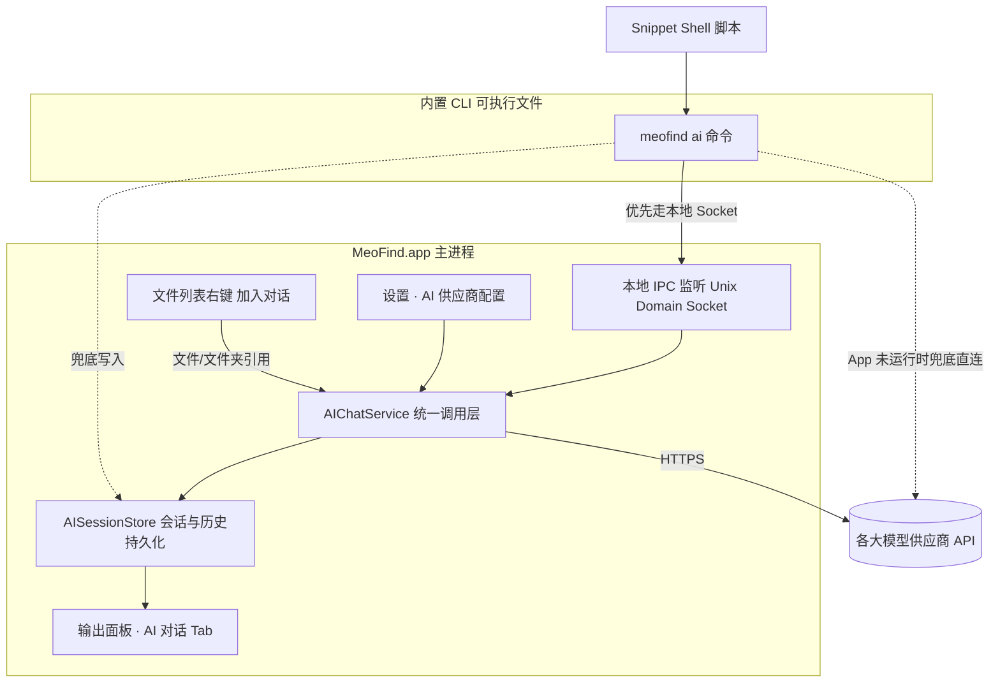

# AI 助手能力 — 设计方案（草案）

> 目标：把 MeoFind（Bundle ID `com.explorer.app`）从「文件管理器」升级为「AI 原生的文件管理与处理工具」。
> 本文档基于用户提出的 5 点原始需求展开架构设计，并补充更多可落地的使用场景与交互方式，供后续拆分实施计划使用。首版不追求一次做全，见「十、分阶段实施计划」。

---

## 一、背景与现状

### 1.1 现状

- `docs/snippets-claude-ai.json` 里已有几个手工示例：Snippet 的 shell 脚本里硬编码解析本机 `claude` CLI 路径，用 `claude -p "..."` 一次性提问。
- 局限：
  1. **绑定单一供应商**：写死调用 Claude Code CLI，用户换用 OpenAI / 通义 / 本地模型都要重写脚本。
  2. **无历史**：每次 `claude -p` 都是独立进程、独立上下文，问完就丢，无法追问。
  3. **无原生文件引用**：只能把路径拼进 prompt 文本，依赖 Claude Code CLI 自带的「Agent 读文件」能力；如果用户配置的是纯 Chat Completions API（OpenAI/DeepSeek 等），模型根本没有文件系统访问权限，路径字符串对它毫无意义。
  4. **交互割裂**：AI 能力只存在于 Snippet 脚本里，和「选中文件 → 右键 → 立即问 AI」这种更自然的操作流程没有打通。

### 1.2 目标（用户原始 5 点 + 关键补充）

| # | 需求 | 补充说明 |
|---|------|----------|
| 1 | 设置中新增大模型配置：供应商 + 模型 + 默认项 | 需支持多供应商同时配置、按用途（文本/视觉/代码）分别指定默认模型 |
| 2 | 安装应用时内置一个 CLI 命令，供 Snippet 用 shell 调用 | 需明确「内置」与「加入 PATH」是两个不同阶段（见 §5.2） |
| 3 | 输出面板命令输入框增加 AI 对话模式 | 需要支持多行输入、流式回复、Markdown 渲染 |
| 4 | Snippet 里 CLI 调用的 prompt 也要能在 AI 对话历史中看到 | 意味着 CLI 和 GUI 必须共享同一个「历史存储」，而不是各写各的 |
| 5 | 文件列表右键「加入对话」，支持多文件/文件夹引用 | 需要设计「引用」在不同模型能力下究竟意味着什么（见 §5.4） |

### 1.3 非目标（首版不做）

- 完整的 Agent 工具编排（模型自主调用 `mv`/`rm` 等系统工具并自动执行）——首版只做「AI 建议 → 用户点按钮确认 → App 执行」，不做无人值守的自动执行。
- 全盘向量索引 / RAG 语义搜索——作为路线图后期方向在 §7.10 提出，不纳入首版范围。
- 多人协作 / 云同步 AI 历史——首版历史只落本机。

---

## 二、总体架构



**关键设计决策：AI 调用统一收口到 `AIChatService`。**
无论调用方是「设置里测试连接」「输出面板里手打 prompt」「右键加入对话后发送」还是「Snippet 通过 CLI 调用」，最终都走同一份 Provider 调用逻辑、同一份历史存储。这是保证需求 4（CLI 调用要能出现在历史里）能够自然成立的根本前提，而不是靠事后同步两份数据。

---

## 三、模块一：大模型供应商配置（设置面板新增 Tab）

### 3.1 数据模型

```swift
struct AIProviderConfig: Codable, Identifiable, Equatable {
    var id: UUID
    var kind: AIProviderKind        // openAI / anthropic / deepSeek / qwen / kimi / zhipu / ollama / custom
    var displayName: String         // 用户可编辑，如「公司内网 DeepSeek」
    var baseURL: String             // 自定义/私有部署时可覆盖默认 endpoint
    var apiKeyRef: String?          // 指向 Keychain 条目的引用，而非明文
    var models: [AIModelConfig]
    var enabled: Bool
}

struct AIModelConfig: Codable, Identifiable, Equatable {
    var id: UUID
    var modelID: String              // 供应商侧真实模型名，如 "gpt-4.1" / "claude-sonnet-4-5"
    var displayName: String
    var capabilities: Set<AIModelCapability> // .text, .vision, .code, .longContext
    var contextWindowTokens: Int?
}

enum AIProviderKind: String, Codable, CaseIterable {
    case openAI, anthropic, deepSeek, qwen, kimi, zhipu, ollama, openAICompatible
}

enum AIModelCapability: String, Codable {
    case text, vision, code, longContext
}
```

### 3.2 内置供应商预设

首版内置常见预设的 `baseURL` 与已知模型列表模板，用户选中后只需填 API Key（本地 `ollama` 除外，不需要 Key）：

| 预设 | 说明 |
|------|------|
| OpenAI | 官方 API |
| Anthropic | 官方 API（区别于「Claude Code CLI」，这里走的是纯 Messages API，无文件系统工具） |
| DeepSeek | 国内常用、性价比高，适合批量任务 |
| 阿里通义千问 Qwen | 兼容 OpenAI 协议 |
| 月之暗面 Kimi | 长上下文，适合整份长文档摘要 |
| 智谱 GLM | 国内常用 |
| Ollama（本地） | `http://localhost:11434`，无需 Key，适合隐私场景（见 §7.8） |
| 自定义 OpenAI 兼容 endpoint | 兜底选项，覆盖企业自建网关等情况 |

### 3.3 关键交互

1. **多默认模型**，而不是单一默认：
   - 「默认模型」：手动对话默认使用
   - 「文本理解默认」「视觉理解默认」「代码相关默认」可分别指定（呼应 §7.7 的按任务路由）
   - 找不到对应能力的模型时，回退到全局默认模型并在 UI 提示
2. **连接测试按钮**：填完 Key 后一键发一条极短测试请求，成功/失败即时反馈，避免用户跑到 Snippet 里才发现配置错了。
3. **API Key 存储**：一律存 macOS Keychain（`kSecClassGenericPassword`），设置的 JSON/UserDefaults 里只存 Keychain 的引用 key，不落盘明文，导出设置时也不能带出明文 Key。
4. **用量与费用提示**（详见 §7.9）：每个供应商展示「本月调用次数 / 预估 token 数」，帮助用户发现异常高频调用（例如某个 Snippet 被循环触发太多次）。

---

## 四、模块二：内置 CLI 命令

### 4.1 「内置」与「加入 PATH」要分两步理解

macOS 上纯 `.app` 拖拽安装（而非走 `.pkg` 安装器）**没有传统意义上的「安装脚本」钩子**，所以不能指望"用户把 App 拖进 Applications 的瞬间"就自动往 `/usr/local/bin` 写文件。可行方案（参考 VS Code / Cursor 的 `Shell Command: Install 'code' command in PATH`）：

1. **构建期**：把 CLI 可执行文件随 App 一起打包，放在 `MeoFind.app/Contents/Resources/bin/meofind`。
2. **首次启动引导 / 设置页按钮**：在「设置 → AI」页提供「安装命令行工具」按钮，点击后：
   - 优先 symlink 到 `~/.local/bin/meofind`（无需管理员权限，前提是该目录已在用户 `PATH` 里，可顺带检测并提示是否要写入 `.zshrc`）；
   - 如果用户坚持要装到 `/usr/local/bin`，触发一次系统授权对话框（`AuthorizationExecuteWithPrivileges` 或 `osascript -e 'do shell script ... with administrator privileges'`）写 symlink。
3. **卸载/更新时的路径稳定性**：symlink 指向 App 内部路径，App 更新替换 `.app` 包后 symlink 自动生效；App 被删除后 symlink 会失效，可在下次启动检测并提示「命令行工具已失效，是否重新安装」。

### 4.2 CLI 与 GUI 的通信方式

**推荐：本地 Unix Domain Socket**，而不是自定义 URL Scheme：

| 方案 | 优点 | 缺点 |
|------|------|------|
| **Unix Domain Socket**（推荐） | 同步请求/响应，CLI 可以直接把结果打印到 stdout 并返回正确的退出码，最贴近现有 Snippet 里 `"$CLAUDE" -p "$PROMPT"` 的使用习惯 | 需要自己维护一个轻量协议（JSON line）|
| 自定义 URL Scheme（`meofind://ai?...`） | 实现简单 | 天生异步、无法同步拿到回复文本写回 stdout，不适合「脚本里等结果」的场景 |
| XPC Mach Service | 系统级、Apple 推荐 | 需要额外注册/签名配置，杀鸡用牛刀 |

监听地址建议：`~/Library/Application Support/MeoFind/ai.sock`（App 启动时监听，退出时清理）。

**App 未运行时的兜底策略：**

1. CLI 连接 socket 失败 → 尝试静默拉起 App（`open -g -b com.explorer.app`），等待 socket 出现（超时约 2-3 秒）；
2. 仍失败（例如用户明确不想为了跑一次 Snippet 打开 GUI）→ CLI 读取本地配置文件（与 App 共享的 Provider 配置，Key 从 Keychain 取）直连模型 API，调用结束后把这轮对话追加写入 `AISessionStore` 的本地文件（见 §6），下次 App 打开时自动加载，保证「历史最终一致」而不是丢失。

### 4.3 CLI 命令设计

```
meofind ai "总结一下这个文件" --file ./report.pdf
meofind ai --file ./a.png --file ./b.png "这两张截图有什么区别？"
cat error.log | meofind ai "帮我看看这个日志有没有报错"
meofind ai --session weekly-report "继续上次的报告，帮我加一段结论"
meofind ai "..." --model gpt-4.1 --json
```

| 参数 | 说明 |
|------|------|
| 位置参数 | prompt 文本，可省略改用 stdin |
| `--file <path>` | 可重复，引用文件/目录（目录按 §5.4 的策略处理） |
| `--session <name>` | 指定会话，续写历史；不传则用 `default` 会话或按需新建（见开放问题 §9） |
| `--model <id>` | 覆盖默认模型 |
| `--json` | 输出结构化 JSON（`{"reply": "...", "sessionId": "..."}`），方便脚本进一步解析而不是抠文本 |
| `--new` | 强制开新会话，不追加到已有历史 |

这样 `docs/snippets-claude-ai.json` 里那些示例可以从「硬编码找 `claude` 二进制路径」简化成一行 `meofind ai "..." --file %f`，同时自动具备：可配置供应商、有历史、结果能在 GUI 里回看。

---

## 五、模块三：输出面板 AI 对话模式

### 5.1 Tab 类型扩展

现有 `JobSource` 只有 `.snippet` / `.shellSession` / `.archiveOperation`，建议新增：

```swift
enum JobSource: Equatable {
    case snippet(id: UUID, name: String)
    case shellSession
    case archiveOperation
    case aiChat(sessionID: UUID)   // 新增
}
```

输出面板的 Tab 栏上，AI 类型的 Tab 用不同图标/配色区分（比如沿用命令框既有的琥珀色系，AI Tab 用另一套强调色，避免和终端型 Tab 混淆）。

### 5.2 命令输入框的模式切换

命令框左侧或右侧增加一个模式切换按钮（图标：`terminal` ⇄ `sparkles`），或者用快捷键（如 `⌘⇧A`）切换当前 Tab 的「Shell 模式」/「AI 模式」：

- **Shell 模式**：沿用现状（`OutputCommandField` → `SnippetExpander` → `ShellRunner`）
- **AI 模式**：
  - 输入框允许多行（`⌥Enter` 换行、`Enter` 发送，贴近 ChatGPT/Slack 习惯）
  - 发送后走 `AIChatService`，回复走**流式**追加渲染，而不是等全部生成完再显示
  - 回复内容按 Markdown 渲染（代码块高亮、可一键复制），复用/扩展现有预览模块里已有的 Markdown 渲染能力
  - 输入框上方常驻一个「已引用文件」chip 区（见 §5.4）

### 5.3 会话与历史 UI

- 建议在输出面板旁增加一个「AI 历史」入口（可以是 Snippets 面板旁边新加一个 Tab，或输出面板 Tab 栏最左侧一个下拉），列出所有历史会话：标题（自动摘要或手动重命名）、最后一条消息预览、时间、来源标签（`交互创建` / `来自 Snippet: XXX` / `CLI 兜底直连`）。
- 支持：置顶、重命名、删除、搜索（按内容全文搜索，复用 §6 存储层）。
- 点击历史里的某个会话 = 在输出面板打开一个新的 AI Tab 并加载完整上下文，可以直接继续追问。

### 5.4 文件引用系统（「加入对话」）

这是本次需求里技术含金量最高的一块，因为**不同供应商模型的「引用文件」能力完全不同**，必须在应用层做归一化：

| 文件类型 | 处理策略 |
|----------|----------|
| 纯文本/代码/Markdown/日志 | 直接读正文注入 prompt 上下文；超过模型上下文窗口时，先做分块摘要（本地不调用大模型的简单截断优先，必要时二次调用模型做「先摘要再回答」） |
| 图片（png/jpg/heic 等） | 若目标模型具备 `.vision` 能力则 base64 编码随请求发送；不具备则退化为「仅引用文件名 + EXIF 等元数据」并提示用户"当前模型不支持读图，是否切换到视觉模型" |
| PDF / Office 文档 | 复用应用已有的预览抽取能力（如果已有文本层抽取），转成纯文本再走文本策略；扫描件退化到图片策略 |
| 目录 | 默认只生成目录结构树（文件名 + 层级），不展开每个文件内容，避免一次性喂爆上下文；提供「深度包含子文件内容」的二级选项，明确提示可能产生的 token 成本 |
| 超大文件 / 二进制文件 | 拒绝引用正文，只带文件名 + 大小 + 类型等元信息，避免无意义的 token 浪费或直接报错 |

**三种引用入口**（用户已提出「右键加入对话」，建议再补两种，降低操作成本）：

1. **右键菜单「加入对话」**（用户原始需求）：`FileListRowContextMenuBuilder` 新增菜单项，选中项转换成引用后追加到「当前活跃的 AI 会话」；若当前没有打开的 AI Tab，则自动新建一个并打开输出面板。
2. **拖拽引用**：直接把文件列表里选中的项拖到输出面板的 AI 输入区，效果等同「加入对话」，符合 Finder 用户的肌肉记忆。
3. **`@` 提及语法**：AI 输入框里敲 `@` 弹出当前目录的文件选择浮层（类似 Cursor/Slack），无需先在文件列表多选，聊到一半临时想加一个文件也很顺手。

引用的文件在输入框上方以 chip 形式展示（文件图标 + 文件名 + 移除按钮），发送前可以增删；发送后在气泡里保留一份「引用了哪些文件」的只读标记，方便回看历史时知道当时问的是哪几个文件。

---

## 六、模块四：历史贯通（CLI ↔ GUI 共享同一份数据）

### 6.1 存储选型

建议新增 `AISessionStore`，独立于现有 `JobStore`（`JobStore` 定位是「本次运行的临时 Job 队列，上限 50 条，进程重启即清空」，语义上不适合承载「要长期回看的 AI 对话历史」）。

- 存储位置：`~/Library/Application Support/MeoFind/ai-sessions.sqlite`（推荐 SQLite，理由：历史量会积累、需要全文搜索、CLI 和 GUI 两个进程需要并发安全读写——SQLite 的文件锁天然解决多进程访问问题，比手写 JSON + 文件锁更省心）。
- 表结构草案：

```
sessions(id, title, created_at, updated_at, source_tag, pinned)
messages(id, session_id, role, content, attachments_json, model_id, provider_id, created_at, token_usage_json)
```

- `source_tag` 记录来源：`interactive` / `snippet:<snippetID>` / `cli-fallback`，用于历史列表里的来源徽标（呼应需求 4「要能看到是 Snippet 触发的」）。

### 6.2 一致性保证

- **App 运行中**：CLI 请求经 Socket 转发给 `AIChatService`，由 GUI 进程唯一写入 SQLite，天然无并发冲突，且新消息可以直接用 Combine/Notification 推给正在显示的 AI Tab 做实时刷新。
- **App 未运行（CLI 兜底直连）**：CLI 自己写 SQLite（同一份文件），下次 App 启动时正常读到；只需注意 CLI 侧用最简单的 `INSERT`，不做复杂的内存态同步。

---

## 七、更多使用场景与交互方式（用户重点想要的部分）

### 7.1 拖拽引用 + `@` 提及

见 §5.4，作为「右键加入对话」的补充入口，覆盖不同用户习惯。

### 7.2 预览区「划词发送到 AI」

在文本/代码/PDF 预览面板里选中一段文字，右键出现「发送到 AI 对话」，用于追问文件里的**某个片段**而不是整份丢进去——比如一份 50 页的合同，只想问其中一条条款。

### 7.3 AI 回复「一键应用」——从建议到执行

现在 Snippet 示例的做法是「AI 输出文本 → 脚本自己用 `sed`/`mv` 解析」，比较脆弱。更好的方式：

- 约定 AI 回复中如果包含结构化的操作建议（如重命名方案），用一种可识别的格式返回（例如一个 fenced code block 标注 `meofind-actions`，内容是 JSON：`[{"op":"rename","from":"a.jpg","to":"海边日落.jpg"}]`）；
- 输出面板在渲染回复时识别到这种代码块，自动在气泡下方渲染一个「应用建议」按钮列表（每条建议可勾选/取消），点击后调用应用现有的重命名/移动 API 真正执行，并复用已有的 `DestructiveActionConfirmer` 二次确认破坏性操作；
- 这比每个 Snippet 各自写 shell 解析文本要稳固得多，也是把「AI 文件管理」从「玩具 demo」升级为「可信赖生产力工具」的关键一步。

### 7.4 流式响应

长文档摘要、批量任务的即时反馈都依赖流式渲染，避免用户盯着空白等待。

### 7.5 AI 快捷指令（Slash Commands）

在 AI 输入框支持 `/summarize`、`/rename`、`/translate`、`/find-duplicates` 等预置指令——本质是「预置 prompt 模板 + 自动带上当前选中文件」，介于「完全自由输入」和「固定 Snippet」之间，降低每次手打 prompt 的门槛，也是把常见 Snippet 场景「上浮」到对话框里的轻量方式。

### 7.6 「聊出来的脚本存起来」——AI ⇄ Snippet 双向打通

不仅 Snippet 能通过 CLI 触发 AI（需求 2/4），反过来，AI 对话里生成的一段 shell 脚本也应该能「一键保存为新 Snippet」，形成完整闭环，类似 Warp AI / Raycast AI 的「保存为脚本」体验。

### 7.7 按任务自动路由模型

除了全局「默认模型」，允许「视觉理解」「代码相关」「长文档摘要」分别绑定不同模型（例如：日常问答用便宜快速的模型，图片理解自动切到带 vision 能力的模型，超长合同/日志自动切到长上下文模型），App 内部按任务类型自动选择，不需要用户每次手动切换。

### 7.8 隐私/本地模式提示

识别到用户引用的文件路径命中敏感目录关键词（如「合同」「工资」「身份证」「财务」，或用户在设置里手动标记的隐私文件夹），发送前提示「检测到可能敏感的文件，是否改用本地模型（Ollama）处理」，把隐私保护落到交互细节而不是只写在文档里。

### 7.9 用量与成本可视化

设置页展示各 Provider/Model 的调用次数与预估 token 消耗，帮助用户及时发现「某个 Snippet 被循环调用太多次」之类的异常开销，尤其是批量处理场景（比如对 100 个文件逐一调用 AI 重命名，成本可能远超预期）。

### 7.10 （远期）语义索引与全盘 AI 搜索

把「批量打标签」场景升级为长期能力：后台增量为浏览过的目录建立向量索引（文件名 + AI 摘要），搜索框支持「语义搜索」模式，输入「上个月的合同」能搜出内容匹配而非仅文件名匹配的结果。这个能力可以复用本方案里「文件引用」「AI 调用」两块基础设施，但工作量较大，建议作为路线图后期目标，不纳入首版。

### 7.11 批量任务的结构化进度展示

对「批量重命名 / 批量摘要」这类循环调用 AI 的 Snippet，输出面板除了打印文本日志，还可以约定一种「进度」协议（脚本按约定输出形如 `##PROGRESS 3/10##` 的标记行），面板识别后在 Job 顶部渲染一个轻量进度条，衔接现有的 `JobOutputSanitizer` 输出处理管线即可实现，不需要新的传输通道。

### 7.12 分行业应用场景补充

| 行业/角色 | 场景 |
|-----------|------|
| 学生/科研 | 批量文献 PDF 提取「标题-作者-年份」重命名，并生成一份文献综述大纲 |
| 律师/法务 | 批量合同提取甲乙方、签署日期、合同类型，生成结构化文件名 + 汇总索引表 |
| 会计/财务 | 批量发票/报销单识别，汇总成一张 Excel/CSV，减少手工誊抄 |
| 自媒体/剪辑 | 素材文件夹里几百个视频片段，AI 看首帧缩略图 + 文件名生成一句话描述，剪辑时可以直接问「找到有笑容特写的素材」 |
| 客服/运营 | 批量用户反馈截图自动分类「UI 异常/文案错误/崩溃」并统计数量 |
| 摄影工作室 | 交付前批量检查照片瑕疵（闭眼、模糊、构图问题），列出建议剔除/重拍清单 |
| IT/运维 | 日志目录（几十个 `.log`）批量丢给 AI，直接问「这些日志里有没有报错，定位在哪个服务」 |
| 教师 | 批量批改学生提交的 txt/pdf 作业，生成简评和分数草稿（供人工复核，不自动定档） |
| HR/招聘 | 批量简历提取姓名/岗位/年限，按岗位分类归档（此前已在 Snippet 示例里提到，可作为内置 Slash Command） |

---

## 八、安全与隐私

1. **API Key 只进 Keychain**，设置的导出/导入功能（参考现有 Snippets 导入导出机制）必须显式排除 Key 字段，避免用户导出配置分享给别人时意外泄露。
2. **破坏性「应用建议」操作**（§7.3）必须复用现有 `DestructiveActionConfirmer` 走二次确认，且默认不允许 AI 未经确认直接执行文件系统写操作。
3. **网络请求走 HTTPS**，自定义 endpoint 场景给出「非 HTTPS 存在风险」的告警但不强制阻断（兼容企业内网网关场景）。
4. **隐私模式**（§7.8）默认关闭识别提示，避免误报打扰，但提供设置项允许用户自定义敏感关键词列表。
5. **CLI 兜底直连模式**要在文档里明确告知用户：此时请求不经过 App 的任何前置校验（比如隐私目录提示），是纯粹的「本地脚本直接调用 API」。

---

## 九、开放问题（需要产品侧进一步拍板）

1. **CLI 命令名**：`meofind`（清晰但略长）？还是加一个短别名如 `meo`？是否需要担心和用户已有别的工具命名冲突？
2. **CLI 默认会话策略**：不传 `--session` 时，是「固定复用一个 `default` 会话」（历史会越滚越长）还是「每次都新建一个临时会话」（历史列表容易被 Snippet 调用刷屏）？倾向前者 + 提供「清空 default 会话」的快捷操作，但需要用户确认符合直觉。
3. **是否需要完全离线兜底**：如果用户既没联网、又没配置 Ollama，Snippet 里调用 CLI 应该给出怎样的降级提示（目前设想是明确报错并给出配置指引，而不是静默失败）。
4. **视觉模型的成本控制**：批量给几百张图片逐一调用视觉模型可能成本很高，是否需要在「批量场景」下加一个「预估费用，是否继续」的前置确认。

---

## 十、分阶段实施计划（建议）

| 阶段 | 内容 |
|------|------|
| P0 | 数据模型与存储：`AIProviderConfig`/`AIModelConfig` + Keychain 存取 + `AISessionStore`（SQLite）雏形 |
| P1 | 设置页「AI」Tab：供应商/模型增删改查、默认模型选择、连接测试 |
| P2 | `AIChatService` 统一调用层：先支持 OpenAI 兼容协议（覆盖 OpenAI/DeepSeek/Qwen/Kimi/GLM/Ollama 大多数），Anthropic 原生协议单独适配 |
| P3 | 输出面板 AI 对话模式：Tab 类型扩展、模式切换、流式渲染、Markdown 渲染 |
| P4 | 文件引用系统：右键「加入对话」+ chip UI + 文本/图片/目录三类处理策略 |
| P5 | 内置 CLI：打包二进制 + 「安装命令行工具」按钮 + Unix Socket 通信 + `--file`/`--session`/`--json` 参数 |
| P6 | 历史贯通验收：Snippet → CLI → Socket → AISessionStore → 输出面板历史，全链路打通 |
| P7（增强） | 「应用建议」结构化 Action、Slash Commands、用量可视化、隐私模式提示等 §7 增强项按优先级排期 |

---

## 十一、验收清单（摘要）

- [ ] 设置页可新增/编辑/删除供应商，Key 存 Keychain 不落盘明文
- [ ] 可分别指定「默认模型」「视觉默认」「代码默认」，且用得上时能生效
- [ ] `meofind ai "prompt"` 在终端里直接可用（PATH 已配置的前提下）
- [ ] Snippet 里通过 CLI 调用的一轮对话，能在 App 的 AI 历史里看到，且带有「来自 Snippet：XXX」标签
- [ ] 输出面板命令框可切换 Shell/AI 两种模式，AI 模式下支持多行输入、流式回复、Markdown 渲染
- [ ] 文件列表右键「加入对话」对单选/多选/含目录的选择都能正确生成引用 chip
- [ ] 引用图片时，若当前模型不支持视觉能力，有明确提示而不是静默发送失败
- [ ] App 未运行时，CLI 调用仍可完成（兜底直连），且历史在下次打开 App 时能看到
- [ ] AI 历史支持搜索、重命名、置顶、删除
