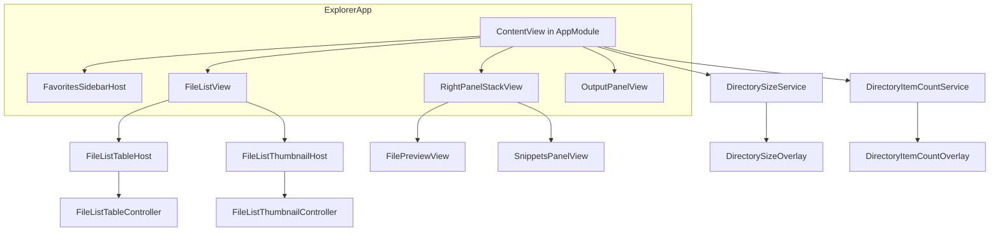

# MacQuickFinder / Explorer 代码审查报告

> 审查日期：2026-06-23  
> 范围：`Sources/`（135 个 Swift 文件，约 29,000 行）、`Tests/`（16 个测试文件）、`docs/` 设计文档  
> 目标：识别代码冗余、可优化点、可抽象为统一函数/组件/模块/架构的改进方向

---

## 执行摘要

本项目是一个基于 Swift Package Manager 的 macOS 文件管理器（产品名 MeoFind），采用 **Explorer（可执行目标）+ FileList（可复用库）** 的双目标架构。FileList 已从早期 SwiftUI Table 桥接方案中抽离（见 `docs/file-list-refactor-plan.md`），Preview、Snippets、ScriptRuntime、RightPanel 等子系统也已逐步拆出独立目录。

**整体评价：功能成熟、性能优化意识强，但架构上存在明显的「双轨并行」与「巨石文件」问题。**

| 维度 | 现状 | 风险等级 |
|------|------|----------|
| 模块边界 | Explorer → FileList 单向依赖，编译边界清晰 | 低 |
| 巨石文件 | `AppModule.swift` 约 **9,160 行**，承载应用壳、预览 UI、目录加载等 | **高** |
| 列表双轨 | 列表模式与缩略图模式大量复制粘贴（约 400+ 行可合并） | **高** |
| 元数据服务 | 目录大小 / 子项数量两套近乎镜像的 Actor + Overlay | **中** |
| 预览加载 | `PreviewSession` 职责过重，加载逻辑与 UI 分散 | **中** |
| 测试覆盖 | 约 **10%** 源文件有对应测试，UI 与集成层几乎无覆盖 | **中** |
| 工具函数 | Shell 转义、目录枚举、进程管道等散落多处 | **低~中** |

**建议优先顺序：**

1. **P0** — 抽取 FileList 交互协调器，消除列表/缩略图双轨重复  
2. **P0** — 拆分 `AppModule.swift`，将预览视图与目录加载迁出  
3. **P1** — 泛化目录元数据服务（size + count）  
4. **P1** — 统一 Archive 加载与 Shell 进程执行  
5. **P2** — 性能热点（listing 签名、padding 列全表遍历、缩略图同步磁盘读）  
6. **P3** — 测试补齐、命名统一、小工具函数集中

---

## 一、项目架构概览

### 1.1 目录结构

```
macquickfinder/
├── Package.swift              # SPM：FileList / Explorer / ExplorerTests
├── Sources/
│   ├── FileList/              # 51 文件 — AppKit 列表 + 缩略图库
│   └── Explorer/              # 84 文件 — 主应用
│       ├── Preview/           # 预览会话、浏览器条、分离窗口
│       ├── Snippets/          # 脚本片段
│       ├── ScriptRuntime/     # Shell 任务与输出面板
│       └── RightPanel/        # 预览 + 片段垂直分栏
├── Tests/ExplorerTests/       # 16 个测试文件（无独立 FileListTests）
├── Explorer/                  # Info.plist、entitlements、图标
└── docs/                      # 15+ 设计/阶段计划文档
```

### 1.2 运行时数据流



### 1.3 模块耦合（良好之处）

- **单向依赖**：26 个 Explorer 文件 `import FileList`，FileList 零反向依赖  
- **桥接清晰**：`FileListRow+FileItem.swift`、`FileListSortBridge.swift` 负责类型映射  
- **回调注入**：`FileListTableInteraction` 将 Explorer 业务（右键菜单、重命名、拖放）注入 FileList  
- **策略共享**：`FileListSortEngine`、`DirectoryListingFSEventsPolicy` 跨模块复用

### 1.4 架构债务（待改进）

| 问题 | 位置 | 说明 |
|------|------|------|
| 应用巨石 | `AppModule.swift`（约 430 行） | 已拆分为 ContentView/PathBar/FileList/Sidebar/Preview/Domain 等模块；详见 `docs/refactor-execution-plan.md` |
| 预览 UI 错位 | `Preview/` vs `AppModule` | 加载器与 `FileContentView`/`FilePreviewSessionHost` 已在 `Preview/`；`FilePreviewView` 等仍在 `AppModule` |
| 命名遗留 | `FileListTableInteraction` | 缩略图模式也使用，含 "Table" 字样易误导 |
| 输出面板游离 | `OutputPanelView` | 与 `RightPanelStackView` 并列挂在 `ContentView`，两套 resize 手柄模式 |

---

## 二、代码冗余详细分析

### 2.1 FileList：列表模式 vs 缩略图模式（**最高优先级**）

FileList 模块约 12,500 行，核心设计是 **两个并行控制器** 实现功能对等，但维护成本是双倍的。

#### 2.1.1 控制器核心状态机重复

`FileListTableController`（1,241 行）与 `FileListThumbnailController`（713 行）重复：

| 关注点 | 两文件中的相同实现 |
|--------|-------------------|
| 行存储 | `sourceRows` / `displayRows` |
| 搜索追踪 | `lastSearchText` / `lastQuickSearchText` |
| 列表变更检测 | `listingSignature = rows.map(\.id).joined(separator: "\u{1F}")` |
| 排序 | `FileListSortEngine.sorted` |
| 指针/拖放状态 | `mouseDown*`、`dragSessionActive`、`blankMouseDownEvent`、`dragThreshold` |
| 重命名资格 | `rowRenameEligibleSince`、`lastKnownSelectionIDs`、`wasAlreadySelectedAtMouseDown` |
| 可见目录通知 | `scheduleVisibleDirectoryPathsNotify` + debounce |

**文件：**

- `Sources/FileList/FileListTableController.swift`（约 131–224、367–392 行）
- `Sources/FileList/Thumbnail/FileListThumbnailController.swift`（约 115–185、589–612 行）

#### 2.1.2 交互扩展约 70% 重叠

| 文件 | 行数 | 重复内容 |
|------|------|----------|
| `FileListTableController+Interaction.swift` | 587 | 快速搜索键盘、`handleKeyDown`、空白区点击/框选、右键菜单、`beginDrag`、`NSDraggingSource`、`effectiveSelectionIDs()` |
| `Thumbnail/FileListThumbnailController+Interaction.swift` | 330 | 同上（缩略图额外支持方向键、Space、F2） |

**典型重复：`quickSearchInputCharacter(from:)` 字节级相同**

- `FileListTableController+Interaction.swift` 263–277 行  
- `FileListThumbnailController+Interaction.swift` 316–328 行  

#### 2.1.3 重命名扩展

| 文件 | 行数 |
|------|------|
| `FileListTableController+Rename.swift` | 182 |
| `Thumbnail/FileListThumbnailController+Rename.swift` | 170 |

共享：`isRenaming`、`cancelRename`、`commitRename`、双击间隔检查、`cancelRenameIfNeededForDataUpdate` 等。仅 UI 绑定不同（`NSTableCellView` + `FileListInlineRenameField` vs `FileListThumbnailItem.beginRename`）。

#### 2.1.4 Host 与 View 子类结构克隆

- `FileListTableHost.swift` ↔ `Thumbnail/FileListThumbnailHost.swift`：`NSViewRepresentable` 壳，结构相同  
- `FileListTableView.swift` ↔ `Thumbnail/FileListThumbnailCollectionView.swift`：`validRequestor`、焦点回调、完整 `NSDraggingDestination` 重写集  

#### 2.1.5 异步列 Provider 结构克隆

`DirectorySizeColumnProvider` 与 `DirectoryItemCountColumnProvider` 除泛型关联类型外完全相同（各 19 行）：

```swift
// DirectorySizeColumnProvider.swift / DirectoryItemCountColumnProvider.swift
public struct XxxColumnProvider: Equatable {
    public let revision: UInt
    public let display: (String) -> XxxDisplayInfo
    public static func == (lhs: Self, rhs: Self) -> Bool {
        lhs.revision == rhs.revision
    }
}
```

对应的 `DirectorySizeDisplayInfo` / `DirectoryItemCountDisplayInfo` 也是 `unknown` 哨兵 + `Equatable` 的平行结构。

#### 2.1.6 目录元数据合并与刷新

- 表格：`mergePreservingDirectorySizes`（`FileListTableController.swift` 227–245）  
- 缩略图：`mergePreservingDirectoryMetadata`（`FileListThumbnailController.swift` 219–252）— 超集，额外合并 `childCountDisplay`  
- 两者均有 `refreshDirectorySizeColumnIfNeeded`、`applyDirectorySizeDisplayUpdates`；缩略图还有几乎复制的 `applyDirectoryItemCountDisplayUpdates`（277–299 vs 255–275）  

#### 2.1.7 其他小重复

| 重复项 | 位置 |
|--------|------|
| `rowsInVerticalRange` | `FileListTableController+Interaction` 155–169、`FileListBlankAreaView.Coordinator` 95–109 |
| `estimatedCost(of:)` | `Thumbnail/ThumbnailCache.swift` 135–140、`ThumbnailDiskCache.swift` 92–97 |
| `FileListRow.withDirectorySizeDisplay` / `withChildCountDisplay` | 各重复 17 字段完整初始化（`FileListRow.swift` 95–166） |
| `dataColumnsTrailingX` vs `FileListRowView.resolvedContentMaxX` | 遍历 `tableColumns` 找最后非 padding 列 |

**估算可消除重复代码：约 400–600 行（含未来新功能只需实现一次）。**

---

### 2.2 Explorer：目录大小 vs 子项数量服务（镜像实现）

`DirectorySizeService.swift`（299 行）与 `DirectoryItemCountService.swift`（244 行）共享约 **80%** 结构：

| 共同模式 | 说明 |
|----------|------|
| `WorkItem` + 优先级枚举 | `visible` / `normal` |
| Actor 队列 | `cache`、`activeGeneration`、`queue`、`runningTasks`、`maxConcurrent` |
| 生命周期 | `resetSession`、`invalidate`、`schedule`、`enqueue`、`sortQueue`、`finishWork` |
| 缓存键 | `cacheKey(path|showHiddenFiles)` |
| Overlay 回写 | MainActor `Overlay.shared.apply(...)` |

对应的 `DirectorySizeOverlay.swift` 与 `DirectoryItemCountOverlay.swift` 也是平行单例：`beginSession`、`apply`、`remove`、`revision`。

**调度编排分散在 `AppModule` 多处**，size 与 count 总是成对出现：

- `loadItems` 后的 `scheduleVisibleDirectorySizes` / `scheduleVisibleDirectoryItemCounts`  
- `handleAutoCalculateDirectorySizesChanged`  
- `DirectoryFSEventsMonitor` 中的成对 `invalidate`  

每次都是独立的 `Task { await ... }` 块，无统一入口。

**双重开关**：`FolderPreviewView.scheduleMetadata` 检查参数级 `autoCalculateDirectorySizes`，`DirectorySizeService.schedule` 又检查 `DirectorySizePreferences` 全局偏好 — 同一功能两层门控。

---

### 2.3 目录枚举逻辑三处实现

| 位置 | 用途 | 排序策略 |
|------|------|----------|
| `AppModule.loadItems`（约 3114–3138） | 主文件列表 | `FileListSortEngine` + 用户 `sortOrder` |
| `RightPanel/FolderPreviewLoader.swift` | 文件夹预览子列表 | 硬编码：目录优先 + 本地化名称 |
| `DirectoryItemCountService.countImmediateChildren` | 子项计数 | `contentsOfDirectory(atPath:)` + 逐子项 `isHiddenKey` |

**隐患：**

- `FolderPreviewLoader` 与主列表排序不一致 → 右栏预览顺序与主列表/browser 条可能不同  
- `DirectoryItemCountService` 与 `FolderPreviewLoader` 对隐藏文件的处理路径不同（`atPath` vs `includingPropertiesForKeys` + `.skipsHiddenFiles`）  
- `FolderPreviewView` 同时调度 `DirectoryItemCountService` 并调用 `FolderPreviewLoader`；~~`itemCountText` 有两套数据源~~ **E5.2 已统一为 `DirectoryMetadataOverlay`**

---

### 2.4 预览子系统冗余

#### 2.4.1 `PreviewSession` 上帝对象

`PreviewSession.swift` + `PreviewSession+Loading.swift` + `PreviewSession+Toolbar.swift` 合计约 **1,500+ 行**，单个类持有 30+ 个 `@Published` 字段，覆盖图片/PDF/文本/媒体/Office/压缩包等全部预览类型的 UI 与加载状态。

#### 2.4.2 加载管道重复

`PreviewSession+Loading.loadContent`（约 260 行）是单体类型分发管道。同类逻辑多处出现：

- 图片加载：`Data(contentsOf:options: [.mappedIfSafe])` 在 builtin（246–262）、PDF（298–315）、`loadCustomPreview`（456–475）三处重复  
- **Archive 加载分裂**：ZIP 走 `ArchivePreviewLoader`（`tar -tvf` + 解析）；tar/tgz 在 `PreviewSession+Loading` 内联（364–390），复制了 `shellEscape` + `runShellCapture` + 超时轮询，但用 `tar -tf`（无 size 解析），条目弱于 ZIP  

#### 2.4.3 控制状态重置不一致

- `resetControls()`（`PreviewSession.swift` 196–236）：重置 markdown/html 模式、`archiveExpanded`、图片 undo 栈等  
- `prepareForLoad()`（`PreviewSession+Loading` 7–40）：重置加载相关字段，**跳过**上述 UI 状态  

`FileContentView.applyLoadTaskIfNeeded` 先调 `resetControls()` 再 `beginLoadTask()` → `prepareForLoad()`，存在冗余与语义漂移风险。

#### 2.4.4 内联 vs 分离窗口 Chrome 重复

`FilePreviewSessionHost`（`AppModule.swift` 约 5110–5277）与 `DetachedPreviewWindowContent`（`DetachedPreviewWindowView.swift` 53–166）重复：

- 工具栏布局（返回、标题、`PreviewToolbarOverflowLayout`、分离/停靠）  
- PDF 页码 → `pdfPageInput` 同步  
- `ImageResizeSheet` + `imageEditUndoClearNonce` 处理  

#### 2.4.5 预览能力判定分散

`PreviewBrowserEligibility.canPreviewInDetachedWindow` 需与 `loadContent`、自定义规则、`BuiltinPreviewExtensions` 保持同步。注释声称已对齐，但无共享的「预览能力」模块 — 每新增扩展类型需改 3+ 处。

#### 2.4.6 Browser 预取机制平行

| 机制 | 文件 | 预取内容 |
|------|------|----------|
| 内容预取 | `PreviewBrowserContentPrefetcher.swift` | 图片/PDF 原始 `Data`（±1 index） |
| 缩略图预取 | `PreviewBrowserStripThumbnailLoader.swift` | `ThumbnailGenerator` 图片（±radius） |
| 加载防抖 | `FileContentView` in `AppModule` | `Task.sleep` on browse switch |

三者都用 offset 窗口迭代，无共享抽象。

---

### 2.5 Snippets 与 ScriptRuntime 冗余

| 重复项 | 位置 |
|--------|------|
| 可见性过滤 | `SnippetsPanelView` 与 `SnippetsContextMenuBuilder.visibleSnippets`（30–44）重复构建 `SnippetVisibilityContext` + `sortedVisible` |
| 破坏性命令确认 | Panel 用 SwiftUI `.alert`；Context menu 用 `NSAlert` inline（`SnippetExecutor.executeFromMenu` 39–47） |
| `displayCommand` 构造 | `SnippetExecutor.performExecute`（102–111）与 `JobStore.rerunEditedCommand`（166–177） |
| `autoShowOutputPanelOnShellRun` | `SnippetExecutor`（两处）、`JobStore.rerunEditedCommand` — 相同 `ActiveWindowLayoutCenter.shared.showOutputPanel` 块 |
| 进程 + 管道模式 | `ShellRunner.swift`（41–62）、`AppleScriptEngine.runViaOSAScript`（40–60）几乎相同 |
| UI 样式 | `SnippetMinimalButtonView` 与 `SnippetListItemView` 平行的 accent 胶囊 + `HoverTooltipAnchor` |

**职责渗透**：`JobStore.rerunEditedCommand` 直接访问 `SnippetStore`、重建 `displayCommand`、分发 `ShellRunner`/`AppleScriptEngine` — 执行编排分散在 `SnippetExecutor` 与 `JobStore` 之间。

---

### 2.6 Shell 单引号转义（至少 5 处）

| 文件 | 函数名 |
|------|--------|
| `Snippets/SnippetExpander.swift` | `shellQuote` |
| `Snippets/SystemTerminalRunner.swift` | `shellSingleQuote` |
| `Preview/ArchivePreviewLoader.swift` | `shellEscape` |
| `Preview/PreviewSession+Loading.swift` | 内联 `shellEscape` |
| `FullDiskAccessPermission.swift` | `shellSingleQuoted` |

算法相同：`"'" + s.replacingOccurrences(of: "'", with: "'\\''") + "'"`

**建议**：在 Explorer 或共享 Utilities 中提供 `ShellQuoting.singleQuote(_:)`。

---

### 2.7 App Bundle 判定

`FileListApplicationBundle.isBundle(path:)` 已在 FileList 中统一，但 Explorer 仍保留局部包装：

- `FolderPreviewView.isAppBundle`（247 行）  
- `AppModule` 内 `isAppBundle`（8882 行）  

逻辑与 `FileListApplicationBundle.isBundle` 重复，应统一调用库方法。

---

## 三、可优化点（性能与实现质量）

### 3.1 热路径：每次 SwiftUI `update`

| 问题 | 位置 | 复杂度 | 建议 |
|------|------|--------|------|
| Listing 签名 | 两 Controller 的 `update` | O(n) 字符串拼接 | 上游传入 `revision` 或采样 hash |
| 全表排序 | `FileListSortEngine.sorted` | 每次 update 全排 | 列表未变时跳过；树模式 Dictionary 构建（35–78 行）可缓存 |
| Padding 列宽度 | `updatePaddingColumnWidth` | 遍历**所有行**设置 `contentBackgroundMaxX` | 仅更新可见 `FileListRowView` |

### 3.2 列表模式特有

| 问题 | 说明 |
|------|------|
| 无图标缓存 | `configure(cell:)` 每次 rebind 调用 `NSWorkspace.shared.icon(forFile:)`（约 1218 行）；缩略图路径有 `workspaceIconCache` |
| `dataColumnsTrailingX` | 交互/绘制路径调用 `tableView.layoutSubtreeIfNeeded()`（约 416 行） |
| 目录大小刷新 | 表格有 `isUserPointerActive` 延迟刷新；**缩略图未镜像此优化** |

### 3.3 缩略图模式特有

| 问题 | 说明 |
|------|------|
| 主线程同步磁盘读 | ~~`prepareThumbnailItem` → 同步磁盘~~ **E6.1/E6.2 已改异步** |
| 框选 O(n) | ~~对每个 `displayRows` 调 `layoutAttributesForItem`~~ **E6.3 已用 `layoutAttributesForElements(in:)`** |
| `setDropHighlight` | ~~遍历所有可见 item~~ **E6.4 仅更新 previous/new** |
| 全量 `reloadData` | 列表变更仍全量；**E6.5 排序/搜索改 `reloadItems`** |
| 磁盘写入阻塞 | **E6.6 已 async** |
| 图标缓存驱逐 | ~~达 300 条目全清~~ **E6.7 已有 LRU 逐出** |

### 3.4 预览加载

| 问题 | 说明 |
|------|------|
| `PreviewSession` 状态膨胀 | 所有类型字段常驻内存，切换文件时 `prepareForLoad` 无法完全释放 UI 状态 |
| Browser 排序不一致 | `PreviewBrowserContext` 用 `FileListSortEngine`；`FolderPreviewLoader` 用不同规则 |
| `ThumbnailGenerator.shutdown` | ~~`QLConcurrencyGate.waitUntilIdle` 轮询~~ **E6.8 已改 `NSCondition`** |

### 3.5 已有优化（值得保留）

- Size 列局部刷新（`reloadSizeColumnPreservingScroll`）  
- `hasSameStaticContent` 早返回  
- 缩略图 deferred collection reload 防布局重入  
- QL 并发门控（max 4）  
- 内存 LRU + 磁盘缓存（mtime/size bucket key）  
- 指针活跃时延迟目录大小刷新（表格模式）

---

## 四、建议抽象与架构重构

### 4.1 FileList 层

#### 4.1.1 `FileListContentController` 协议 / 基类

抽取共享：

- `update(rows:interaction:selectionGet:selectionSet:preferencesStore:)` 管道  
- Listing 签名、排序、早返回优化  
- `onOpenRow`、`onVisibleDirectoryPathsChanged`  
- 选择同步辅助方法  

#### 4.1.2 `FileListInteractionCoordinator`

共享模块：

- 快速搜索键盘处理  
- 空白区点击/拖放/框选  
- 右键菜单 + 空白菜单  
- 拖放源会话生命周期  
- `effectiveSelectionIDs()`  

视图适配器：`TableSelectionAdapter`（行索引）vs `CollectionSelectionAdapter`（indexPath）。

#### 4.1.3 `FileListRenameCoordinator`

共享重命名状态机 + 可插拔 `RenamePresenter`（表格 cell vs 缩略图 cell）。

#### 4.1.4 泛型异步列 Provider

```swift
struct AsyncColumnProvider<Info: Equatable>: Equatable {
    let revision: UInt
    let display: (String) -> Info
}
```

配合统一的 `MetadataRefreshEngine` 处理 size + count 刷新与 merge。

#### 4.1.5 其他 FileList 抽象

| 抽象 | 用途 |
|------|------|
| `FileListSelectionBinding` | 统一 `selectionGet`/`selectionSet` + 双向同步 |
| `FileListRowMutation` / Builder | 消除 `withX` 方法的 17 字段复制 |
| `FileListDropTargetResolver` | 统一表格与缩略图的 `resolvedDropTarget` |
| `FileListContentView` 基类 | 共享 `NSDraggingDestination` 与 Services `validRequestor` |
| `FileListHighlighting` | 合并 `attributedName` / `attributedOverlayName` 搜索高亮循环 |
| `FileListColumnLayout.lastDataColumnMaxX(in:)` | 统一列尾 X 计算 |

#### 4.1.6 大文件拆分建议

| 文件 | 行数 | 建议拆分为 |
|------|------|-----------|
| `FileListTableController.swift` | 1,241 | `+ColumnLayout`、`+CellConfiguration`、`+Selection`、`+Observers`、`+DirectorySize` |
| `FileListThumbnailController.swift` | 713 | `+UpdatePipeline`、`+ThumbnailLoading`、`+Selection`、`+Observers` |
| `FileListThumbnailCellView.swift` | 485 | `+Layout`、`+Rename`、`+Appearance` |

---

### 4.2 Explorer 层

#### 4.2.1 拆分 `AppModule.swift`（路线图）

建议按职责迁出（优先级由高到低）：

| 新模块/文件 | 迁出内容 | 预估行数 |
|-------------|----------|----------|
| `Explorer/ContentView.swift` | 顶层状态编排、`loadItems`、面板 wiring | ~1,500 |
| `Explorer/FileList/FileListView.swift` | `FileListView` SwiftUI 壳 | ~600 |
| `Preview/FileContentView.swift` | 预览内容渲染 + 加载触发 | ~400 |
| `Preview/FilePreviewSessionHost.swift` | 预览 chrome、文件夹内联预览 | ~200 |
| `Explorer/Domain/FileItem.swift` | `FileItem`、`SortOrder`、`FileOperations` | ~800 |
| `Explorer/Domain/FavoritesStore.swift` | 收藏夹持久化 | ~200 |
| `Explorer/Domain/TrashRestoreStore.swift` | 回收站恢复记录 | ~150 |
| `Explorer/PathBarView.swift` | 地址栏 + 工具栏输入框焦点栈 | ~1,902 |
| `Explorer/Settings/SettingsView.swift` | 设置界面 | ~300 |

目标：`AppModule.swift` 仅保留 `@main struct ExplorerApp` + WindowGroup 声明（< 200 行）。

#### 4.2.2 泛化目录元数据服务

```swift
actor DirectoryMetadataService<Entry> {
    // 共享队列、优先级、缓存、generation、invalidate
    func compute(path: String, showHidden: Bool) async -> Entry
}
```

- `DirectorySizeService` → `DirectoryMetadataService<DirectorySizeEntry>`  
- `DirectoryItemCountService` → `DirectoryMetadataService<Int>`  
- Overlay 可合并为 `DirectoryMetadataOverlay<Key, Entry>` 或保留薄包装  

配套：`DirectoryMetadataScheduler` 在 `AppModule`/`ContentView` 统一调度 size + count，替代成对 `Task` 块。

#### 4.2.3 统一目录列表加载

```swift
struct DirectoryListingLoader {
    func load(
        url: URL,
        sort: FileListSortState,
        showHidden: Bool,
        propertyKeys: [URLResourceKey]
    ) async throws -> [FileListRow] // 或 FileItem
}
```

供主列表、`FolderPreviewLoader`、（可选）item count 复用。

#### 4.2.4 预览子系统重构

| 方向 | 说明 |
|------|------|
| 按类型拆分状态 | `ImagePreviewState`、`PDFPreviewState` 等，或 per-kind 小型状态机 |
| 统一 Archive 加载 | 所有 archive 类型走 `ArchivePreviewLoader`，扩展支持 tar/tgz 的 verbose 解析 |
| 共享 `PreviewChromeView` | 内联/分离窗口工具栏合一 |
| `PreviewCapability` 模块 | 单一来源判定「能否预览 / 能否分离窗口 / browser 资格」 |
| 抽取 `ShellProcessRunner` | 超时、取消、`runShellCapture` 统一 |

#### 4.2.5 ScriptRuntime 重构

| 方向 | 说明 |
|------|------|
| `ProcessOutputStreamer` | 统一 stdout/stderr readabilityHandler + terminationHandler |
| `SnippetExecutionService` | 唯一执行入口；`JobStore` 只管存储/队列 |
| `DestructiveActionConfirmer` | 统一 SwiftUI alert 与 NSAlert 路径 |

#### 4.2.6 共享 Utilities 模块（可选第三 target）

若 Explorer 继续膨胀，可新增 `ExplorerCore` 或 `MeoFindUtilities`：

- `ShellQuoting`  
- `ProcessRunner`  
- `UserDefaultsBacked` property wrapper（统一 `SnippetsSettings`、`DirectorySizePreferences` 等模式）

---

### 4.3 横切关注点

#### 4.3.1 命名统一

| 现状 | 建议 |
|------|------|
| `FileListTableInteraction` | 重命名或 typealias 为 `FileListContentInteraction` |
| `SortOrder`（Explorer）vs `FileListSortState`（FileList） | 已通过 `FileListSortBridge` 桥接，文档化即可 |

#### 4.3.2 偏好设置集中

当前 `UserDefaults` 分散在：

- `AppModule.AppSettings` / `ExplorerAppSettings`  
- `SnippetsSettings`  
- `DirectorySizePreferences`  
- `CustomPreviewRuleStore`  
- `WindowSnapCoordinator`  
- `PreviewBrowserContext`  

可考虑 ~~`AppPreferences` 注册表~~ **E5.5 已实现** + 统一 key 命名空间（`docs/i18n-design.md` 国际化时也会受益）。

#### 4.3.3 Resize 手柄统一

`VerticalResizeDivider`（RightPanel）与 `OutputPanelResizeHandle`（ScriptRuntime）是平行 UX，可抽象为 `PanelResizeHandle` 组件。

---

## 五、测试覆盖分析

### 5.1 统计

| 指标 | 数值 |
|------|------|
| 源文件 | 135 |
| 测试文件 | 16 |
| 有直接测试的源单元 | ~13（约 **10%**） |
| 独立 `FileListTests` target | 无 |

### 5.2 已覆盖（纯逻辑为主）

| 测试 | 被测源 |
|------|--------|
| `FileListSortEngineTests` | 排序引擎 |
| `FileListPreferencesTests` | 列偏好持久化 |
| `FileListLayoutTests` | 布局度量 |
| `DirectorySizeComputePolicyTests` | 大小计算策略 |
| `DirectoryListingFSEventsPolicyTests` | FSEvents 刷新策略 |
| `LeftPanelStateMachineTests` | 左侧面板状态机 |
| `RightPanelHeightCalculatorTests` | 右栏高度计算 |
| `PreviewPlacementTests` / `PreviewSessionStoreTests` / `PreviewSessionTests` | 预览会话 |
| `PreviewBrowserContextTests` / `PreviewBrowserEligibilityTests` | 预览浏览器 |
| `ArchivePreviewLoaderTests` | 压缩包解析 |
| `CustomPreviewRuleStoreTests` | 自定义预览规则 |
| `SnippetScopeMatcherTests` / `SnippetExpanderTests` | 片段作用域与展开 |

### 5.3 高风险未覆盖区域

| 区域 | 风险 | 建议测试策略 |
|------|------|--------------|
| `AppModule.swift` / `ContentView` | 集成回归 | 提取 `loadItems` 为可测纯函数；快照/UITest 选做 |
| `FileListTableController*` | 交互回归 | 抽取 Coordinator 后单元测试状态机 |
| 缩略图全栈 | 性能/崩溃 | `ThumbnailGenerator` 纯逻辑测试；磁盘缓存 mock |
| `DirectorySizeService` / `DirectoryItemCountService` | 并发/缓存 | Actor 隔离测试 + 假 FS |
| `DirectoryFSEventsMonitor` | 实时刷新 | 策略层已测；集成 mock FSEvents |
| `FavoritesSidebarHost`（916 行） | UI 逻辑 | 提取数据层测试 |
| `WindowSnapCoordinator`（688 行） | 多窗口 | 几何计算单元测试 |
| `SnippetExecutor` / `JobStore` / `ShellRunner` | 脚本执行 | `ProcessOutputStreamer` 提取后 mock Process |
| `PreviewSession+Loading`（468 行） | 加载分支 | 按扩展名分派表 + fixture 文件 |
| `FileListRow+FileItem` | 映射正确性 | 边界：bundle、symlink、tree depth |

### 5.4 测试架构建议

1. 新增 `FileListTests` target，与 Explorer 测试分离  
2. 重构时 **先抽纯函数再写测试**（符合项目现有「测确定性逻辑」风格）  
3. 对 Actor 服务使用 `async` 单元测试 + 可控 clock/generation

---

## 六、与现有设计文档的对照

| 文档 | 与审查结论关系 |
|------|----------------|
| `file-list-refactor-plan.md` | FileList 模块已落地；`AppModule` 仍偏大，未完全达到「集成层瘦身」 |
| `thumbnail-view-design.md` | 缩略图已实现，但双轨重复未在计划中系统解决 |
| `viewer-plugin-architecture.md` | 插件化预览仍 largely 在 `AppModule`/`PreviewSession` 单体中 |
| `preview-detached-window-design.md` | 已实现，但 chrome 与内联预览重复 |
| `snippets-panel-design.md` | 已实现，执行层与 JobStore 职责可再清晰 |
| `remote-server-connect-design.md` | 未来功能；建议挂载后复用统一 `DirectoryListingLoader` |
| `i18n-design.md` | 字符串分散在巨石 `AppModule` 会增加 i18n 成本 — 拆分是先决条件 |

---

## 七、分阶段实施路线图

### Phase A — 低风险、高收益（1–2 周）✅ 已完成 2026-06-23

- [x] 提取 `ShellQuoting` 工具，删除 5 处重复  
- [x] 统一 `isAppBundle` → `FileListApplicationBundle.isBundle`（`FileItem.isApplicationBundle`）  
- [x] 泛型 `AsyncColumnProvider<Info>` 替换两个 ColumnProvider  
- [x] 列表模式增加 workspace 图标缓存（`FileListWorkspaceIconCache`，缩略图同步复用）  
- [x] `SnippetExecutor` 抽取 `SnippetDisplayCommand.build`，`JobStore` 复用  

### Phase B — FileList 双轨合并 ✅ 已完成 2026-06-23

- [x] 实现 `FileListInteractionCoordinator`（键盘、框选、拖放项、空白菜单、选中 ID）  
- [x] 实现 `FileListRenameCoordinator`（二次点击改名状态机）  
- [x] 统一 `FileListDirectoryMetadataRefresh`（size + count merge/refresh）  
- [x] 拆分 `FileListTableController.swift`（+DirectoryMetadata；其余逻辑已在 +Interaction/+Rename 扩展）  
- [x] 优化 listing 签名（`FileListListingSignature.hash`）与 padding 列可见行更新  

### Phase C — Explorer 瘦身 ✅ 部分完成 2026-06-23

- [x] 迁出 `FileContentView`、`FilePreviewSessionHost` 到 `Preview/`  
- [x] 迁出 `ContentView`、`FileListView` 到 `Explorer/ContentView.swift`（~1,108 行）、`Explorer/FileListView.swift`（~662 行）  
- [x] 迁出 `SidebarView`、`SidebarRailView`、`SidebarRow` 到 `Explorer/SidebarView.swift`（~563 行）  
- [x] 迁出 `PathBarView` 栈到 `Explorer/PathBarView.swift`（~1,902 行）  
- [x] 迁出 `SettingsView`、`PreviewViews`、`Domain/*`（`FileItem`、`FavoritesStore`、`TrashLoader`、`FileOperations` 等）；`AppModule.swift` 降至约 **430 行**（仅 `@main` + 命令 + 工具栏图标）  
- [x] 统一目录元数据调度（`DirectoryMetadataScheduler` + 共享 `DirectoryMetadataSchedulePriority`）  
- [x] `DirectoryMetadataService<Entry>` 泛型 Actor — size/count 共享队列、缓存、generation；`DirectorySizeComputer` / `DirectoryItemCountComputer` 提供计算策略  
- [x] `DirectoryListingLoader` 替换主列表与 `FolderPreviewLoader` 枚举  
- [x] Archive 加载全部走 `ArchivePreviewLoader.listArchiveEntries`  
- [x] `ProcessOutputStreamer` + `OutputPanelPresenter`（脚本输出流与面板展示）  
- [x] `SnippetExecutionService` — 统一 scriptType 分发；`JobStore.rerunEditedCommand` / `SnippetExecutor` 已接入  

### Phase D — 深度重构 ✅ 已完成 2026-06-23

- [x] `PreviewCapability` — 单一来源判定预览/分离/浏览/预取能力；`PreviewBrowserEligibility` 转发  
- [x] `PreviewChromeView` — 内联侧栏与独立窗口共享顶栏  
- [x] `PreviewSessionStateReset` — 按类型分组的重置逻辑（image/pdf/text/media/office/archive）  
- [x] `PreviewSessionViewModifiers` — PDF 页码、图片缩放 sheet 等共用修饰  
- [x] `PreviewSession` 嵌套状态（`PreviewSessionNestedState` + `session.image.*` 绑定迁移）  
- [x] `PreviewContentLoader` / `PreviewLoadRoute` / `PreviewLoadPayload` 加载管道拆分  
- [x] `DirectoryMetadataServiceTests`、`PreviewCapabilityTests`、`PreviewLoadDispatchTests`  

### Phase E — 收尾与测试基建 🔄 进行中 2026-06-23

详见 `docs/refactor-execution-plan.md`。

**已完成（首批评审）：** `FileListTests` target、`FileListListingSignatureTests`、`FileListInteractionCoordinatorTests`、`DirectoryListingLoaderTests`；`ThumbnailImageCost`、`ShellProcessRunner`、`DestructiveActionConfirmer`、`SnippetStore.visibleSnippets`、`FileListContentInteraction` typealias；移除 `ThumbnailCache.entry` 同步磁盘 API。

**待后续 PR：** `FileListSortEngine` 树缓存（E6.9）、`FileListThumbnailCellView` 拆分（E4.4）、目录大小双重门控（E5.3）。

**E5.5 已完成：** `AppPreferences` 键注册表 + `UserDefaultsStorage` / `@UserDefaults*` property wrapper；`ExplorerAppSettings` 兼容转发；主要 Store/Settings 已迁移。

**E4.3 已完成：** `FileListTableController` 拆为 `+ColumnLayout`（padding/列宽/表头菜单/观察者）与 `+CellConfiguration`（cell 工厂/配置/命中测试）；主文件 ~330 行。

**E6 已完成：** 框选/命中测试改 `layoutAttributesForElements(in:)`；drop 高亮仅更新前后 item；排序/搜索用 `reloadItems`；`QLConcurrencyGate` 改 `NSCondition`；`FileListWorkspaceIconCache` 已为 LRU。

**E4.2 已完成：** 表格拖放迁入 `FileListTableController+DragDrop`；`FileListDragDropSupport` 统一 `evaluateDrop` / `performAcceptedDrop` / `beginFileDrag`；缩略图保留会话态，目标解析与 perform 走共享模块。

**E7.1 已完成：** `PreviewViews.swift` 瘦身为侧栏壳（~146 行）；各类型预览迁入 `Preview/Views/`（13 个文件）。

**E7.2 已完成：** 收藏夹拖放/重排逻辑迁入 `Domain/`（`FavoritesSidebarDropPolicy`、`FavoritesSidebarDropHandler`、`FavoritePathNormalization`）。

**E5.1 已完成：** `DirectorySizeOverlay` + `DirectoryItemCountOverlay` 合并为 `DirectoryMetadataOverlay`。

**E5.2 已完成：** `FolderPreviewView` 子项数量统一取自 `DirectoryMetadataOverlay`；`LoadResult` 不再携带 `totalCount`。

---

## 八、文件级热点清单（Top 20 按行数）

| 行数 | 文件 | 主要问题 |
|------|------|----------|
| 430 | `Explorer/AppModule.swift` | `@main`、菜单命令、Lucide 工具栏图标 |
| 1,902 | `Explorer/PathBarView.swift` | 地址栏、面包屑、工具栏输入框焦点 |
| 1,108 | `Explorer/ContentView.swift` | 主窗口编排、`loadItems`、面板 wiring |
| 662 | `Explorer/FileListView.swift` | 文件列表 SwiftUI 壳 + 元数据桥接 |
| 563 | `Explorer/SidebarView.swift` | 侧栏 SwiftUI + 卷挂载/拖放 |
| 330 | `FileList/FileListTableController.swift` | ~~过大~~ **E4.3 已拆 +ColumnLayout / +CellConfiguration** |
| 916 | `Explorer/FavoritesSidebarHost.swift` | 无测试，可抽数据层 |
| 713 | `FileList/Thumbnail/FileListThumbnailController.swift` | 与 TableController 大量重复 |
| 688 | `Explorer/WindowSnapCoordinator.swift` | 无测试 |
| 587 | `FileList/FileListTableController+Interaction.swift` | 与缩略图 Interaction 重复 |
| 485 | `FileList/Thumbnail/FileListThumbnailCellView.swift` | 可拆分 |
| 468 | `Explorer/Preview/PreviewSession+Loading.swift` | 单体 loadContent + 内联 tar |
| 390 | `FileList/Thumbnail/FileListThumbnailController+DragDrop.swift` | ~~与表格拖放重复~~ **E4.2 已共享 `FileListDragDropSupport`** |
| 367 | `Explorer/ScriptRuntime/OutputPanelView.swift` | 无测试 |
| 362 | `Explorer/ExplorerWindowLayoutState.swift` | 无测试 |
| 330 | `FileList/Thumbnail/FileListThumbnailController+Interaction.swift` | 重复 |
| 324 | `FileList/Thumbnail/ThumbnailGenerator.swift` | 无测试 |
| 299 | `Explorer/DirectorySizeService.swift` | 与 CountService 镜像 |
| 244 | `Explorer/DirectoryItemCountService.swift` | 镜像 |
| ~340 | `Explorer/Preview/PreviewSession.swift` | 上帝对象 |
| ~720 | `Explorer/Preview/PreviewSession+Toolbar.swift` | 过大 |
| 182 | `FileList/FileListTableController+Rename.swift` | 与缩略图 Rename 重复 |
| 170 | `FileList/Thumbnail/FileListThumbnailController+Rename.swift` | 重复 |

---

## 九、结论

MacQuickFinder 在 **FileList 库抽离、预览/片段子目录化、性能补丁（局部刷新、缩略图批处理、QL 门控）** 方面已经走在正确方向上。当前最大的技术债来自两类问题：

1. **横向重复**：列表与缩略图两套控制器、目录 size/count 两套服务、多处 Shell/进程/枚举复制。  
2. **纵向膨胀**：`AppModule.swift` 仍承担过多职责，导致新功能（远程挂载、i18n、插件化预览）难以低成本接入。

按照本报告 **Phase A → B → C** 的顺序推进，可以在不破坏现有功能的前提下，逐步将重复代码减少 **30–40%**（主要来自 FileList 双轨合并），并显著改善可测试性与后续功能扩展成本。

---

*本报告由代码静态分析与模块抽样阅读生成，行号随代码演进可能偏移；实施前请以当前仓库为准复核。*
