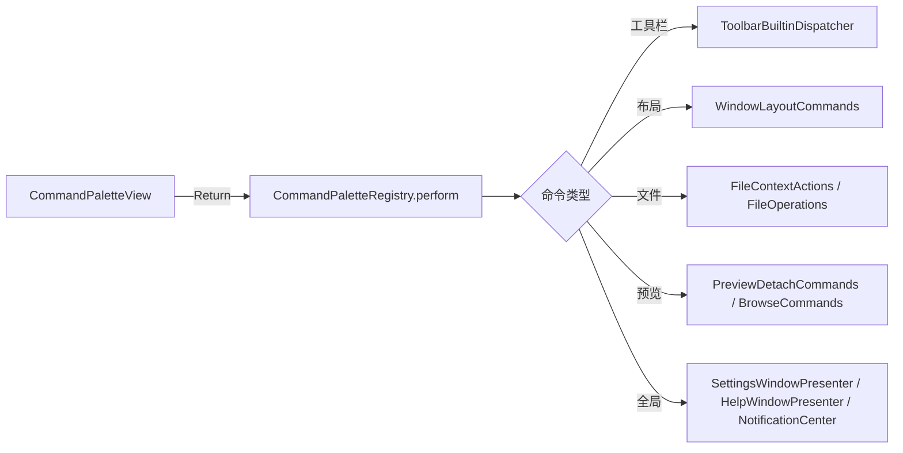

# 快捷命令面板（Command Palette）— 设计方案

> 目标：为 MeoFind 增加与 **Cursor / VS Code** 一致的 **⌘⇧P 快捷命令面板**，用户通过模糊搜索快速执行应用内任意操作，无需记忆菜单路径或快捷键。  
> 本文档基于当前 Explorer 架构（`ContentView`、`FocusedValues`、工具栏 Dispatcher、帮助速查表）编写，可直接拆分为开发 Plan。

---

## 一、背景与目标

### 1.1 参照对象：Cursor 的 Command Palette

Cursor（基于 VS Code）的快捷命令面板核心行为：

| 行为 | 说明 |
|------|------|
| **触发** | `⌘⇧P` 打开；再次 `⌘⇧P` 或 `Esc` 关闭 |
| **形态** | 窗口居中浮层（非独立窗口、非 Sheet），半透明遮罩 + 圆角面板 |
| **搜索框** | 顶部单行输入，占位符如「输入命令名称…」；获得焦点后接管键盘 |
| **空搜索** | 显示「最近使用」命令列表（按使用时间倒序，上限 ~10 条） |
| **有输入** | 对命令标题做 **模糊匹配**（fuzzy match），实时过滤 |
| **列表项** | 左侧命令名；右侧灰色显示快捷键（若有） |
| **导航** | `↑` `↓` 高亮选中项；`Return` 执行；`Esc` 关闭且不执行 |
| **禁用项** | 当前上下文不可执行的命令 **仍显示但置灰**，不可选中执行 |
| **执行后** | 关闭面板；记录到最近使用；部分命令无即时视觉反馈时保持静默 |
| **与 Quick Open 分离** | `⌘P` 打开文件；`⌘⇧P` 仅命令——本应用首版同样分离（文件搜索已有 `⌘F`） |

### 1.2 MeoFind 现状

| 区域 | 现状 |
|------|------|
| 命令入口 | 菜单栏 `Commands`、工具栏按钮、右键菜单、部分隐藏快捷键按钮 |
| 快捷键体系 | 四层：`ExplorerKeyboardShortcuts`、隐藏 Button、`LocalShortcutMonitor`、全局热键 |
| 命令目录 | `AppShortcutRegistry`（设置页只读）、`HelpCheatSheetContent`（功能速查分类） |
| 动作执行 | 分散在 `ContentView` 私有方法、`ToolbarBuiltinDispatcher`、`FocusedValues` 闭包 |
| **⌘⇧P** | **当前未被占用**，可直接注册 |
| Command Palette | **不存在** |

### 1.3 需求目标

1. **快捷键**：`⌘⇧P` 打开/关闭快捷命令面板（与 Cursor 一致）。
2. **搜索执行**：模糊搜索 + 键盘导航，体验对齐 Cursor。
3. **命令覆盖**：聚合菜单、工具栏、面板切换、文件操作、Snippets、设置等 **全部可执行用户操作**。
4. **上下文感知**：根据当前窗口状态（选中文件、预览模式、废纸篓路径等）动态启用/禁用命令。
5. **多语言**：命令标题复用现有 `L10n`，新增面板专属文案进 `Localizable.xcstrings`。
6. **可扩展**：后续可加入收藏夹跳转、Snippet 运行、自定义 Open App 等动态命令。

### 1.4 非目标（首版）

- `⌘P` 式「快速打开文件/路径」面板（已有 `⌘F` 聚焦搜索，另立专项）
- 用户自定义命令或宏录制
- 命令别名在线编辑（关键词写死在注册表）
- iCloud 同步最近使用记录
- 在 Command Palette 内修改快捷键绑定

---

## 二、交互设计

### 2.1 视觉布局（对齐 Cursor）

```
┌─────────────────────────────────────────────────────────────┐
│  🔍  输入命令名称…                                           │  ← 搜索框（自动聚焦）
├─────────────────────────────────────────────────────────────┤
│  切换左侧面板                                    ⌘B         │  ← 高亮选中行
│  连接服务器…                                     ⌘K         │
│  显示 Snippets 面板                              ⌘⇧S        │
│  分离预览                                        ⌘⌥P        │  ← 不可用时置灰
│  删除选中项                                      ⌫          │
│  …                                                          │
└─────────────────────────────────────────────────────────────┘
         ↑ 面板宽约 560pt，最大高度 ~320pt，列表可滚动
```

**遮罩层**：key 窗口内容区上方半透明 `Color.black.opacity(0.25)`，点击遮罩关闭面板。

**面板样式**：
- 圆角 10pt（`continuous`）
- 背景 `NSColor.controlBackgroundColor`，轻阴影
- 相对 **key 窗口内容区** 水平居中、垂直偏上（约 18% 处，与 Cursor 类似）

### 2.2 键盘交互

| 按键 | 行为 |
|------|------|
| `⌘⇧P` | 切换面板开/关 |
| `Esc` | 关闭面板 |
| `↑` `↓` | 在 **可执行** 项间移动选中（跳过 disabled） |
| `Return` | 执行当前选中命令并关闭 |
| 可打印字符 | 写入搜索框，触发过滤 |
| `Backspace` | 删除搜索字符 |
| `⌘A` 等 | 由搜索框处理，不透传给文件列表 |

**焦点隔离**：面板打开时，文件列表 Quick Search、Output 命令框、预览文本编辑 **不得** 消费按键。通过局部 `NSEvent` monitor 或 SwiftUI `@FocusState` + overlay 优先级保证。

### 2.3 搜索与排序

**模糊匹配算法**（与 VS Code 同类，首版可实现简化版）：
- 查询字符按顺序出现在命令标题中即匹配（不区分大小写）
- 连续匹配、词首匹配加分
- 匹配 `keywords` 数组（英文 id、中文别名，如「删除」→ `delete`）

**排序优先级**（有查询时）：
1. 标题前缀匹配
2. 标题子串连续匹配
3. 关键词匹配
4. 字母序

**无查询时**：显示 `CommandPaletteRecentsStore` 最近使用（最多 10 条）；若不足，用「常用命令」静态种子列表补足（见 §4.3）。

### 2.4 空状态与无结果

| 状态 | 展示 |
|------|------|
| 无查询、无最近记录 | 分组标题「常用命令」+ 种子列表 |
| 有查询、零匹配 | 单行「未找到匹配的命令」 |
| 唯一匹配 | 自动选中该项 |

---

## 三、命令体系设计

### 3.1 核心类型

```swift
/// 命令唯一标识，稳定字符串，用于最近使用持久化
struct CommandPaletteID: Hashable, Codable, RawRepresentable {
    let rawValue: String
}

/// 命令展示与执行条目
struct CommandPaletteItem: Identifiable {
    let id: CommandPaletteID
    let title: String              // 运行时 L10n 解析后的标题
    let category: String           // 分组/排序用，L10n.Help.sectionTitle
    let keywords: [String]         // 搜索增强
    let shortcutDisplay: String?   // 右侧展示，如 "⌘⇧S"
    let priority: Int              // 默认可选排序权重
    let isEnabled: (CommandPaletteContext) -> Bool
    let perform: (CommandPaletteContext) -> Void
}

/// 执行上下文：从 key 窗口的 ContentView 注入
struct CommandPaletteContext {
    let layout: ExplorerWindowLayoutState
    let path: URL?
    let selection: [URL]
    let previewState: PreviewCommandContext?
    // 闭包桥接现有 dispatcher
    let toolbarPerform: (ToolbarBuiltinID) -> Void
    let fileActions: FileContextActions
    let windowLayout: WindowLayoutCommands
    let previewDetach: PreviewDetachCommands?
    // …
}
```

### 3.2 注册表：`CommandPaletteRegistry`

单一真相来源，静态声明所有命令；**禁止**在 View 层散落 `perform` 逻辑。

```swift
enum CommandPaletteRegistry {
    static func allItems() -> [CommandPaletteItem] { … }
    static func enabledItems(context: CommandPaletteContext) -> [CommandPaletteItem]
    static func filter(_ items: [CommandPaletteItem], query: String) -> [CommandPaletteItem]
}
```

**与现有资产关系**：

| 现有资产 | 复用方式 |
|----------|----------|
| `HelpCheatSheetContent.sections` | 命令 `category` 与 entry 覆盖范围 |
| `AppShortcutRegistry.entries` | `shortcutDisplay` 来源 |
| `L10n.Help.entryName(id)` | 静态命令 `title` |
| `L10n.Action.*` / `L10n.Menu.*` / `L10n.Toolbar.*` | 菜单/工具栏类命令标题 |
| `ToolbarBuiltinID` + `ToolbarBuiltinDispatcher` | 工具栏类命令 `perform` |
| `FocusedValues` 各 `*Commands` | 面板切换、预览分离等 |

### 3.3 命令分类与清单（首版）

#### 导航（navigation）

| ID | 标题来源 | 快捷键 | 启用条件 |
|----|----------|--------|----------|
| `focus_search` | `L10n` / help `global_search` | ⌘F | 始终 |
| `back` | `L10n.Action.back` | ⌘[ | `canGoBack` |
| `forward` | `L10n.Action.forward` | ⌘] | `canGoForward` |
| `go_up` | `L10n.Action.goUp` | — | 非根路径 |
| `connect_server` | `L10n.Menu.connectServer` | ⌘K | 始终 |
| `new_window` | `L10n.Toolbar.newWindow` | ⌘N | 始终 |
| `new_tab` | `L10n.Toolbar.newTab` | 可配置 | 始终 |
| `show_all_tabs` | `L10n.Toolbar.showAllTabs` | ⌘⇧\ | 多标签时 |

#### 面板与布局（panels / layout）

| ID | 标题 | 快捷键 |
|----|------|--------|
| `toggle_left_panel` | 切换左侧面板 | ⌘B |
| `toggle_right_panel` | 切换右侧面板 | ⌘⇧B |
| `toggle_preview` | 显示/隐藏预览 | — |
| `toggle_snippets` | Snippets 面板 | ⌘⇧S |
| `toggle_git` | Git 面板 | ⌘⇧G |
| `toggle_output` | Output 面板 | ⌘J |
| `detach_preview` | 分离预览 | ⌘⌥P |
| `dock_preview` | 停靠预览 | — |
| `toggle_preview_strip` | 展开/折叠预览条 | ⌘⌥B |
| `preview_previous` / `preview_next` | 预览上/下一张 | — |

#### 文件操作（files）

| ID | 启用条件摘要 |
|----|--------------|
| `open` | 有选中项 |
| `open_new_window` | 有选中项 |
| `open_with` | 有选中项（执行时弹应用选择或最近应用子菜单——首版执行默认「打开方式」流程） |
| `cut` / `copy` / `paste` | 依 `FileCommandHandlers.can*` |
| `delete` | 有选中且可删 |
| `rename` | 单选 |
| `copy_path` | 有选中 |
| `new_folder` / `new_file` | 可写目录 |
| `compress` / `extract` | 选中项类型匹配 |
| `show_info` | 有选中 |
| `open_terminal` | 有效路径 |
| `empty_trash` | 废纸篓上下文 |
| `put_back` | 废纸篓内选中 |
| `refresh` | 网络卷等 |

#### 视图（view）

| ID | 说明 |
|----|------|
| `view_list` / `view_thumbnail` / `view_panorama` | 切换视图模式 |
| `toggle_hidden_files` | 显示/隐藏隐藏文件 |
| `customize_toolbar` | 打开工具栏自定义 |

#### Snippets / Output

| ID | 说明 |
|----|------|
| `import_snippets` / `export_snippets` | NotificationCenter 现有入口 |
| `toggle_operation_recording` | 操作录制 |
| `focus_output_command` | Output 命令框聚焦 |

#### 系统（system）

| ID | 快捷键 |
|----|--------|
| `open_settings` | ⌘, |
| `open_help_cheat_sheet` | ⌘? |
| `show_command_palette` | ⌘⇧P（列表中显示，执行无操作或关闭再开） |

#### 动态命令（Phase 2）

| 类型 | 来源 |
|------|------|
| 收藏夹跳转 | `FavoritesStore` 条目 |
| 运行 Snippet | 当前 scope 可用 snippets |
| 工具栏 Open App | `ToolbarCustomizationStore` 用户配置 |
| 最近访问路径 | `PathHistory` |

### 3.4 常用命令种子（无查询默认展示）

首版静态列表（顺序即展示顺序）：

1. `focus_search`
2. `toggle_left_panel`
3. `toggle_snippets`
4. `connect_server`
5. `new_tab`
6. `open_settings`
7. `customize_toolbar`
8. `open_help_cheat_sheet`

---

## 四、架构设计

### 4.1 模块与文件规划

```
Sources/Explorer/CommandPalette/
├── CommandPaletteItem.swift          # 数据模型
├── CommandPaletteContext.swift       # 上下文与构建器
├── CommandPaletteRegistry.swift      # 静态命令表 + 过滤
├── CommandPaletteFuzzyMatcher.swift  # 模糊搜索
├── CommandPaletteRecentsStore.swift  # 最近使用 UserDefaults
├── CommandPaletteView.swift          # SwiftUI 面板 UI
├── CommandPalettePresenter.swift     # 显示/隐藏、key 窗口定位
└── CommandPaletteKeyboardMonitor.swift # 可选：Esc/方向键兜底
```

### 4.2 集成点

```
ExplorerApp
  └── explorerCommands（可选：菜单「查看 → 命令面板…」⌘⇧P）

ContentView
  ├── .overlay { CommandPaletteOverlay }   // 或由 Presenter 管理 NSPanel
  ├── 构建 CommandPaletteContext（与 fileCommandHandlers 同源数据）
  ├── 隐藏 Button .keyboardShortcut(⌘⇧P)  // 与 ⌘F 同模式
  └── focusedValue 不变，perform 时调用既有闭包

CommandPalettePresenter
  ├── show(context:) / dismiss()
  ├── 绑定 key window（ActiveWindowLayoutCenter）
  └── 打开时注册 local event monitor；关闭时移除
```

**推荐 UI 载体**：SwiftUI `ZStack` overlay 挂在 `ContentView` 根节点（与 Cursor 一致，非独立 `NSWindow`）。  
若 AppKit 文件列表抢焦点无法完全阻断，再升级为 `NSPanel`（`.nonactivatingPanel` + `.floating`）由 `CommandPalettePresenter` 管理。

### 4.3 动作执行路径（避免重复实现）



**原则**：Palette 只做 **路由**，不复制业务逻辑。若 `ContentView` 中某动作尚无共享入口，**先提取**到现有 Dispatcher 或 `*Actions` 结构，再注册命令。

### 4.4 多窗口策略

- 仅 **key window** 响应 `⌘⇧P`。
- `CommandPaletteContext` 从该窗口的 `ContentView` 实例构建（`FocusedValues` 已按 key window 路由）。
- 非 key 窗口不显示 overlay。

### 4.5 与文本编辑态的协调

| 场景 | 行为 |
|------|------|
| 文件列表 Quick Search 激活 | `⌘⇧P` 仍打开面板（Quick Search 退出或面板优先） |
| 预览文本编辑中 | 面板打开；`Esc` 先关面板，不退出编辑 |
| Output 命令框聚焦 | 同左 |
| 系统设置窗口 | 不显示 Explorer palette（无 ContentView） |

参考现有 `TextEditingSupport` / `previewTextEditActive` 模式，面板可见时设置 `commandPaletteActive` 环境标志，供 `LocalShortcutMonitor` 跳过冲突绑定。

---

## 五、UI 实现要点

### 5.1 `CommandPaletteView`

- `@State query: String` — 搜索文本
- `@State selectedIndex: Int` — 当前高亮行
- `List` 或 `ScrollView` + `LazyVStack`；行高 28–32pt
- 行视图 `CommandPaletteRow`：左 `title`，右 `shortcutDisplay`（`.secondary`、`.caption`）
- 选中行：`.background(accentColor.opacity(0.15))` 或 `NSColor.selectedContentBackgroundColor`
- disabled：`foregroundStyle(.tertiary)`，`allowsHitTesting(false)`

### 5.2 搜索框

- `TextField`，样式 `.plain` 或自定义圆角边框
- 左侧 SF Symbol `command` 或 `magnifyingglass`
- placeholder：`L10n.CommandPalette.placeholder`

### 5.3 动画

- 出现：`opacity` + `scale(0.98→1)`，150ms easeOut
- 消失：反向 120ms
- 与 Cursor 一致的轻量感，避免 Spring 过度弹跳

---

## 六、国际化（i18n）

### 6.1 新增键（`Localizable.xcstrings` + `L10n.swift`）

| 键 | en | zh-Hans |
|----|-----|---------|
| `command_palette.placeholder` | Type a command name… | 输入命令名称… |
| `command_palette.no_results` | No matching commands | 未找到匹配的命令 |
| `command_palette.recents_section` | Recently used | 最近使用 |
| `command_palette.common_section` | Common commands | 常用命令 |
| `command_palette.menu_title` | Command Palette… | 命令面板… |

命令 **标题** 优先复用 `L10n.Action` / `L10n.Menu` / `L10n.Help.entryName`，不重复翻译。

### 6.2 测试

`Tests/ExplorerTests/CommandPaletteTests.swift`：
- 模糊匹配排序
- `enabledItems` 在模拟上下文下的启用/禁用
- `L10n.CommandPalette.*` 不等于键名

---

## 七、持久化

### 7.1 最近使用

```swift
// UserDefaults key: AppPreferences.commandPaletteRecents
// 值: [CommandPaletteID] 最多 10 条，LRU
```

执行成功后：`CommandPaletteRecentsStore.record(id)`。

### 7.2 不持久化

- 上次搜索文本（Cursor 亦不持久化）
- 面板位置（始终居中）

---

## 八、菜单与发现性

在 `ExplorerApp.explorerCommands` 增加（建议放在 `CommandGroup(after: .sidebar)` 或新建「查看」组）：

| 菜单项 | 快捷键 |
|--------|--------|
| 命令面板… | ⌘⇧P |

同时在 `AppShortcutRegistry` 增加 `command_palette` 条目，设置页快捷键列表可见。

---

## 九、实施计划（Phase 拆分）

### Phase A — 最小可用（MVP）

| 任务 | 文件 | 估时 |
|------|------|------|
| A1 数据模型 + Registry 静态表（~30 条核心命令） | `CommandPalette*.swift` | 1d |
| A2 FuzzyMatcher + filter 单测 | 同上 + Tests | 0.5d |
| A3 CommandPaletteView UI | `CommandPaletteView.swift` | 1d |
| A4 ContentView overlay + ⌘⇧P + Context 构建 | `ContentView.swift` | 0.5d |
| A5 执行路由接 Toolbar / WindowLayout / 部分 FileActions | Registry perform | 1d |
| A6 i18n + L10nTests | `Localizable.xcstrings`, `L10n.swift` | 0.25d |
| A7 最近使用 Store | `CommandPaletteRecentsStore.swift` | 0.25d |

**验收**：`⌘⇧P` 打开面板；可搜索「删除」「snippet」「设置」并执行；`Esc` 关闭；多窗口仅 key window 响应。

### Phase B — 覆盖补全

- 补全 §3.3 全部命令
- 上下文 `isEnabled` 精细对齐菜单 `can*` 逻辑
- 动态命令：收藏夹跳转、可运行 Snippets
- 菜单项 + `AppShortcutRegistry` 注册

### Phase C — 体验打磨

- 自定义 Open App 动态项
- 命令执行结果 toast（可选）
- 与 Help 速查表互相跳转（「查看所有快捷键 ⌘?」footer 提示）
- 性能：命令数 >100 时虚拟化列表

---

## 十、风险与对策

| 风险 | 对策 |
|------|------|
| 动作逻辑困在 `ContentView` 私有方法 | Phase A 先提取 5–10 个高频动作到共享 Dispatcher；其余迭代迁移 |
| FileList Quick Search 抢键 | 面板打开时 `NSEvent` monitor 优先；或暂停 Quick Search |
| 禁用态与 Cursor 不一致 | 统一「显示但置灰」，不隐藏，便于用户学习命令存在 |
| `AppShortcutRegistry` 与代码快捷键双源 | Palette 展示以 Registry 为准；可配置项读 `ShortcutSettingsStore` 实时值 |
| 翻译遗漏 | 命令标题走 `L10n`；CI 已有 `L10nTests` 模式扩展 |

---

## 十一、与现有功能的关系

| 功能 | 关系 |
|------|------|
| **功能速查表（⌘?）** | 只读参考；Palette 为 **执行** 入口。速查表可保留，互不替代 |
| **工具栏自定义** | Palette 提供 `customize_toolbar` 命令直达 |
| **文件 Quick Search** | 列表内打字过滤文件，与命令面板独立；快捷 ⌘F vs ⌘⇧P 分工明确 |
| **全局显示/隐藏（⌘⌥Space）** | 全局热键，不纳入 Palette（应用隐藏时无窗口） |

---

## 十二、关键文件索引

```
Sources/Explorer/ContentView.swift
Sources/Explorer/AppModule.swift
Sources/Explorer/ExplorerKeyboardShortcuts.swift
Sources/Explorer/Shortcuts/AppShortcutRegistry.swift
Sources/Explorer/Help/HelpCheatSheetContent.swift
Sources/Explorer/Toolbar/ExplorerToolbarEnvironment.swift
Sources/Explorer/ExplorerWindowLayoutState.swift
Sources/Explorer/L10n.swift
Sources/Explorer/Resources/Localizable.xcstrings
docs/i18n-design.md
```

---

*文档版本：2026-07-13 · 首版设计，待评审后进入 Phase A 开发。*
