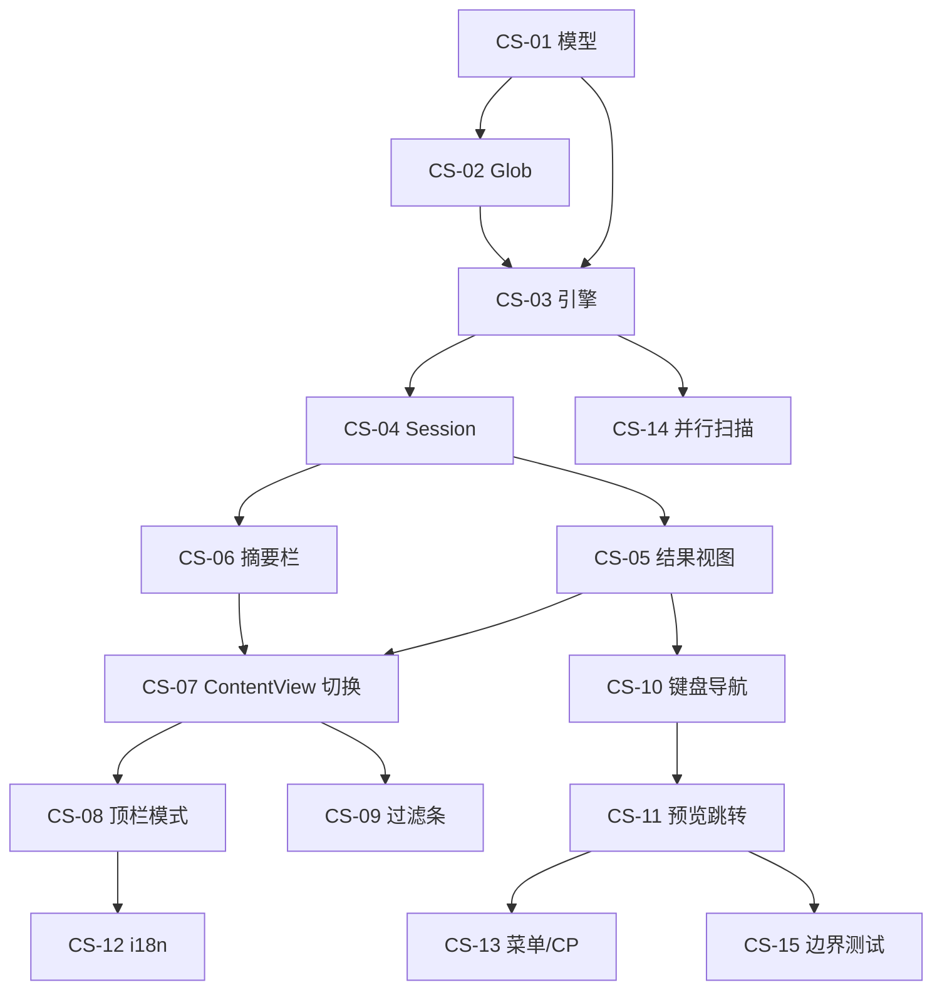

# 当前目录全文搜索（方案 A）— 开发计划

> 依据：[directory-content-search-design.md](./directory-content-search-design.md)  
> 目标：分阶段交付「顶栏内容搜索 → 主区域结果视图 → 过滤 → 预览联动 → 体验打磨」完整闭环；首版聚焦纯文本类文件与子串匹配。

---

## 总览

| Phase | 主题 | Issue 数 | 预估 | 用户可见 |
|-------|------|----------|------|----------|
| **P1** | 模型 + 搜索引擎 + 结果视图 MVP | 6 | 3–4 天 | 是 |
| **P2** | 顶栏模式 + 过滤条 + ContentView 集成 | 5 | 2–3 天 | 是 |
| **P3** | 预览联动 + 键盘导航 + Quick Search 互斥 | 4 | 2 天 | 是 |
| **P4** | i18n + 菜单/Command Palette + Help | 3 | 1 天 | 是 |
| **P5** | 并行扫描 + 性能 + 边界打磨 | 4 | 1.5–2 天 | 部分 |
| **P6** | 进阶（正则、PDF、grep 后端）— 可选 | 3 | 2–3 天 | 部分 |

**MVP 定义（P1 + P2 + P3）**：用户可通过顶栏切到内容模式、输入关键词、在主区域看到分组结果、Enter 打开预览并跳转。  
**完整首版（P1–P5）**：含过滤、快捷键、i18n、大目录进度与取消。

---

## 依赖关系

---

## P1：模型 + 搜索引擎 + 结果视图 MVP

> 原则：不改动顶栏 UI；可通过 Preview/单元测试驱动 Session；主区域可临时用 `#Preview` 或 debug 按钮触发。

### CS-01：数据模型与 Filter 默认值

**类型**：feature  
**依赖**：无  
**文件**：

- `Sources/Explorer/DirectoryContentSearch/DirectoryContentSearchModels.swift`（新建）
- `Sources/Explorer/DirectoryContentSearch/DirectoryContentSearchFilter.swift`（新建）
- `Tests/ExplorerTests/DirectoryContentSearchModelsTests.swift`（新建）

**任务**：

- [ ] 定义 `DirectorySearchMode`、`ContentSearchFilter`、`ContentSearchMatch`、`ContentSearchFileGroup`、`ContentSearchProgress`
- [ ] `ContentSearchFilter.default`：exclude `node_modules/**`、`.git/**`；`includesSubdirectories = true`；`maxFileSizeBytes = 2MB`；`maxMatchCount = 200`
- [ ] `ContentSearchFilter` Codable，供 `@AppStorage` 持久化
- [ ] 单元测试：默认值、Equatable、Codable 往返

**验收**：

- 模型可在测试中被构造并序列化

---

### CS-02：Glob 匹配器

**类型**：feature  
**依赖**：CS-01  
**文件**：

- `Sources/Explorer/DirectoryContentSearch/ContentSearchGlobMatcher.swift`（新建）
- `Tests/ExplorerTests/ContentSearchGlobMatcherTests.swift`（新建）

**任务**：

- [ ] `matches(path:relativeTo:includePatterns:excludePatterns:) -> Bool`
- [ ] 支持 `*`、`**`（至少 `**/` 前缀语义）
- [ ] 无 include 时视为 `*`；exclude 优先
- [ ] 测试：`*.swift`、`**/Tests/**`、排除 `node_modules`、大小写路径

**验收**：

- 覆盖设计文档 §3.5 示例 pattern

---

### CS-03：搜索引擎（原生行扫描）

**类型**：feature  
**依赖**：CS-01, CS-02  
**文件**：

- `Sources/Explorer/DirectoryContentSearch/DirectoryContentSearchEngine.swift`（新建）
- `Tests/ExplorerTests/DirectoryContentSearchEngineTests.swift`（新建）

**任务**：

- [ ] `actor DirectoryContentSearchEngine`
- [ ] `enumerateFiles(root:filter:showHiddenFiles:)` — 递归或非递归由 `includesSubdirectories` 控制
- [ ] 扩展名过滤：复用 `PreviewTypeClassifier.isTextFile || isCodeFile`
- [ ] `scanFile`：读 UTF-8（失败 fallback）；按行 `PreviewTextSearchHighlighter.findMatchRanges`；每行生成 `ContentSearchMatch`
- [ ] `runSearch(request:generation:)` — 检查 generation 取消；更新 progress；达到 `maxMatchCount` 时 `wasTruncated = true`
- [ ] 单文件超过 `maxFileSizeBytes` 跳过
- [ ] 测试：临时目录 fixture（3 个文件、多行匹配）；取消 generation；截断上限

**验收**：

- 测试不依赖 UI；`swift test --filter DirectoryContentSearchEngine` 通过

---

### CS-04：Session（debounce + 取消 + 分组）

**类型**：feature  
**依赖**：CS-03  
**文件**：

- `Sources/Explorer/DirectoryContentSearch/DirectoryContentSearchSession.swift`（新建）
- `Tests/ExplorerTests/DirectoryContentSearchSessionTests.swift`（新建）

**任务**：

- [ ] `@MainActor DirectoryContentSearchSession: ObservableObject`
- [ ] `query` 变化 debounce 300ms 触发 `search(root:showHiddenFiles:)`
- [ ] `cancel()`：递增 generation，清空进行中 Task
- [ ] 结果聚合为 `groups: [ContentSearchFileGroup]`；维护 `flattenedMatches`
- [ ] `selectNextMatch(forward:)`、`selectedMatchID`
- [ ] `toggleGroupExpansion(fileID:)`
- [ ] 测试：debounce 可用 mock clock 或直调 `search`；分组数、flat 顺序

**验收**：

- Session 在 query 清空时 `groups = []`、`progress.isComplete = false`

---

### CS-05：结果视图 UI

**类型**：feature  
**依赖**：CS-04  
**文件**：

- `Sources/Explorer/DirectoryContentSearch/DirectoryContentSearchResultsView.swift`（新建）
- `Sources/Explorer/DirectoryContentSearch/DirectoryContentSearchFileGroupView.swift`（新建）
- `Sources/Explorer/DirectoryContentSearch/DirectoryContentSearchMatchRowView.swift`（新建）

**任务**：

- [ ] `DirectoryContentSearchResultsView`：`ScrollView` + `LazyVStack`
- [ ] 空态：无结果 copy（暂用英文字符串，P4 换 L10n）
- [ ] `FileGroupView`：chevron、图标、`FileItem` 图标加载复用现有 helper
- [ ] `MatchRowView`：行号 + snippet + 高亮（`FileListTextHighlight` 或 inline AttributedString）
- [ ] 选中行背景；`ScrollViewReader` + `scrollTo(selectedMatchID)`
- [ ] 搜索中：顶部 `ProgressView`（indeterminate 或比例）

**验收**：

- SwiftUI Preview 可展示 mock groups；选中行可见

---

### CS-06：摘要栏

**类型**：feature  
**依赖**：CS-04  
**文件**：

- `Sources/Explorer/DirectoryContentSearch/DirectoryContentSearchSummaryBar.swift`（新建）

**任务**：

- [ ] 完成态：`N files · M matches · Xs`
- [ ] 进行中：`Scanned a/b files · M matches`
- [ ] 截断提示、`wasCancelled` 时不显示错误
- [ ] 右侧「下一个匹配」按钮（调用 `session.selectNextMatch(forward: true)`）

**验收**：

- 与 ResultsView 组合布局正确（footer 或 header sticky）

---

## P2：顶栏模式 + 过滤条 + ContentView 集成

### CS-07：ContentView 主区域切换

**类型**：feature  
**依赖**：CS-05, CS-06  
**文件**：

- `Sources/Explorer/ContentView.swift`（修改）
- `Sources/Explorer/FileListView.swift`（修改，如需）

**任务**：

- [ ] `@StateObject private var contentSearchSession = DirectoryContentSearchSession()`
- [ ] `@State private var searchMode: DirectorySearchMode` + `@AppStorage` 持久化
- [ ] `@State private var contentQuery: String`（与 `searchText` 分离）
- [ ] 计算属性 `shouldShowContentSearchResults`：`searchMode == .content && !contentQuery.isEmpty`
- [ ] `explorerBrowserColumn`：`PathBar` 下条件渲染 ResultsView / FileListView
- [ ] `path` onChange：`contentSearchSession.cancel()`；清空 query 或保留（首版：**清空 query**）
- [ ] 150ms 切换动画

**验收**：

- 手动设 `searchMode = .content` + query 可看到结果视图
- 切换路径搜索结果消失

---

### CS-08：顶栏搜索模式选择器

**类型**：feature  
**依赖**：CS-07  
**文件**：

- `Sources/Explorer/DirectoryContentSearch/DirectoryContentSearchModePicker.swift`（新建）
- `Sources/Explorer/ContentView.swift`（修改 toolbar `searchContent`）

**任务**：

- [ ] 模式下拉：`文件名` / `内容`
- [ ] 文件名模式：`BarTextField` 绑定 `$searchText`（现有 prompt）
- [ ] 内容模式：绑定 `$contentQuery`；同步到 `contentSearchSession.query`
- [ ] 模式切换：切到文件名 → cancel + 清 contentQuery；切到内容 → 清 searchText
- [ ] 隐藏 Button + `.keyboardShortcut("f", modifiers: [.command, .shift])` → `⌘⇧F`

**验收**：

- `⌘F` 仍聚焦搜索；`⌘⇧F` 切内容模式并聚焦
- 文件名过滤行为与改版前一致

---

### CS-09：过滤条 UI

**类型**：feature  
**依赖**：CS-07  
**文件**：

- `Sources/Explorer/DirectoryContentSearch/DirectoryContentSearchFilterBar.swift`（新建）
- `Sources/Explorer/ContentView.swift`（修改）

**任务**：

- [ ] 内容模式下 PathBar 与主区域之间显示（`filterExpanded` toggle）
- [ ] 包含/排除 TextField（空格分隔 glob）
- [ ] Toggle：子目录、区分大小写
- [ ] Picker：最大文件大小（512KB / 2MB / 10MB）、最大匹配数（100 / 200 / 500）
- [ ] 变更 filter → 若 query 非空则重新 search
- [ ] `@AppStorage` 持久化 filter

**验收**：

- 输入 `*.md` 后仅 markdown 文件出现在结果中
- 取消「包含子目录」仅搜当前层

---

### CS-10：引擎接入 filter 选项

**类型**：feature  
**依赖**：CS-03, CS-09  
**文件**：

- `Sources/Explorer/DirectoryContentSearch/DirectoryContentSearchEngine.swift`（修改）
- `Tests/ExplorerTests/DirectoryContentSearchEngineTests.swift`（修改）

**任务**：

- [ ] `caseSensitive` 传给 `findMatchRanges`（或 parallel 实现）
- [ ] `includesSubdirectories == false` 时只扫描 root 层文件（仍 respect glob）
- [ ] `showHiddenFiles == false` 时跳过 hidden
- [ ] 测试：case sensitive、非递归

**验收**：

- CS-09 UI 改动实际影响扫描结果

---

### CS-11：默认展开策略

**类型**：polish  
**依赖**：CS-05  
**文件**：

- `Sources/Explorer/DirectoryContentSearch/DirectoryContentSearchSession.swift`（修改）
- `DirectoryContentSearchFileGroupView.swift`（修改）

**任务**：

- [ ] 搜索完成：前 5 个 file group `isExpanded = true`，其余 false
- [ ] 选中匹配所在 group 自动展开
- [ ] 记住用户手动折叠（会话内字典，不持久化）

**验收**：

- 第 6 个文件默认折叠；选中其中匹配时自动展开

---

## P3：预览联动 + 键盘导航 + Quick Search 互斥

### CS-12：预览跳转到匹配行

**类型**：feature  
**依赖**：CS-07, CS-05  
**文件**：

- `Sources/Explorer/Preview/PreviewSession+ContentSearchJump.swift`（新建）
- `Sources/Explorer/Preview/PreviewSession+ToolbarText.swift` 或 `PreviewTextState`（修改）
- `Sources/Explorer/ContentView.swift`（修改）
- `Tests/ExplorerTests/PreviewContentSearchJumpTests.swift`（新建）

**任务**：

- [ ] `PreviewSession.revealContentSearchMatch(_:query:)`
- [ ] 设置 `text.searchQuery`；加载完成后 `scrollToLine(lineNumber:)`（新增 API）
- [ ] 定位 `searchCurrentIndex` 到该行第一个匹配
- [ ] ResultsView：`onSelectMatch` → 更新 `selection`、 `showPreview = true`、调用 reveal
- [ ] 测试：mock 文本内容，断言 line scroll API 被调用

**验收**：

- Enter 匹配行后预览区显示对应行且关键词高亮

---

### CS-13：结果视图键盘导航

**类型**：feature  
**依赖**：CS-05, CS-12  
**文件**：

- `Sources/Explorer/DirectoryContentSearch/DirectoryContentSearchKeyboardMonitor.swift`（新建）
- `DirectoryContentSearchResultsView.swift`（修改）

**任务**：

- [ ] `↑↓`：`selectNextMatch` 在 `flattenedMatches` 上移动
- [ ] `Enter`：触发 CS-12
- [ ] `⌘G` / `⌘⇧G`：全局下一/上一匹配
- [ ] `Space`：`showPreview = true`
- [ ] `←→`：折叠/展开当前 group
- [ ] `Esc`：清 query、切文件名模式或仅清结果（与设计 §2.2 一致：**清 query 回列表**）
- [ ] 结果视图可见时注册 local monitor；关闭时移除

**验收**：

- 键盘流无需鼠标即可完成搜索→跳转

---

### CS-14：Quick Search 互斥

**类型**：feature  
**依赖**：CS-07  
**文件**：

- `Sources/FileList/FileListInteractionCoordinator.swift`（修改）
- `Sources/FileList/FileListTableInteraction.swift`（修改）
- `Sources/Explorer/ContentView.swift`（修改）

**任务**：

- [ ] `FileListTableInteraction` 增加 `isContentSearchActive: Bool`
- [ ] `handleQuickSearchKeys`：若 active，直接 return false（不消费字母键）
- [ ] ContentView 传入：`searchMode == .content && !contentQuery.isEmpty`
- [ ] 内容搜索时列表不可见，但缩略图/panorama 切换路径需一致

**验收**：

- 内容搜索结果展示时，列表区不存在误触 Quick Search（回归 FileListInteractionCoordinatorTests）

---

### CS-15：全局 ⌘G 与预览内搜索协调

**类型**：feature  
**依赖**：CS-12, CS-13  
**文件**：

- `Sources/Explorer/DirectoryContentSearch/DirectoryContentSearchSession.swift`（修改）
- `Sources/Explorer/Preview/PreviewTextSearchKeyboard.swift`（修改，可选）

**任务**：

- [ ] 定义优先级：结果视图聚焦时 `⌘G` 走 global；预览搜索框聚焦时走文件内
- [ ] `DirectoryContentSearchSession` 暴露 `currentGlobalIndex` / `matchCount`
- [ ] 预览内搜索不覆盖 global index（或 Enter 从 global 跳转到 preview 时同步）

**验收**：

- 结果列表按 ⌘G 跨文件循环；预览聚焦搜索框时 ⌘G 仅文件内

---

## P4：i18n + 菜单 + Command Palette + Help

### CS-16：国际化

**类型**：feature  
**依赖**：CS-05, CS-08, CS-09  
**文件**：

- `Sources/Explorer/Resources/Localizable.xcstrings`（修改）
- `Sources/Explorer/L10n.swift`（修改）
- `Tests/ExplorerTests/L10nTests.swift`（修改）

**任务**：

- [ ] 写入设计文档 §6.1 全部键（en + zh-Hans，`state: translated`）
- [ ] `L10n.Search` 扩展
- [ ] 替换 ResultsView / FilterBar / ModePicker 硬编码字符串
- [ ] L10nTests 覆盖关键新键

**验收**：

- 中/英切换无键名泄露

---

### CS-17：菜单与 AppShortcutRegistry

**类型**：feature  
**依赖**：CS-08  
**文件**：

- `Sources/Explorer/ExplorerApp.swift`（修改）
- `Sources/Explorer/AppShortcutRegistry.swift`（修改）
- `Sources/Explorer/Help/HelpCheatSheetContent.swift`（修改）

**任务**：

- [ ] 菜单「编辑 → 在文件夹中查找…」`⌘⇧F`
- [ ] `AppShortcutRegistry` 增加 `find_in_folder`
- [ ] Help 速查表 `content_search` 条目

**验收**：

- 设置页快捷键列表可见；Help 可查到

---

### CS-18：Command Palette 注册

**类型**：feature  
**依赖**：CS-08  
**文件**：

- `Sources/Explorer/CommandPalette/CommandPaletteRegistry.swift`（修改）

**任务**：

- [ ] 新增 `find_in_folder`：`perform` → 切内容模式 + `activeBarField = .search`
- [ ] keywords：`["search", "grep", "find", "搜索", "查找", "全文"]`

**验收**：

- `⌘⇧P` 输入「文件夹」可执行

---

## P5：并行扫描 + 性能 + 边界打磨

### CS-19：并行文件扫描

**类型**：perf  
**依赖**：CS-03  
**文件**：

- `DirectoryContentSearchEngine.swift`（修改）

**任务**：

- [ ] `TaskGroup` 并发读文件（默认 4 worker）
- [ ] 结果 batch 合并到 MainActor（每 50ms 或每 20 matches）
- [ ] 网络卷检测（可选）：`DirectorySizeVolumeFilter.isNetworkVolume` 降并发为 2

**验收**：

- 1 万文件 fixture 模拟（或 partial）无明显 UI 卡顿

---

### CS-20：搜索取消与 Esc 链路

**类型**：polish  
**依赖**：CS-04, CS-13  
**文件**：

- `DirectoryContentSearchSession.swift`（修改）
- `ContentView.swift`（修改）

**任务**：

- [ ] 搜索框 Esc：内容模式清空 query
- [ ] 搜索中 Esc：cancel 进行中的 scan
- [ ] 窗口 close / tab 切换：cancel
- [ ] `progress.wasCancelled` UI 提示（可选，静默亦可）

**验收**：

- 大目录搜索中途 Esc 1s 内停止追加结果

---

### CS-21：二进制/NUL 检测

**类型**：fix  
**依赖**：CS-03  
**文件**：

- `DirectoryContentSearchEngine.swift`（修改）
- `DirectoryContentSearchEngineTests.swift`（修改）

**任务**：

- [ ] 读前 8KB：含 NUL 则视为二进制跳过
- [ ] 扩展名不在白名单但用户强制 include 时仍跳过二进制

**验收**：

- `.png` 误命名 `.txt` 不被扫描

---

### CS-22：集成与回归测试

**类型**：test  
**依赖**：P1–P4  
**文件**：

- `Tests/ExplorerTests/DirectoryContentSearchIntegrationTests.swift`（新建）
- `Tests/FileListTests/FileListInteractionCoordinatorTests.swift`（修改）

**任务**：

- [ ] 集成：临时目录 + Session + Engine 端到端
- [ ] Quick Search 互斥回归
- [ ] Glob + exclude 组合 case

**验收**：

- `swift test` 全通过

---

## P6：进阶能力（可选，后续迭代）

### CS-23：正则搜索

**依赖**：CS-09, CS-03  
**估时**：1 天  

- [ ] 过滤条「正则」Toggle
- [ ] 无效正则 inline 错误
- [ ] 单测：`\d+`、`(?i)todo`

---

### CS-24：PDF / Office 文本抽取

**依赖**：CS-12  
**估时**：1.5–2 天  

- [ ] PDF：`PDFDocument` 按页抽文本
- [ ] Office：仅 `.text` 模式或已有 `textContent` 路径
- [ ] 性能限制更严（10MB）

---

### CS-25：rg / grep 后端（可选）

**依赖**：CS-03  
**估时**：1 天  

- [ ] 设置项「使用 ripgrep（若已安装）」
- [ ] 解析 `-n` 输出映射到 `ContentSearchMatch`
- [ ] 失败 fallback 原生引擎

---

## 里程碑与排期建议

| 里程碑 | 包含 Issue | 目标日期（参考） | 交付物 |
|--------|------------|------------------|--------|
| **M1 内部 Demo** | CS-01 – CS-06 | 第 1 周末 | Preview 可展示搜索结果 |
| **M2 可交互 Alpha** | CS-07 – CS-11 | 第 2 周中 | 顶栏切换 + 过滤 + 主区域替换 |
| **M3 Beta** | CS-12 – CS-18 | 第 2 周末 | 预览跳转 + 快捷键 + i18n |
| **M4 首版发布** | CS-19 – CS-22 | 第 3 周 | 性能 + 测试 + 文档 |
| **M5 进阶** | CS-23 – CS-25 | 按需 | 正则 / 二进制格式 / rg |

**总估时（P1–P5）**：约 **9.5–12 人日**（1 人约 2–2.5 周）。

---

## 测试策略

| 层级 | 范围 | 命令 |
|------|------|------|
| 单元 | Glob、Engine、Session、L10n | `swift test --filter DirectoryContentSearch` |
| 单元 | Quick Search 互斥 | `swift test --filter FileListInteractionCoordinator` |
| 单元 | 预览跳转 | `swift test --filter PreviewContentSearchJump` |
| 手动 | 中英文 UI | 系统语言切换 |
| 手动 | 大目录 | 含 `node_modules` 的 repo 根目录 |
| 手动 | 预览联动 | Enter / ⌘G 跨文件 |

---

## 手动测试清单（首版发布前）

- [ ] 文件名模式：`⌘F` 过滤列表，行为与改版前一致
- [ ] 内容模式：输入关键词，主区域变为结果视图
- [ ] 包含 `*.swift` 过滤生效
- [ ] 排除 `node_modules` 生效
- [ ] 取消「包含子目录」仅搜当前层
- [ ] `↑↓` `Enter` `⌘G` `Esc` 正常
- [ ] Enter 后预览跳到正确行
- [ ] 切换目录清空搜索
- [ ] Quick Search 在内容搜索时不弹出
- [ ] `⌘⇧P` →「在文件夹中查找」可用
- [ ] 中英文无键名
- [ ] 网络卷 / 外置盘可取消

---

## 文档与收尾

- [ ] 设计文档与计划保持同步（若实现偏离则回写 design）
- [ ] README 或 Help 增加「在文件夹中查找」说明（可选，1 段）
- [ ] 不在本计划内：Spotlight 全局搜索、Replace in Files

---

## Issue 索引

| ID | 标题 | Phase |
|----|------|-------|
| CS-01 | 数据模型与 Filter 默认值 | P1 |
| CS-02 | Glob 匹配器 | P1 |
| CS-03 | 搜索引擎（原生行扫描） | P1 |
| CS-04 | Session debounce + 取消 | P1 |
| CS-05 | 结果视图 UI | P1 |
| CS-06 | 摘要栏 | P1 |
| CS-07 | ContentView 主区域切换 | P2 |
| CS-08 | 顶栏模式选择器 | P2 |
| CS-09 | 过滤条 UI | P2 |
| CS-10 | 引擎接入 filter | P2 |
| CS-11 | 默认展开策略 | P2 |
| CS-12 | 预览跳转匹配行 | P3 |
| CS-13 | 结果视图键盘导航 | P3 |
| CS-14 | Quick Search 互斥 | P3 |
| CS-15 | ⌘G 全局与预览协调 | P3 |
| CS-16 | i18n | P4 |
| CS-17 | 菜单与 ShortcutRegistry | P4 |
| CS-18 | Command Palette | P4 |
| CS-19 | 并行扫描 | P5 |
| CS-20 | 取消与 Esc | P5 |
| CS-21 | 二进制检测 | P5 |
| CS-22 | 集成回归测试 | P5 |
| CS-23 | 正则搜索 | P6 |
| CS-24 | PDF/Office | P6 |
| CS-25 | rg 后端 | P6 |
