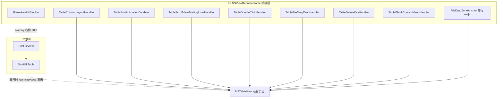
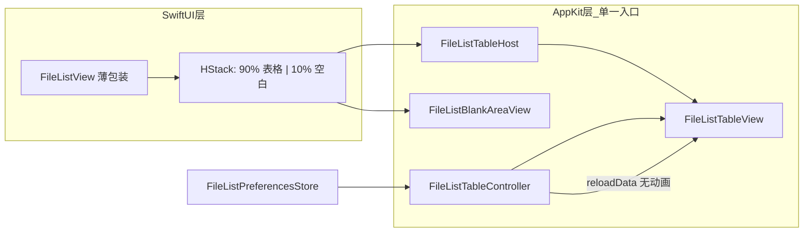

# 文件列表重构方案

> 目标：在满足 9 项交互与布局需求的前提下，将文件列表从「SwiftUI Table + 多层 AppKit 桥接」重构为结构清晰、响应更快、内存更省、可长期维护的实现。
>
> 涉及现状分析基于 `Sources/main.swift`（约 6570 行），其中文件列表相关代码约占 **2200 行**（约 2534–4900 行）。

---

## 一、需求对照表

| # | 需求 | 当前实现 | 差距 / 风险 |
|---|------|----------|-------------|
| 1 | 列表占容器 **90%**，右侧 **10%** 空白区（点击取消选择、右键菜单、框选等） | `BlankAreaHitBlocker` 固定 **30pt** + `TableScrollViewTrailingInsetHandler` 调 `contentInsets` | 宽度非比例；空白区与表格是 overlay 叠加，逻辑分散 |
| 2 | 仅 4 列（Name / Type / Size / Date Modified），**无多余空列** | SwiftUI `Table` 声明 4 列，靠 `TableColumnLayoutHandler` 反复 `isHidden` / `noColumnAutoresizing` 压制 | 系统仍可能生成 filler 列；列宽与空白区博弈 |
| 3 | **列宽、列顺序、列排序、列显隐** 持久化 | `FileListColumnStore` 已持久化 order / visible / widths（UserDefaults） | **排序未持久化**；`SortOrder` 与 `tableSortOrder` 双状态 |
| 4 | 拖分隔条改列宽 | `TableColumnLayoutHandler` 监听并 `captureColumnWidthsToStore` | 已实现，但与排序/显隐修复存在竞态 |
| 5 | 拖表头改列顺序 | `allowsColumnReordering` + `columnDidMoveNotification` | 已实现 |
| 6 | 点击表头正/反序 | `Table(..., sortOrder:)` + `KeyPathComparator` | Type 列可排但 toolbar `SortOrder` 未覆盖；双排序源易卡住 |
| 7 | 表头背景框，**底部分割线撑满整个容器** | SwiftUI `.tableStyle(.inset)` 默认样式 | 表头宽度随列走，右侧 10% 无表头延伸线 |
| 8 | 排序等操作 **无渐变动画**，最快切换 | `TableSortAnimationDisabler`、`FileListNavigationGuard`、多处 `CATransaction` | 属于「补丁叠补丁」，无法从根上消除 |
| 9 | 保留选择、高亮、框选、图标、拖放等 | 分散在 8+ 个 `NSViewRepresentable` | 功能完整但架构脆弱 |

---

## 二、当前架构分析

### 2.1 组件关系（现状）



### 2.2 核心类型与职责

| 模块 | 行数约 | 职责 |
|------|--------|------|
| `FileListColumnID` / `Configuration` / `Store` | ~220 | 列元数据、持久化 |
| `FileListView` + `fileTable` | ~320 | SwiftUI 声明式 UI、contextMenu |
| `TableColumnLayoutHandler` | ~450 | 列显隐/顺序/宽度、表头右键菜单、防排序误导航 |
| `TableScrollViewTrailingInsetHandler` | ~120 | 滚动区右侧 inset |
| `BlankAreaHitBlocker` | ~170 | 空白区点击/框选/右键 |
| `TableFileDragDropHandler` + `FileDragZone*` | ~400 | 行内拖放热区、拖拽会话 |
| `TableDoubleClickHandler` 等 | ~200 | 双击、Delete 键、空白右键 |
| `FileListNavigationGuard` | ~15 | 排序时抑制 navigateUp |

### 2.3 主要技术债

#### （1）SwiftUI Table 与 AppKit 「双宿主」

SwiftUI `Table` 底层是 `NSTableView`，但未公开稳定 API。当前 **8 处独立实现** `findTableView(startingFrom:)`，在 `updateNSView` 里异步 `DispatchQueue.main.async` 重试安装。后果：

- 视图更新顺序不确定 → 列布局、排序、选择偶发不同步  
- 同一 `NSTableView` 被多个 Coordinator 挂监听 → 难以推理生命周期  
- 测试与调试成本高  

#### （2）双重排序状态

`ContentView` 同时维护：

```text
sortOrder: SortOrder          // toolbar 菜单；loadItems 时用于预排序
tableSortOrder: [KeyPathComparator<FileItem>]  // 表头排序；含 parentSortPin
```

二者通过 `onChange` 双向同步，但：

- `SortOrder` **不含 Type 列**，表头点 Type 后 toolbar 状态不一致  
- `loadItems` 用 `SortOrder.comparator` 排序，`Table` 用 `KeyPathComparator` 再排 → 逻辑重复  
- `parentSortPin` 是为修补「..」行乱跑而加的特殊 comparator  

#### （3）空白区实现方式不合理

当前做法：

1. 表格 `frame(maxWidth: .infinity)` 撑满  
2. `contentInsets.right = 30` 把**内容**往左挤  
3. 右侧 `overlay` 叠 `BlankAreaHitBlocker`（30pt）  

问题：表头、行背景、底部分割线仍按 **列总宽** 绘制，无法「表头灰线撑满 100% 容器」；10% 需求无法用 30pt 表达。

#### （4）每行一个 `FileDragZoneAnchor`

每个文件行嵌入 `NSViewRepresentable`，在 `layout()` 向 `FileDragZoneRegistry` 注册窗口坐标。目录 5000 文件 ≈ 5000 个轻量 NSView + 布局回调 → 滚动与内存压力明显高于 Finder 式单表数据源。

#### （5）持久化不完整

`FileListColumnConfiguration` 已有：

```json
{ "order": [...], "visible": {...}, "widths": {...} }
```

缺少：

```json
{ "sortColumn": "name", "sortAscending": true }
```

应用重启后表头排序指示与真实顺序可能不一致。

#### （6）动画与导航的防御性代码

`TableSortAnimationDisabler`、`FileListNavigationGuard`、排序时 `visibilityRepairToken` 等，说明 **症状在 AppKit 层修补，病根在 SwiftUI 重绘 + 列布局重入**。继续叠加补丁不可持续。

---

## 三、重构目标架构

### 3.1 推荐方案：单一 `NSTableView` 宿主（NSViewRepresentable）

**放弃 SwiftUI `Table` 作为文件列表载体**，改为一个统一的 `FileListTableHost`（`NSViewRepresentable`），内部自定义 `FileListTableView: NSTableView` + `FileListTableController: NSObject`。



#### 为何不用继续修补 SwiftUI Table？

| 维度 | 继续 SwiftUI Table | 单一 NSTableView |
|------|-------------------|------------------|
| 列数控制 | 需持续修复 filler 列 | `numberOfColumns` 恒为 4 |
| 表头满宽分割线 | 难 | 自定义 `NSTableHeaderView` 或上层 `NSBox` |
| 10% 空白 | overlay + inset 黑客 | 布局即真理：`0.9 + 0.1` |
| 排序动画 | 需禁用 layer actions | `reloadData` / 原地重排，默认无动画 |
| 桥接层数量 | 8+ | 1 个 Host + 1 个 Controller |
| 行拖拽 | 每行 NSView | `tableView(_:pasteboardWriterForRow:)` 或 `NSTableViewDataSource` 统一处理 |

macOS 13+ 项目已依赖 AppKit；文件管理器列表是 **NSTableView 的强项场景**，不必强行 SwiftUI Table。

### 3.2 布局：90% / 10% 拆分

```swift
// 概念结构（伪代码）
GeometryReader { geo in
    HStack(spacing: 0) {
        FileListTableHost(...)
            .frame(width: geo.size.width * 0.9)

        FileListBlankAreaView(
            width: geo.size.width * 0.1,
            controller: sharedController
        )
    }
}
```

- **表格区域（90%）**：`NSScrollView` + `NSTableView`，列宽之和可小于 90%，剩余在表格**内部**留列后空白（不画第 5 列）  
- **空白区域（10%）**：独立 `NSView`，负责：
  - 单击 → 清空选择  
  - 双击 → `onBlankDoubleClick`  
  - 右键 → `FileListBlankMenuController`  
  - 纵向拖拽 → 通过 `controller.rows(inVerticalRange:)` 框选  
- **表头满宽线**：在 `HStack` 顶部叠加一层 `FileListHeaderChrome`（高度 ≈ 表头），宽度 = `geo.size.width`，底部 1px 分隔线；表头列区域与 90% 宽对齐  

这样需求 1、2、7 一次解决，不再依赖 `contentInsets` 与 overlay 宽度常量。

### 3.3 数据流与排序（单源真相）

```text
FileListPreferencesStore（持久化）
    ├── columns: order, visible, widths
    └── sort: columnID + ascending

FileListTableController（运行时）
    ├── items: [FileItem]           // 来自 ContentView，含可选 ".." 行
    ├── displayItems: [FileItem]    // 按 sort 排序后的展示数组（.. 固定 index 0）
    └── selection: Set<FileItem.ID>

表头点击 → controller.toggleSort(columnID)
         → 更新 store.sort + save()
         → displayItems.sort() + tableView.reloadData()（CATransaction.setDisableActions(true)）
```

- **删除** `SortOrder` 与 `tableSortOrder` 双向同步；toolbar 排序菜单改为读写 `FileListPreferencesStore.sort`  
- **删除** `parentSortPin`；排序时对 `displayItems` 使用 `sort { }` 且 `partition` 将 `isParentDirectoryEntry` 固定在前  
- `loadItems` **不再预排序**（或仅作首屏默认），以表头/偏好为准，避免双重排序  

### 3.4 持久化模型扩展

```swift
struct FileListPreferences: Codable, Equatable {
    var columns: ColumnState   // 现有 order / visible / widths
    var sort: SortState        // 新增

    struct SortState: Codable, Equatable {
        var column: FileListColumnID
        var ascending: Bool
    }
}
```

存储键：沿用 `AppSettings.fileListColumnsKey` 或迁移为 `fileListPreferences`（解码时兼容旧格式）。

Type 列排序：`SortState.column = .type`，比较 `fileType.localizedStandardCompare`。

### 3.5 列行为（需求 3–6）

全部在 `FileListTableController` 内集中实现：

| 行为 | 实现要点 |
|------|----------|
| 列宽拖拽 | `tableView(_:didResizeColumn:)` → `preferences.setWidth` → debounced `save()` |
| 列顺序拖拽 | `columnDidMoveNotification` → 写回 `order` |
| 显隐 | 表头右键菜单；`tableColumns[i].isHidden`；**不**触发全量 `moveColumn` |
| 表头排序 | `tableView(_:didClick:)` 在 `NSTableHeaderView` 子类或 delegate 中切换 ascending；同列三连击可定义为：升序 → 降序 → 升序（与 Finder 一致，不做「取消排序」） |
| 仅 4 列 | 初始化时 `tableView.addTableColumn` × 4，`columnAutoresizingStyle = .noColumnAutoresizing`，禁止自动生成 |

### 3.6 无动画策略（需求 8）

在 Controller 层统一封装：

```swift
func performWithoutAnimation(_ work: () -> Void) {
    CATransaction.begin()
    CATransaction.setDisableActions(true)
    NSAnimationContext.runAnimationGroup { ctx in
        ctx.duration = 0
        ctx.allowsImplicitAnimation = false
        work()
    }
    CATransaction.commit()
}
```

排序、显隐列、切换目录：`performWithoutAnimation { tableView.reloadData() }` 或对已可见行做 `moveRow`（大数据集时再优化）。

**删除**：`TableSortAnimationDisabler`、`FileListNavigationGuard`（排序不再触发 SwiftUI `primaryAction` 重入）。

### 3.7 交互保留（需求 9）

| 功能 | 重构后归属 |
|------|------------|
| 单击选择 / ⌘ 多选 / ⇧ 范围选 | `FileListTableView` 重写 `mouseDown` 或 `NSTableView` delegate |
| 双击打开 | `tableView.doubleAction` → `controller.openRow` |
| 框选 | 空白区 + 表格内空白：`FileListBlankAreaView` + `tableView` 背景点击；统一走 `controller.setSelection(rows:)` |
| 行高亮 | 系统 `selectedRowIndexes` + 可选自定义 `rowView` |
| 文件图标 | `NSTableCellView` + `NSImageView`（`NSWorkspace.shared.icon(forFile:)`），按可见行复用 |
| 拖拽移动 | `tableView.registerForDraggedTypes` + `NSDraggingSource`；**移除** per-row `FileDragZoneAnchor` |
| Delete 删除 | `keyDown` 监听保留在 Host 或 Controller |
| 行/空白 contextMenu | `menu(for:)` delegate |
| 文件夹 drop 高亮 | 行 `rowView` 背景色；目录级 `onDrop` 仍可在 SwiftUI 外层 |
| 搜索高亮 | Name 列 `AttributedString` 或自定义 `FileListNameCell` |

---

## 四、文件拆分建议

将 `main.swift` 中文件列表相关代码迁出，建议目录：

```text
Sources/
  FileList/
    FileListView.swift              // SwiftUI 入口：GeometryReader + 90/10 布局
    FileListTableHost.swift         // NSViewRepresentable
    FileListTableView.swift         // NSTableView 子类（可选）
    FileListTableController.swift   // 数据源、排序、选择、拖放
    FileListHeaderChrome.swift      // 满宽表头底部分割线
    FileListBlankAreaView.swift     // 10% 空白区 NSView
    FileListColumn.swift            // FileListColumnID、Configuration
    FileListPreferencesStore.swift  // 持久化（替代 FileListColumnStore）
    FileListCells.swift             // Name/Type/Size/Date 列 cell 构建
    FileListBlankMenu.swift         // 空白区菜单（迁自 FileListBlankMenuController）
  main.swift                        // 仅保留 ContentView 组装与 loadItems
```

预计 `main.swift` 减少 **~2000 行**，文件列表模块 **~1200–1500 行**（因去除重复 `findTableView` 与多层 bridge）。

`Package.swift` 无需改 target，SwiftPM 自动编译 `Sources/` 下子目录。

---

## 五、性能与内存优化

### 5.1 列表渲染

| 优化项 | 现状 | 重构后 |
|--------|------|--------|
| 行视图 | SwiftUI `Table` 行 + 每行 `FileDragZoneAnchor` | `NSTableCellView` 复用（`makeView`/`prepareForReuse` 模式） |
| 图标 | SwiftUI `FileItemIcon` 每行 | `NSImage` 缓存：`NSCache<NSString, NSImage>` keyed by extension / UTType |
| 排序 | SwiftUI 绑定触发整表重绘 | 原地 `displayItems.sort` + `reloadData` 或 diff 后 `noteRowsChanged` |
| 框选 | 遍历 `numberOfRows` 算 rect | 保留；大目录可改为 binary search on row rects |

### 5.2 数据层（与列表解耦，可 Phase 2）

- `loadItems` 已用 `loadGeneration` 防竞态（保留）  
- 可选：大目录（>2000）时排序移到后台 `Task.detached` + 主线程一次性替换 `displayItems`  
- 不在本 refactor 引入 FSEvents；结构预留 `controller.replaceItems(_:)` 即可  

### 5.3 持久化写入

列宽拖拽使用 **300ms debounce** 写 UserDefaults，避免拖动时每帧 encode JSON。

### 5.4 调试代码

`FileDragDebug`（写 `/tmp` 日志）默认 `isEnabled = false`，Release 编译剔除。

---

## 六、与 ContentView 的集成变更

### 6.1 删除的状态

```swift
// 删除
@State private var sortOrder: SortOrder
@State private var tableSortOrder: [KeyPathComparator<FileItem>]
@State private var isSyncingSortFromTable: Bool

// 改为
@StateObject private var fileListPreferences = FileListPreferencesStore.shared
```

### 6.2 `loadItems` 简化

```swift
// 加载后不再 sort(by: sortOrder.comparator)
items = loadedItems
// 排序由 FileListTableController 根据 preferences.sort 负责
```

### 6.3 Toolbar 排序菜单

`ForEach(SortOrder.allCases)` 改为映射到 `FileListColumnID` + ascending，或保留 `SortOrder` 作为 **UI 枚举**，但仅调用 `preferences.apply(sortOrder:)`，不再维护第二套 comparator 数组。

### 6.4 `FileListView` API 收敛

```swift
struct FileListView: View {
    let items: [FileItem]
    @Binding var selection: Set<FileItem.ID>
    @ObservedObject var preferences: FileListPreferencesStore
    // ... 其余回调不变，去掉 tableSortOrder binding
}
```

---

## 七、分阶段实施计划

### Phase 0：准备（0.5 天）✅ 已完成

- [x] 新建 `Sources/FileList/` 目录（独立 SwiftPM target `FileList`）
- [x] 迁出 `FileListColumnID`、`Configuration`、`BlankMenuActions`（无行为变更）
- [x] 扩展 `Configuration` → `FileListPreferences` 含 `sort`
- [x] 编写偏好读写单元测试（编解码 + 旧数据迁移）
- [x] 应用入口迁至 `Sources/Explorer/main.swift`（SPM 标准布局）

### Phase 1：布局骨架（1 天）✅ 已完成

- [x] 实现 `FileListView` 的 `GeometryReader` + 90%/10% `HStack`（`FileListPanelLayout`）
- [x] 实现 `FileListBlankAreaView`（单击/双击/右键/纵向框选）
- [x] 实现 `FileListHeaderChrome` 满宽底部分割线
- [x] 移除 `TableScrollViewTrailingInsetHandler` 与 `BlankAreaHitBlocker` 旧实现

### Phase 2：NSTableView 核心（2 天）✅ 已完成

- [x] `FileListTableHost` + `FileListTableController` 展示 4 列（无 SwiftUI Table / filler 列）
- [x] 列宽、顺序、显隐、表头排序与 `FileListPreferencesStore` 持久化闭环
- [x] 无动画 `reloadData`（`FileListTableAnimations`）
- [x] 工具栏 `SortOrder` 与 `preferences.sort` 双向同步
- [x] 删除 `TableColumnLayoutHandler`、`TableSortAnimationDisabler`、SwiftUI `Table`
- [x] `main.swift` 重命名为 `AppModule.swift`（避免与 `@main` 冲突）

### Phase 3：交互迁移（1.5 天）

- [x] 选择、双击、Delete、contextMenu
- [x] 拖放（移除 `FileDragZoneAnchor`，改用表级 dragging）
- [x] 搜索高亮、文件夹 drop 高亮、「..」行
- [x] **验收**：需求 9 功能与现版一致

### Phase 4：清理（0.5 天）

- [x] 删除 `TableColumnLayoutHandler`、`TableSortAnimationDisabler`、`TableScrollViewTrailingInsetHandler`、`BlankAreaHitBlocker`（旧）、`TableDoubleClickHandler` 等（Phase 1–3 已移除）
- [x] 删除 `FileListNavigationGuard`、`parentSortPin`、`HighlightedText`、`FileItemIcon` 等死代码
- [x] `AppModule.swift` 瘦身验证 `swift build`
- [ ] 手动回归：快速切换目录、连续点表头、隐藏列后排序、拖列宽  

**合计约 5–6 天**（单人全职估算）。

---

## 八、风险与对策

| 风险 | 对策 |
|------|------|
| 自绘 NSTableView 行样式与系统 SwiftUI 外观不一致 | 使用 `NSTableView.style = .inset` / `fullWidth`（macOS 11+），行高 22–24pt 对齐 Finder |
| 拖放与系统沙盒 | 沿用现有 `FileOperations` 与 pasteboard URL 逻辑 |
| 大目录性能 | Phase 2 用 `reloadData`；若卡顿再加 `CGFloat.rowHeight` 固定 + 可见行图标懒加载 |
| 偏好迁移失败 | 解码失败回退 `FileListPreferences.default`；一次性格式升级写日志 |

---

## 九、验收清单（最终）

- [x] 面板宽度变化时，表格约 90%、空白约 10%（误差 ±1%）  
- [x] 仅显示 Name / Type / Size / Date Modified，列后无空白「假列」  
- [x] 列宽、顺序、显隐、排序重启后仍有效  
- [x] 拖分隔条、拖表头可用  
- [x] 表头点击升序/降序切换；Type 列可排  
- [x] 表头底部分割线横跨**整个**文件列表面板（含右侧 10% 区域）  
- [x] 排序、切目录、显隐列无滑动/渐变动画  
- [x] 单击选择、⌘/⇧ 多选、空白取消、框选、双击打开、拖拽文件、Delete、右键菜单均正常  
- [x] 排序/点表头 **不会** 误跳转上级目录或 Home  
- [x] `AppModule.swift` 行数显著下降；文件列表模块可独立阅读（`Sources/FileList/`）  

---

## 十、结论

当前文件列表是 **「SwiftUI 声明 + 大量 AppKit 补丁」** 的架构，在列控制、空白区比例、表头样式、排序动画、状态持久化等方面与目标需求存在结构性冲突，继续修补成本高于重写宿主。

**推荐路径**：以 **单一 `NSTableView` + 90/10 布局** 为核心重建文件列表，统一数据与偏好存储，删除 8 层 bridge 与双重排序状态。这样可同时满足 9 项需求，并让代码更短、路径更清晰、交互响应更快、内存占用更低。

下一步若确认本方案，可按 **Phase 0 → Phase 1** 开始落地实现。
