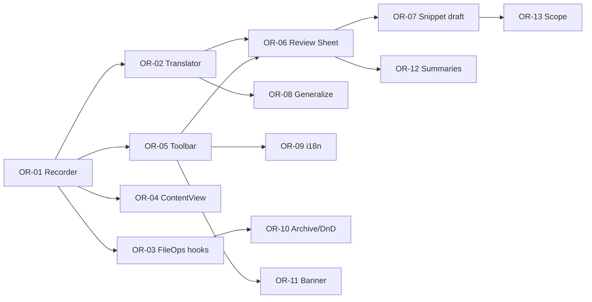

# 操作录制 → Shell Snippet — 开发计划

> 依据：[operation-recording-design.md](./operation-recording-design.md)  
> 目标：分阶段交付「工具栏录制 → 审阅 → Snippet 预填保存」闭环；首版聚焦常见文件 mutation，不追求 Finder 全量 parity。

---

## 总览

| Phase | 主题 | Issue 数 | 预估 | 用户可见 |
|-------|------|----------|------|----------|
| **P1** | 录制核心 + 基础翻译 + 工具栏按钮 | 5 | 2–3 天 | 是 |
| **P2** | 审阅 Sheet + Snippet 预填 + i18n | 4 | 1.5–2 天 | 是 |
| **P3** | 压缩/解压 + 拖放 + 指示条 | 3 | 1–1.5 天 | 是 |
| **P4** | 泛化增强 + 边界打磨 + 文档 | 3 | 1–2 天 | 部分 |

本文档展开 **P1–P4**（OR-01 ~ OR-15）。

---

## P1：录制核心 + 基础翻译 + 工具栏

> 原则：完成后可在工具栏开始/停止录制，复制/粘贴/删除/重命名/新建文件夹可生成字面路径 Shell；`swift test` 通过。

### OR-01：录制模型与 Recorder

**类型**：feature  
**依赖**：无  
**文件**：

- `Sources/Explorer/OperationRecording/RecordedOperation.swift`（新建）
- `Sources/Explorer/OperationRecording/OperationRecorder.swift`（新建）
- `Sources/Explorer/OperationRecording/OperationRecordingHub.swift`（新建）
- `Tests/ExplorerTests/OperationRecorderTests.swift`（新建）

**任务**：

- [ ] 定义 `RecordedOperation`、`RecordedOperationStep`、`PasteMode`
- [ ] `OperationRecorder`：`start` / `stop` / `discard` / `append`；`@Published isRecording`、`steps`
- [ ] `OperationRecordingHub.activeRecorder` 弱引用；未录制时 `record` 为 no-op
- [ ] 单元测试：生命周期、append 条件、stop 返回副本

**验收**：

- Recorder 仅在 `isRecording == true` 时累积步骤
- 主线程 `@MainActor` 约束

---

### OR-02：Shell 翻译器（字面路径模式）

**类型**：feature  
**依赖**：OR-01  
**文件**：

- `Sources/Explorer/OperationRecording/OperationShellTranslator.swift`（新建）
- `Tests/ExplorerTests/OperationShellTranslatorTests.swift`（新建）

**任务**：

- [ ] `translate(steps:options:) -> String`
- [ ] 实现 copy+cut+paste 合并为 `cp` / `mv`
- [ ] 实现 rename、createDirectory、createFile、trash、deleteImmediately
- [ ] 路径统一 `ShellQuoting.singleQuote`（与 `SnippetExpander` 一致）
- [ ] 步骤间空行分隔；可加 `# step N:` 注释（可选，设置控制）

**验收**：

- 测试覆盖：copy→paste、cut→paste、rename、mkdir、touch、trash（osascript 形式）
- 输出为合法 zsh 片段（不执行也可静态检查引号配对）

---

### OR-03：FileOperations 埋点

**类型**：feature  
**依赖**：OR-01  
**文件**：

- `Sources/Explorer/Domain/FileOperations.swift`（修改）
- `Tests/ExplorerTests/OperationRecordingIntegrationTests.swift`（新建，可选 mock hub）

**任务**：

- [ ] `copy` / `cut`：记录源 URL 列表
- [ ] `paste` 成功：记录 sources + destination + mode（从 pasteboardState）
- [ ] `moveItems` 成功：区分 copy vs move
- [ ] `trashItems` / `delete` / `deleteImmediately` / `moveItem`（rename）成功分支
- [ ] 失败、取消、alert 拒绝 **不** 记录

**验收**：

- 集成测试：模拟 recorder 挂 hub，调用 FileOperations 后 steps 数量正确

---

### OR-04：ContentView 新建项埋点 + 每窗口 Recorder

**类型**：feature  
**依赖**：OR-01  
**文件**：

- `Sources/Explorer/ContentView.swift`（修改）

**任务**：

- [ ] `@StateObject` 或等效方式每窗口持有一个 `OperationRecorder`
- [ ] 窗口 appear 时将 recorder 设为 hub active（带 windowID）；disappear 时清理
- [ ] `createNewFolder` / `createNewFile` 成功时 `record`
- [ ] 窗口关闭时若正在录制：NSAlert 三选一（停止并审阅 / 放弃 / 取消）

**验收**：

- 两窗口同时打开时，仅 active 窗口 recorder 接收事件（OR-01 windowID 或 active 指针策略）

---

### OR-05：工具栏录制按钮

**类型**：feature  
**依赖**：OR-01  
**文件**：

- `Sources/Explorer/Toolbar/ToolbarModels.swift`
- `Sources/Explorer/Toolbar/ExplorerToolbarItemViews.swift`
- `Sources/Explorer/Toolbar/ExplorerToolbarEnvironment.swift`
- `Sources/Explorer/ContentView.swift`
- `Tests/ExplorerTests/ToolbarCustomizationStoreTests.swift`（更新 default 项）

**任务**：

- [ ] `ToolbarBuiltinID.recordOperations`
- [ ] 默认布局：放在 `.snippets` 之后
- [ ] `mergeNewBuiltinItemsFromDefault` 可补全新项
- [ ] 单击 toggle；录制中图标红色态
- [ ] 停止且 steps 为空：轻提示（OR-02 前可先 `NSAlert` 占位，P2 改 Toast）

**验收**：

- 工具栏自定义面板可隐藏/拖移录制按钮
- 录制中点击再次停止触发后续流程（P2 前可先 copy 脚本到剪贴板调试）

---

## P2：审阅 Sheet + Snippet 预填 + i18n

### OR-06：OperationRecordingReviewSheet

**类型**：feature  
**依赖**：OR-02, OR-05  
**文件**：

- `Sources/Explorer/OperationRecording/OperationRecordingReviewSheet.swift`（新建）
- `Sources/Explorer/OperationRecording/RecordedOperationSummary.swift`（新建，步骤人类可读文案）

**任务**：

- [ ] 展示步骤列表 + 勾选
- [ ] 「泛化为变量」Toggle（默认开，读 `@AppStorage`）
- [ ] 脚本预览 `TextEditor` 只读或等宽 `ScrollView`
- [ ] 按钮：取消、复制脚本、创建 Snippet
- [ ] 零步数时不 present

**验收**：

- 取消勾选步骤后预览实时更新
- 复制脚本可用

---

### OR-07：Snippet 预填与保存

**类型**：feature  
**依赖**：OR-06  
**文件**：

- `Sources/Explorer/Snippets/SnippetEditorSheet.swift`
- `Sources/Explorer/OperationRecording/SnippetRecordingDraftBuilder.swift`（新建）

**任务**：

- [ ] `SnippetEditorSheet` 增加 `draft: SnippetRecordingDraft?`
- [ ] `SnippetRecordingDraftBuilder`：根据步骤推断 `suggestedName`、`suggestedScope`
- [ ] Review Sheet「创建 Snippet」→ present Editor → `SnippetStore.add`

**验收**：

- 保存后 Snippets 面板可见新条目
- scope 推断合理（单选 rename → `singleSelection` 等）

---

### OR-08：路径泛化（基础）

**类型**：feature  
**依赖**：OR-02  
**文件**：

- `Sources/Explorer/OperationRecording/OperationShellTranslator.swift`（扩展）
- `Tests/ExplorerTests/OperationShellTranslatorTests.swift`（扩展）

**任务**：

- [ ] `TranslationOptions.generalizePaths`
- [ ] cwd → `%d`；单选源 → `%p`；多选 → `%P`
- [ ] 无法泛化保留字面量 + `# TODO`

**验收**：

- Toggle 关：字面路径；开：含 `%p`/`%d`

---

### OR-09：i18n

**类型**：chore  
**依赖**：OR-05, OR-06  
**文件**：

- `Sources/Explorer/Resources/Localizable.xcstrings`
- `Sources/Explorer/L10n.swift`
- `Tests/ExplorerTests/L10nTests.swift`

**任务**：

- [ ] 工具栏 tooltip、指示条、Review Sheet、Alert 文案
- [ ] `L10n.OperationRecording.*` 命名空间
- [ ] L10nTests 断言非键名

**验收**：

- 中英文切换无键名泄露

---

## P3：压缩/解压 + 拖放 + 指示条

### OR-10：Archive 与拖放埋点

**类型**：feature  
**依赖**：OR-03  
**文件**：

- `Sources/Explorer/Domain/ArchiveOperations.swift`
- `Sources/Explorer/FileListView.swift`
- `Sources/Explorer/SidebarView.swift`
- `Sources/Explorer/Domain/FavoritesSidebarDropHandler.swift`

**任务**：

- [ ] 压缩/解压 Job 成功时 record（存 `ArchiveCommandBuilder` 命令字符串）
- [ ] 列表/侧栏拖放成功 → `moveItems` 已有埋点则验证；否则补 record

**验收**：

- 录制「压缩 → 解压」可生成含 `ditto`/`tar`/`unzip` 的脚本

---

### OR-11：录制指示条

**类型**：feature  
**依赖**：OR-05, OR-09  
**文件**：

- `Sources/Explorer/OperationRecording/OperationRecordingBanner.swift`（新建）
- `Sources/Explorer/ContentView.swift`

**任务**：

- [ ] 主内容区顶部 banner；显示步数
- [ ] 「停止并生成」「放弃」
- [ ] `@AppStorage("operationRecording.showBanner")` 默认 true

**验收**：

- 关闭 banner 偏好后仅工具栏指示仍可见

---

### OR-12：步骤摘要文案完善

**类型**：polish  
**依赖**：OR-06, OR-10  
**文件**：

- `Sources/Explorer/OperationRecording/RecordedOperationSummary.swift`

**任务**：

- [ ] 本地化摘要模板（「移动 %d 个项目到 %@」等）
- [ ] compress/extract 友好名称

---

## P4：泛化增强 + 边界 + 帮助

### OR-13：Scope 推断增强

**类型**：enhancement  
**依赖**：OR-07  
**文件**：

- `Sources/Explorer/OperationRecording/SnippetRecordingDraftBuilder.swift`

**任务**：

- [ ] 扩展名一致 → `fileExtensions`
- [ ] 无选中依赖（仅 mkdir）→ `anytime`
- [ ] 审阅 Sheet 显示 scope 建议说明

---

### OR-14：边界与设置

**类型**：polish  
**依赖**：P1–P3  
**文件**：

- `Sources/Explorer/Settings/SettingsView.swift`（可选 Advanced 小节）
- `Sources/Explorer/OperationRecording/*`

**任务**：

- [ ] 设置：默认开启路径泛化、默认显示指示条
- [ ] 录制中执行 Snippet：忽略（文档说明）
- [ ] 废纸篓内录制：Review Sheet 脚注警告

---

### OR-15：帮助与 Cheat Sheet

**类型**：docs  
**依赖**：全部  
**文件**：

- `docs/help-cheat-sheet-plan.md`（追加条目，可选）
- `docs/operation-recording-design.md`（随实现更新「已实现」标记）

**任务**：

- [ ] 帮助页增加「操作录制」条目
- [ ] 设计文档 §1.3 勾选已实现操作

---

## 依赖关系

---

## 验收清单（发布前）

- [ ] 工具栏开始/停止录制，指示条与 tooltip 正确
- [ ] 复制/粘贴、剪切/粘贴、重命名、新建文件夹、删除可生成脚本
- [ ] 审阅 Sheet 可排除步骤、切换泛化、创建 Snippet
- [ ] Snippet 保存后在面板可执行（变量展开符合 scope）
- [ ] 多窗口不串录
- [ ] 中英文 UI 无键名
- [ ] `swift test` 全绿

---

## 后续扩展（不在本计划内）

- ⌃⌘R 全局快捷键
- 「用 XX 打开」录制为 `open -a`
- 录制导出为 `.sh` 文件
- 与输出面板联动：「将上次 Job 命令转为 Snippet」
- Python / AppleScript 类型导出（当前仅 Shell）
