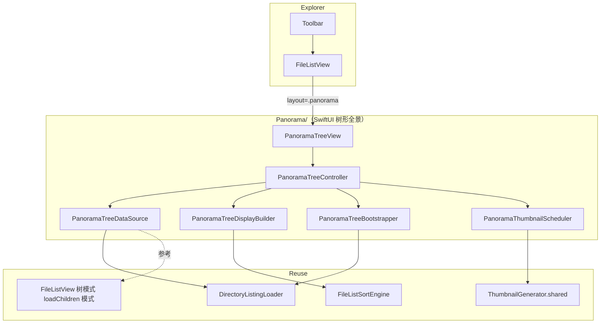
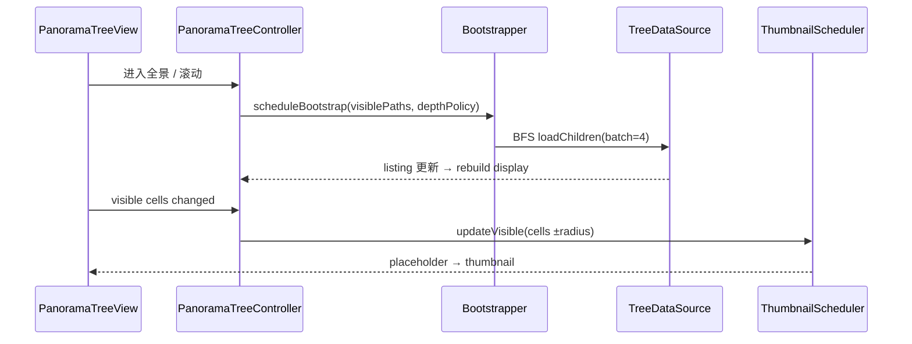

# 子目录全景缩略图（Panorama Thumbnail）— 设计方案

> 目标：在缩略图模式下增加 **「子目录全景」** 子模式，采用 **「树形递归展开 + 目录标题行 + 下方多行网格」** 布局；进入时逻辑上全树展开，物理上渐进加载；支持收起为普通缩略图格。性能优先、内存可控。  
> 关联文档：[thumbnail-view-design.md](./thumbnail-view-design.md)  
> 开发计划：[panorama-thumbnail-plan.md](./panorama-thumbnail-plan.md)  
> **决策记录**：原「一级分区 + 横向胶片条」方案已废弃，由本文档完全替代。

---

## 一、背景与目标

### 1.1 现状

| 区域 | 现状 |
|------|------|
| 缩略图模式 | 单层扁平 `NSCollectionViewGridLayout`，仅当前目录一层 |
| 树形展开 | 仅在 **列表模式**（`FileListView.treeEnabled`） |
| 列表树基础设施 | `expandedDirectoryIDs`、`cachedChildrenByDirectoryID`、`loadChildren(for:)` 已存在 |
| 缩略图管线 | `ThumbnailGenerator`（QL 并发 4）+ `ThumbnailCache`（500 项 / 80MB LRU） |
| 类似树 flatten | `ArchiveTreeBuilder.visibleRows` 可参考 |

### 1.2 目标

1. 缩略图模式下新增子模式 **「子目录全景」**，与 **「标准网格」** 互斥切换。
2. 进入全景时：**一级、二级及所有子目录逻辑上全部展开**；每个 **有内容** 的目录独占一行 **标题行**（随深度左缩进）。
3. 标题行含 **折叠按钮**；收起后该目录变为 **普通文件夹缩略图格**，与同级收起的目录、文件混排于 **父目录下方网格**（多行铺满）。
4. 每个展开目录下方：**子目录优先**（展开的递归为标题行；收起的为网格格）→ **文件缩略图网格**（常规多行）。
5. **性能**：禁止进入时同步全树扫描；渐进 BFS 加载 + 视口缩略图 + 网格 cap + 子树 evict。
6. 复用排序、缩放、选中、打开、进入目录；与列表树共享数据层。

### 1.3 非目标（首版）

- 修改现有 `FileListThumbnailController` / AppKit 标准网格
- 框选、拖放（Phase 2）
- 各目录异步计算递归总大小
- 搜索模式下启用全景
- 横向胶片条布局（已废弃）

---

## 二、体验设计

### 2.1 展开态（默认进入）

```
📁 当前目录                                    [全部收起]
  📁 Photos                                    [▼ 收起]
    📁 Vacation                                [▼]
      📁 2024                                  [▼]
        ┌──────────────────────────────────────────────┐
        │ [📁 Trip 收起] [file] [file] [file] [file]      │  ← depth=3 网格
        │ [file] [file] ... [+12]                       │
        └──────────────────────────────────────────────┘
      ┌──────────────────────────────────────────────┐
      │ [file] [file] ...                               │  ← Vacation 层网格
      └──────────────────────────────────────────────┘
    ┌──────────────────────────────────────────────┐
    │ [📁 Archive 收起] [file] ...                    │  ← Photos 层网格
    └──────────────────────────────────────────────┘
  📁 Documents                                 [▼]
    ...
  ┌──────────────────────────────────────────────┐
  │ [file] [file] [file]                            │  ← 当前目录根层网格（仅文件+收起目录）
  └──────────────────────────────────────────────┘
```

**缩进规则：** `leadingPadding = depth × indentStep`（建议 `indentStep = 20pt`）。

### 2.2 收起态

用户点击标题行 **[▼]** → 该目录及 **整个子树 UI** 折叠：

- 子树内所有标题行、子网格不再渲染
- 该目录在 **父级网格** 中呈现为一个 **普通文件夹缩略图格**
- 可与同级其他 **收起的目录**、**文件** 在同一 `LazyVGrid` 多行排列

```
父目录网格：
┌──────────────────────────────────────────────┐
│ [📁 Photos 已收起] [📁 Docs 已收起] [file] [file] │
│ [file] [file] ...                              │
└──────────────────────────────────────────────┘
```

再次点击文件夹格上的展开 affordance（或双击，见 §2.5）→ 恢复展开。

### 2.3 「有内容的目录」

| 类型 | 标题行 | 网格中的表现 |
|------|--------|--------------|
| 非空目录（含文件和/或子目录） | ✅ 展开时独占一行 | 收起时为文件夹格 |
| 空目录 | ❌ 无标题行 | 父网格中一个文件夹格 |
| 文件 | ❌ | 父网格中文件格 |

### 2.4 目录区块内排序

每个目录的 **直接子项** 展示顺序（与 `FileListSortEngine` 一致）：

1. **展开的子目录** → 各自递归为「标题行 + 子树 + 网格」（不占父网格）
2. **收起的子目录** → 父网格中的文件夹格（排在文件之前）
3. **文件** → 父网格多行排列

同层网格内：**文件夹（收起态）优先于文件**；各自内部仍按全局排序设置。

### 2.5 工具栏

```
[列表] [缩略图 ▼]
         ├─ 标准网格
         └─ 子目录全景

全景模式附加（工具栏或溢出菜单）：
  [全部展开] [全部收起]
  展开深度：自动 / 2 / 5 / 全部     ← 设置项，默认「自动」
```

| 状态 | 行为 |
|------|------|
| 搜索非空 | 禁用全景或强制回退标准网格 |
| loading | 禁用切换 |
| ⌘+滚轮 | 调节 `thumbnailCellSize`，全部网格同步 reflow |

### 2.6 交互一览

| 操作 | 行为 |
|------|------|
| 点击标题行 **[▼]** | 收起该目录子树 → 父网格中显示文件夹格 |
| 点击收起态文件夹格上的 **[▶]** | 展开该目录 |
| 双击文件夹格 | 进入该目录（`onItemOpen`） |
| 单击 / ⌘ 单击 cell | 更新 `selection` |
| 双击文件格 | 打开 / 预览 |
| 点击标题行文件夹名区域 | 进入该目录 |
| 点击 `+N` | 进入该目录查看全部 |
| 全部收起 / 全部展开 | 批量更新 `collapsedDirectoryIDs` |
| 切换目录 / 子模式 | `PanoramaTreeController.reset()` |

---

## 三、架构设计

### 3.1 总览



**核心原则：**

1. **独立 SwiftUI 路径** — 不改动 `FileListThumbnailController`。
2. **逻辑全展开、物理渐进加载** — UI 默认 expanded；I/O 由 `Bootstrapper` BFS 队列按视口优先级填充。
3. **共享树数据层** — 从 `FileListView` 抽取或镜像 `loadChildren` + generation 取消模式。
4. **全局缩略图预算** — 单一 `PanoramaThumbnailScheduler`；QL 并发 4、batch 8。
5. **Display 与 Data 分离** — `PanoramaTreeDisplayBuilder` 纯函数：`(treeState, collapsedIDs) → [DisplayBlock]`。

### 3.2 集成点

```swift
switch viewMode {
case .list:
    FileListTableHost(...)
case .thumbnail:
    switch thumbnailLayoutMode {
    case .grid:
        FileListThumbnailHost(...)
    case .panorama:
        PanoramaTreeView(...)
    }
}
```

### 3.3 文件规划

```
Sources/Explorer/Panorama/
  PanoramaMetrics.swift
  PanoramaTreeModels.swift
  PanoramaTreeDataSource.swift
  PanoramaTreeBootstrapper.swift
  PanoramaTreeDisplayBuilder.swift
  PanoramaTreeController.swift
  PanoramaThumbnailScheduler.swift
  PanoramaVisibleCellTracker.swift
  PanoramaTreeView.swift
  PanoramaFolderHeaderView.swift
  PanoramaItemGridView.swift
  PanoramaGridCellView.swift
  PanoramaOverflowCellView.swift
  PanoramaFolderSectionView.swift      // 递归：header + children + grid

Sources/FileList/
  FileListThumbnailLayoutMode.swift

Tests/ExplorerTests/
  PanoramaTreeDisplayBuilderTests.swift
  PanoramaTreeDataSourceTests.swift
  PanoramaTreeControllerTests.swift
  PanoramaThumbnailSchedulerTests.swift
```

---

## 四、数据模型

### 4.1 配置常量

```swift
enum FileListThumbnailLayoutMode: String, Codable {
    case grid
    case panorama
}

enum PanoramaMetrics {
    static let indentStep: CGFloat = 20
    static let headerHeight: CGFloat = 32
    static let sectionVerticalSpacing: CGFloat = 8
    static let gridSpacing: CGFloat = 4          // 对齐 FileListThumbnailMetrics.cellSpacing
    static let gridContentInset: CGFloat = 8
    static let itemsPerGridCap = 48              // 每目录网格 soft cap
    static let thumbnailPrefetchRadius = 2
    static let visibilityDebounce: TimeInterval = 0.08
    static let bootstrapBatchSize = 4            // BFS 每批 enumerate 目录数
    static let maxCachedDirectoryListings = 32   // 内存中保留 children 的目录上限
    static let bootstrapPriorityDepth = 2        // 「自动」模式下优先 I/O 深度
}

enum PanoramaExpandDepthPolicy: String, Codable {
    case automatic   // 视口 + depth≤2 优先，其余 BFS 后台
    case depth2
    case depth5
    case unlimited
}
```

持久化：

| 键 | 说明 |
|----|------|
| `explorer.fileList.thumbnailLayoutMode` | `grid` / `panorama` |
| `explorer.panorama.expandDepthPolicy` | 展开深度策略 |

### 4.2 树节点状态

```swift
struct PanoramaDirectoryID: Hashable, Sendable {
    let path: String
}

enum PanoramaListingState: Equatable {
    case unloaded
    case loading
    case loaded([FileItem])
    case failed(String)
}

struct PanoramaDirectoryNode: Identifiable {
    let id: PanoramaDirectoryID
    let item: FileItem
    let depth: Int
    var listing: PanoramaListingState
    var childCountHint: Int?          // 未 load 时可选，来自父 listing
}
```

### 4.3 展开 / 收起状态机

```swift
/// 进入全景模式时：collapsedDirectoryIDs = ∅（全部展开）
/// 用户点击收起：insert directoryID（该节点 subtree UI 隐藏，父网格显示 folder cell）
var collapsedDirectoryIDs: Set<String>

func isExpanded(_ id: String) -> Bool {
    !collapsedDirectoryIDs.contains(id)
}

func collapse(_ id: String) {
    collapsedDirectoryIDs.insert(id)
    // 同时 collapse 所有 descendant（可选，推荐：只标记自身，DisplayBuilder 递归判断）
}

func expand(_ id: String) {
    collapsedDirectoryIDs.remove(id)
}
```

**DisplayBuilder 规则：**

- `collapsedDirectoryIDs.contains(folderID)` → 该节点 **不渲染** 标题行与子树；在 **父节点 gridItems** 中加入 `.folderCollapsed(folder)`
- 否则 → 渲染 `folderHeader` + 递归子目录 + `gridItems`

### 4.4 展示块（Display Model）

```swift
enum PanoramaGridItem: Identifiable {
    case file(FileListRow)
    case folderCollapsed(FileListRow)   // 收起态目录
    case overflow(directoryID: String, remaining: Int)
}

enum PanoramaDisplayBlock: Identifiable {
    case folderHeader(FolderHeaderModel)
    case itemGrid(depth: Int, directoryID: String, items: [PanoramaGridItem])
    case childBlocks([PanoramaDisplayBlock])   // 展开子目录递归内容
}

struct FolderHeaderModel: Identifiable {
    let directoryID: String
    let name: String
    let depth: Int
    let itemCount: Int?
    let isLoading: Bool
    let loadError: String?
}
```

**构建流程：**

```
PanoramaTreeDataSource.nodes + collapsedDirectoryIDs
  → PanoramaTreeDisplayBuilder.build(rootPath:)
  → [PanoramaDisplayBlock] 扁平化供 LazyVStack 递归渲染
  → 每个 itemGrid 应用 itemsPerGridCap + overflow
```

---

## 五、加载与性能策略

### 5.1 四层管线



| 层级 | 触发 | 成本 | 取消 |
|------|------|------|------|
| **L0 骨架** | 进入全景 | 0；用 ContentView 已有 `items` 渲染根层 | path 变化 |
| **L1 目录列举** | BFS 队列 + 视口优先 | 每目录 1× `contentsOfDirectory` | generation token |
| **L2 Display rebuild** | listing / collapse 变化 | 纯 CPU，O(可见节点) | — |
| **L3 缩略图** | 可见 grid cell ±2 | QL / 磁盘缓存 | generation + scroll |

### 5.2 渐进式全展开（Bootstrapper）

**禁止：** 进入瞬间 DFS 同步扫完整个子树。

**做法：**

```
onEnterPanorama:
  collapsedDirectoryIDs = ∅
  enqueue(rootPath) // 根已 by ContentView items，标记 loaded
  for each direct subdirectory in sort order:
      enqueue(path, priority: depthFirst ≤ bootstrapPriorityDepth ? .high : .low)

onScroll(visibleDirectoryIDs):
  boost priority for visible ±1 directories

worker loop (background, batch=4):
  dequeue → DirectoryListingLoader.loadFileItems
  MainActor → update listing state
  for each child directory in result:
      if shouldAutoExpand(depthPolicy, depth): enqueue(child)
```

**「自动」深度策略：** 首屏保证 depth ≤ 2 的目录优先 load；更深层随滚动 / 空闲队列渐进。

### 5.3 内存预算

| 资源 | 上限 | 策略 |
|------|------|------|
| **ThumbnailCache** | 500 / 80MB | 全局共享，不增加 cap |
| **cached listings** | 32 目录 | LRU evict：`listing → .unloaded`，保留节点骨架 |
| **Display blocks** | 按需 rebuild | 不持久化大数组跨 frame |
| **Scheduler images** | 可见 cell ±2 | prune `imageByRowID` |
| **collapsedDirectoryIDs** | O(目录数) | 仅 path 字符串 Set |

**Evict：** 滚出视口且非 ancestor  of visible 的目录 listing 可 evict；用户滚回时重新 enumerate（有 disk cache 的缩略图不受影响）。

### 5.4 网格 cap

每个 `itemGrid`：

- 渲染 `min(items.count, itemsPerGridCap - 1)` 个 cell
- 若有剩余 → 末尾 `overflow(remaining)` 卡片，`+N` 点击进入目录
- cap 仅限制 **渲染**；listing 仍完整保存在 memory 直到 evict

### 5.5 缩略图调度

`PanoramaThumbnailScheduler`（多 grid 可见窗口）：

- 输入：`[(rowID, indexPathInFlatVisibleList)]`
- 合并 index ± `thumbnailPrefetchRadius`
- `loadGeneration++` → cancel + prune
- batch ≤ 8；网络卷 radius = 0
- `shutdown()` on 模式切换 / memory pressure

### 5.6 明确禁止

- ❌ 进入时单线程递归 enumerate 全树
- ❌ 无 cap 渲染超大网格（500+ cell 同时 mount）
- ❌ 每个目录独立 ThumbnailGenerator
- ❌ 未可见 grid 预加载 QL
- ❌ 收起子树后仍保留子树 listing（应允许 evict）

---

## 六、UI 组件规格

### 6.1 PanoramaFolderHeaderView

| 元素 | 说明 |
|------|------|
| 缩进 | `depth × indentStep` |
| 折叠钮 | `[▼]` expanded / 点击 → collapse |
| 图标 + 名称 | 文件夹名；tooltip 完整路径 |
| 统计 | `N 项`（listing loaded 后）；loading skeleton |
| 进入 | 点击名称 → `onEnterDirectory` |

### 6.2 PanoramaItemGridView

- `LazyVGrid` 列数：`(availableWidth) / (cellSize + spacing)`  
  `availableWidth = viewportWidth - depth×indentStep - inset×2`
- Cell：`PanoramaGridCellView`（复用标准缩略图视觉：图标/QL + 底部文件名 + 大小角标）
- 收起态文件夹格：角标或 overlay 显示 **[▶]** 展开
- 选中态：与 `FileListThumbnailCellView` 一致 accent border

### 6.3 PanoramaFolderSectionView（递归）

```swift
// 伪结构
@ViewBuilder
func folderSection(header: FolderHeaderModel, children: ...) -> some View {
    PanoramaFolderHeaderView(...)
    ForEach(expandedChildSections) { child in
        folderSection(...)  // 递归
    }
    PanoramaItemGridView(items: gridItems, depth: header.depth + 1)
}
```

根 `PanoramaTreeView`：`ScrollView` + `LazyVStack` 包裹根目录 section。

---

## 七、与列表树的关系

| 能力 | 列表模式 | 全景模式 |
|------|----------|----------|
| 数据源 | `FileListView` 内联 state | `PanoramaTreeDataSource`（抽取共享逻辑） |
| 展开语义 | `expandedDirectoryIDs` | **inverse**：默认全展开，`collapsedDirectoryIDs` |
| loadChildren | `Task.detached` + generation | 同模式 |
| 排序 | `FileListSortEngine` | 同 |

**Phase 1 实现选项：**

- **A（推荐）**：新建 `PanoramaTreeDataSource`，复制 generation 模式；后续 refactor 与列表共用 `FileTreeListingService`
- **B**：直接在 `FileListView` 暴露 tree state binding 给 Panorama（耦合高，不推荐）

---

## 八、验收指标

| 指标 | 目标 | 测量 |
|------|------|------|
| 首帧骨架 | < 100ms | 50 子目录，仅根层 + 标题 skeleton |
| 深度 2 列举 | < 500ms 本地 SSD | 自动策略下首屏可交互 |
| 单目录 1000 文件网格 | 仅 48 格 + `+N` | UI 不 mount 全量 |
| 缩略图占位 | 即时 | instantPlaceholder |
| 内存增量（典型） | ≤ +20MB | 32 cached listings + 可见 thumbnails |
| 收起/展开 reflow | selection 不丢（同一 item） | 手动 |
| grid ↔ panorama ×20 | 无 QL 泄漏 | Instruments |
| 500+ 子目录仓库 | 不 freeze | 渐进 BFS，可滚动 |

---

## 九、Phase 2 预留

| 功能 | 说明 |
|------|------|
| 框选 / 拖放 | 统一 `FileListInteractionCoordinator` |
| 收起状态持久化 | 按 rootPath 存 `collapsedDirectoryIDs` |
| 扩展名过滤 | 工具栏「仅图片」隐藏非匹配 grid cell |
| 目录总大小 | 单目录按需 overlay |
| 与列表树 state 统一 | `FileTreeListingService` 抽取 |

---

## 十、废弃方案记录

| 原方案 | 废弃原因 |
|--------|----------|
| 一级分区 + 横向胶片条 | 无法表达多级目录从属；用户选定树形递归交互 |
| 每区 cap 24 横向 strip | 替换为每目录网格 cap 48 + 多行 |

---

## 十一、i18n

键前缀 `panorama.*`，写入 `Sources/Explorer/Resources/Localizable.xcstrings`（`en` + `zh-Hans`），`L10n.Panorama.*` 暴露：

| 键 | 示例（zh-Hans） |
|----|----------------|
| `viewMode.thumbnail.layout.panorama` | 子目录全景 |
| `panorama.expand_all` | 全部展开 |
| `panorama.collapse_all` | 全部收起 |
| `panorama.expand_depth.automatic` | 自动 |
| `panorama.section.item_count` | `%lld 项` |
| `panorama.overflow.more` | `+%lld` |
| `panorama.loading` | 正在加载… |
| `panorama.load_failed` | 无法加载此文件夹 |

详见 [i18n-design.md](./i18n-design.md)。
