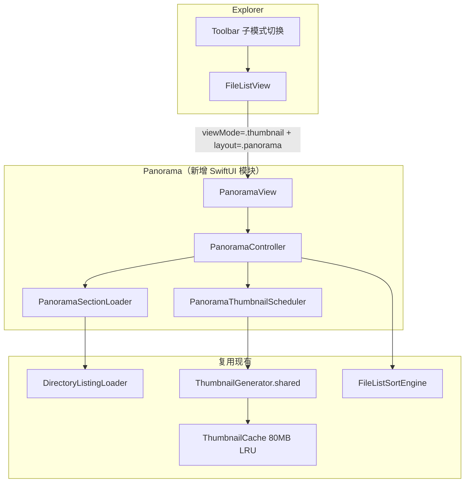
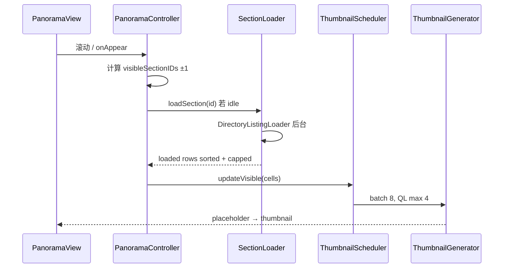

# 子目录全景缩略图（Panorama Thumbnail）— 设计方案

> 目标：在缩略图模式下增加 **「子目录全景」** 子模式，采用 **「纵向分区 + 横向胶片条」** 布局，一次浏览当前目录下各直接子文件夹的内容概貌；性能优先、内存可控、按需加载。  
> 关联文档：[thumbnail-view-design.md](./thumbnail-view-design.md)、[preview-browser-strip-design.md](./preview-browser-strip-design.md)  
> 开发计划：[panorama-thumbnail-plan.md](./panorama-thumbnail-plan.md)

---

## 一、背景与目标

### 1.1 现状

| 区域 | 现状 |
|------|------|
| 缩略图模式 | 单层扁平 `NSCollectionViewGridLayout`，仅展示当前目录一层条目 |
| 树形展开 | 仅在 **列表模式** 启用（`FileListView.treeEnabled`） |
| 分组 / Section | 缩略图网格无 supplementary header、无按文件夹分组 |
| 水平胶片条 | `PreviewBrowserStripView` 已在预览区实现，可复用交互与缩略图调度模式 |
| 缩略图管线 | `ThumbnailGenerator`（QL 并发 4）+ `ThumbnailCache`（500 项 / 80MB LRU） |

### 1.2 目标

1. 缩略图模式下新增子模式 **「子目录全景」**，与现有 **「标准网格」** 互斥切换。
2. 每个 **直接子文件夹** 占一行分区：标题 + 可横向滚动的缩略图胶片条。
3. 任意缩略图可立刻辨识所属子目录（分区标题 + 左侧色条）。
4. **不影响性能**：首帧零额外 I/O、按视口 lazy 列举与加载缩略图、严格内存预算。
5. 复用现有排序、缩放、选中、打开、进入目录等交互能力。

### 1.3 非目标（首版）

- 递归全树扫描（默认 **仅一级子目录**）
- 修改现有 `FileListThumbnailController` / AppKit 网格 layout
- 框选、拖放（Phase 2）
- 按类型 / 日期分组标题
- 各分区异步计算总大小（避免触发 DirectorySize 递归）
- 搜索模式下启用全景（首版搜索非空时禁用或回退标准网格）

---

## 二、体验设计

### 2.1 布局示意

```
┌─────────────────────────────────────────────────────────────────┐
│  当前目录（3）                                                   │
│  [img] [doc] [vid]                                              │
├─────────────────────────────────────────────────────────────────┤
│  ▌ 📁 Photos                              24 项        [→ 进入] │
│  ┌──────────────────────────────────────────────────────────→  │
│  │ [🖼] [🖼] [🖼] [🖼] [🖼] [🖼] [🖼] [🖼] [+16]              │  ← 横向滚动
│  └──────────────────────────────────────────────────────────→  │
├─────────────────────────────────────────────────────────────────┤
│  ▌ 📁 Documents                           12 项        [→ 进入] │
│  [📄] [📄] [📄] [📄] [📄] ... →                                 │
├─────────────────────────────────────────────────────────────────┤
│  ▌ 📁 Videos                               8 项        [→ 进入] │
│  [🎬] [🎬] [🎬] ... →                                           │
└─────────────────────────────────────────────────────────────────┘
         ↑ 纵向 ScrollView（LazyVStack），逐区浏览
```

### 2.2 分区标题

```
┌──────────────────────────────────────────────────────────────┐
│ ▌ 📁 Photos                              24 项      [→ 进入] │
└──────────────────────────────────────────────────────────────┘
  ↑ 4pt 色条（folderPath hash 着色，稳定可辨）
```

| 元素 | 说明 |
|------|------|
| 左侧色条 | 4pt 宽；`accentHue = hash(folderPath) % 360` |
| 文件夹图标 + 名称 | 主标识；tooltip 显示完整路径 |
| 统计 | `N 项`（列举完成后显示；首版不算总大小） |
| 进入 | 点击标题区 → `onItemOpen(folderItem)` |

### 2.3 胶片条

- 格子尺寸 = 全局 `thumbnailCellSize`（64–256 pt，与标准缩略图同步）
- 复用 `PreviewBrowserStripCell` 视觉规格，或抽公共 `ThumbnailStripCellView`
- 每区最多渲染 **24** 格；超出显示 **`+N`** 卡片，点击 → 进入该子目录
- 横向 `ScrollView(.horizontal)`，`showsIndicators: false`

### 2.4 当前目录块

- 仅当当前目录存在非文件夹条目时显示
- 标题「当前目录」+ 同样横向胶片条
- 可选 cap=48 防止极端大目录（常量可配置）

### 2.5 工具栏与子模式切换

在缩略图视图激活时，工具栏提供子模式 Menu：

```
[列表] [缩略图 ▼]
         ├─ 标准网格      ← 现有 NSCollectionView
         └─ 子目录全景    ← 本功能
```

| 状态 | 行为 |
|------|------|
| 搜索非空 | 禁用「子目录全景」或自动回退标准网格 |
| loading | 禁用切换 |
| ⌘+滚轮 | 调节 `thumbnailCellSize`，全部分区同步 reflow |

### 2.6 交互

| 操作 | 行为 |
|------|------|
| 单击 cell | 更新 `selection: Set<FileItem.ID>`（⌘ 多选） |
| 双击 cell | `onItemOpen(item)` |
| 单击分区标题 | 进入子目录 |
| 点击 `+N` | 进入子目录 |
| 切换子模式 | grid ↔ panorama；清理 scheduler + section cache |
| 切换目录 | `PanoramaController.reset()` |

---

## 三、架构设计

### 3.1 总览



**核心原则：**

1. **独立视图路径** — 全景走 SwiftUI；标准缩略图仍走 `FileListThumbnailHost`，互不影响。
2. **按需列举** — 父目录 `items` 已有子文件夹列表；**分区进入视口 ±1 才 enumerate 子项**。
3. **全局缩略图预算** — 所有分区共享一个调度器（QL 并发 4、batch 8）。
4. **零额外大图缓存** — 解码图只进全局 `ThumbnailCache`；scheduler 仅保留可见 cell 引用。

### 3.2 集成点

`FileListView` 分支：

```swift
switch viewMode {
case .list:
    FileListTableHost(...)
case .thumbnail:
    switch thumbnailLayoutMode {
    case .grid:
        FileListThumbnailHost(...)      // 现有
    case .panorama:
        PanoramaView(...)
    }
}
```

### 3.3 建议文件路径

```
Sources/Explorer/Panorama/
  PanoramaView.swift
  PanoramaSectionHeaderView.swift
  PanoramaSectionStripView.swift
  PanoramaOverflowCellView.swift
  PanoramaController.swift
  PanoramaSectionLoader.swift
  PanoramaThumbnailScheduler.swift
  PanoramaMetrics.swift
  PanoramaVisibleRangeTracker.swift

Sources/FileList/
  FileListThumbnailLayoutMode.swift

Tests/ExplorerTests/
  PanoramaControllerTests.swift
  PanoramaSectionLoaderTests.swift
```

---

## 四、数据模型

### 4.1 枚举与配置

```swift
/// 缩略图子布局（持久化）
enum FileListThumbnailLayoutMode: String, Codable {
    case grid       // 现有 NSCollectionView
    case panorama   // 子目录全景
}

enum PanoramaMetrics {
    static let sectionSpacing: CGFloat = 16
    static let headerHeight: CGFloat = 32
    static let stripVerticalPadding: CGFloat = 8
    static let itemsPerSectionCap = 24
    static let prefetchSectionCount = 1
    static let thumbnailPrefetchRadius = 3
    static let listingDebounce: TimeInterval = 0.05
    static let visibilityDebounce: TimeInterval = 0.08
    static let maxConcurrentSections = 6
}
```

持久化键：`explorer.fileList.thumbnailLayoutMode`（`grid` / `panorama`）。

### 4.2 分区模型

```swift
struct PanoramaSectionID: Hashable, Sendable {
    let folderPath: String
}

enum PanoramaSectionLoadState: Equatable {
    case idle
    case loading
    case loaded(totalCount: Int, displayRows: [FileListRow])
    case failed(message: String)
}

struct PanoramaSectionModel: Identifiable {
    let id: PanoramaSectionID
    let folderItem: FileItem
    var loadState: PanoramaSectionLoadState
    var accentHue: Double
}
```

### 4.3 根模型与构建（零 I/O）

```swift
struct PanoramaRootModel {
    let currentDirectoryPath: String
    var currentDirectoryFiles: [FileListRow]
    var sections: [PanoramaSectionModel]
}
```

**PanoramaRootBuilder** 从父目录已有 `[FileItem]` 构建：

```
父目录 items（ContentView 已有）
  → isDirectory → sections
  → !isDirectory → currentDirectoryFiles
  → sections 按 FileListSortEngine 排序
  → 不立即 enumerate 子目录内容
```

---

## 五、性能与内存策略

### 5.1 三层加载管线



| 层级 | 触发 | 成本 | 取消 |
|------|------|------|------|
| **L0 分区骨架** | 进入全景模式 | 0 额外 I/O | path 变化 |
| **L1 目录列举** | 分区进入视口 ±1 | 1× `contentsOfDirectory` | generation token |
| **L2 缩略图** | cell 进入视口 ±3 | QL / 磁盘缓存 | generation + scroll |

### 5.2 内存预算

| 资源 | 上限 | 策略 |
|------|------|------|
| **ThumbnailCache（全局）** | 500 项 / 80MB | 与标准网格共享，不翻倍 |
| **Section item 列表** | 最多 6 分区 × 24 行 | 超出视口 evict 到 `.idle` |
| **Scheduler 解码引用** | 可见 cell ±3 × 可见分区 | 滚出视口 `imageByRowID.filter` |
| **FileItem 元数据** | 每区 cap 24 | 不保留全量 URL 数组 |

**Evict 规则：**

```
visibleSections = viewport ± prefetchSectionCount
loadedSections 超过 maxConcurrentSections 时：
  LRU 淘汰最远分区 → loadState = .idle，释放 displayRows
```

### 5.3 缩略图调度

`PanoramaThumbnailScheduler`（参考 `PreviewBrowserStripThumbnailLoader`，升级为多 section）：

- 输入：各可见分区的 `(sectionID, rows, visibleIndexRange)`
- 合并所有可见 cell 的 index ± `thumbnailPrefetchRadius`
- `loadGeneration++` 时 `cancelInFlightRequests()` 并 prune `imageByItemID`
- 先 `instantPlaceholder` → `cachedThumbnailImage` → `load()`
- 全局 in-flight ≤ 8

模式切换 / 内存压力：监听 `.meoFindMemoryPressure`，evict 所有 section + `scheduler.shutdown()`。

### 5.4 速度优化

| 优化点 | 做法 |
|--------|------|
| 首帧 | L0 骨架即时渲染（文件夹名来自父 listing） |
| 排序 | enumerate 后在后台跑 `FileListSortEngine`，主线程只 apply cap 切片 |
| 网络卷 | `DirectoryListingOptions.forPath` lightweight；缩略图 radius=0 |
| 搜索 | 非空 → 禁用全景 |
| FSEvents | 仅 refresh 受影响 section |
| debounce | visibility 0.08s；与 `scheduleVisibleThumbnailLoad` 对齐 |

### 5.5 明确不做（防性能坑）

- ❌ 进入模式时递归扫描所有子树
- ❌ 每区展示全部文件（无 cap）
- ❌ 每区独立 ThumbnailGenerator / 独立缓存
- ❌ 分区未可见时 preload 缩略图
- ❌ 首版各分区异步计算总大小

---

## 六、验收指标

| 指标 | 目标 | 测量方式 |
|------|------|----------|
| 首帧骨架 | < 100ms | 50 个子文件夹，仅标题、无 enumerate |
| 分区列举 | < 200ms/区（本地 SSD） | 1000 文件子目录，后台完成 |
| 缩略图占位 | 即时 | `instantPlaceholder` 同步 |
| 内存增量 | ≤ +15MB（典型） | 10 区可见、每区 24 格，Instruments |
| 滚出 evict | 分区 idle 后 item 数组释放 | Memory Graph |
| 模式切换 | 无 QL 泄漏 | 切换 20 次 grid↔panorama |

---

## 七、Phase 2 预留

| 功能 | 说明 |
|------|------|
| 递归深度 2+ | 扁平 path 分组，BFS + 深度预算 |
| 分区折叠持久化 | `collapsedSectionIDs` |
| 框选 / 拖放 | 需 AppKit 层或统一交互协调器 |
| 按扩展名过滤 | 工具栏「仅图片」 |
| 分区总大小 | 复用 `DirectoryMetadataOverlay` 按需单区计算 |
| 布局切换 | 分区内「胶片 / 网格」密度切换 |

---

## 八、备选方案对比（决策记录）

| 方案 | 全景感 | 目录区分 | 信息密度 | 实现成本 | 结论 |
|------|--------|----------|----------|----------|------|
| **A. 分区 + 水平胶片条** | ★★★★★ | ★★★★★ | ★★★☆ | 中 | **采用** |
| B. 纵向网格 + Sticky 分区头 | ★★★☆ | ★★★★☆ | ★★★★★ | 中高 | 密度优先时备选 |
| C. 单一连续网格 + 角标路径 | ★★★☆ | ★★☆☆ | ★★★★★ | 低 | 目录多时难辨 |
| D. Cover Flow 式 3D | ★★★★☆ | ★★★☆ | ★★☆ | 高 | 与归属辨识冲突 |
| E. 树形可折叠 + 内嵌网格 | ★★☆ | ★★★★★ | ★★☆ | 高 | 不够「全景」 |

---

## 九、i18n

新增用户可见文案须写入 `Sources/Explorer/Resources/Localizable.xcstrings`（`en` + `zh-Hans`），并在 `L10n.swift` 暴露。预计键：

- `viewMode.thumbnail.layout.grid` / `viewMode.thumbnail.layout.panorama`
- `panorama.current_directory`
- `panorama.section.item_count`（`%lld 项`）
- `panorama.overflow.more`（`+%lld`）
- `panorama.empty_folder`
- `panorama.load_failed`

详见 [i18n-design.md](./i18n-design.md)。
