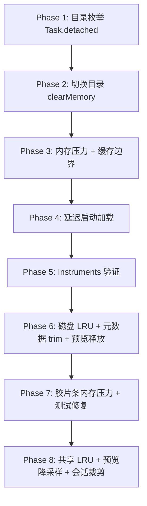

# MeoFind 性能与内存优化建议

> 目标：加载快、响应快、内存占用少、长时间使用不持续增长；**不改变已有功能行为**。

## 现状：已经做得不错的地方

| 领域 | 现有机制 |
|------|----------|
| 列表渲染 | `NSTableView` / `NSCollectionView` 虚拟化，只渲染可见行 |
| 目录切换 | `loadGeneration` 取消过期任务，避免竞态 |
| 缩略图 | 内存 LRU（500 条 / **80MB 共享单例**）、磁盘缓存、QL 并发限制（4）、仅加载可见区、分批 8 张 |
| 目录元数据 | Actor 队列 + 有界缓存 + 路径切换时 `resetSession` |
| 预览 | `cancelLoad()`、`clearLoadedContent()`、预取有上限 |
| 脚本输出 | `JobStore` 最多保留 50 条 |

---

## 第一优先级：启动快、响应快（低风险）

### 1. 目录枚举移出主线程（影响最大）

`ContentView.loadItems()` 在 `Task { }` 里直接调用同步枚举。SwiftUI 的 `Task` 继承 `@MainActor`，大目录枚举会卡住 UI。

**建议**：改为 `Task.detached(priority: .userInitiated)` 包裹 `DirectoryListingLoader.loadFileItems`，与 `FolderPreviewLoader` 对齐。

### 2. 启动时延迟非关键初始化

当前启动即加载 `SnippetStore`、`CustomPreviewRuleStore`、`FullDiskAccessPromptController` 等。

**建议**：片段面板首次展开时再 `load()`；自定义预览规则在首次预览时再读；全盘访问提示可延后到首次访问受保护路径。

### 3. Release 构建开启编译器优化

`Package.swift` 可加 Release 的 `-O` / `-whole-module-optimization`。

### 4. 保持「自动计算目录大小」默认关闭或按需开启

`DirectorySizeComputer` 会递归遍历整棵子树，是 CPU + I/O 大户。设置里已有开关；长时间浏览时建议默认关。

---

## 第二优先级：控内存、防长时间膨胀（低风险）

### 5. 目录切换时清空缩略图内存缓存

`ThumbnailCache.clearMemory()` 已实现，但切换目录时未调用；`purgeAll()` 注释写明「目录切换不应调用」。

**建议**：在 `listingChanged` 时调用 `clearMemory()`，保留磁盘缓存。

### 6. 响应系统内存压力

在 `ExplorerAppDelegate` 使用 `DispatchSource.makeMemoryPressureSource`（macOS 标准做法），清理缩略图内存、路径栏缓存、语法高亮 NSCache 等。

### 7. 给无上限缓存加边界

| 缓存 | 现状 | 建议 |
|------|------|------|
| `PathSubdirectoryCache` | 仅 60s TTL，无条数上限 | 加 LRU，例如最多 50 条 |
| `TextSyntaxHighlighter` | `NSCache` 未设 limit | `countLimit = 20`，`totalCostLimit ≈ 32MB` |
| `DirectoryItemCountService` | `resetSession` 不清缓存 | 路径切换时 trim |
| `ThumbnailDiskCache` | 只增不减 | 磁盘上限（如 500MB）LRU 淘汰 |

### 8. 预览会话与窗口生命周期对齐

主窗口关闭时调用 `PreviewSessionStore.removeAll(forHostWindowID:)`，避免 PDF、AVPlayer、大段文本残留。

---

## 第三优先级：体验微调（中风险，需少量测试）

### 9. 首屏「先出列表、后补元数据」

列表先显示基础属性，目录大小/子项数量/缩略图走 visible-only 调度。

### 10. SwiftUI 刷新面收窄

`DirectoryMetadataOverlay` revision 变化时，尽量只刷新大小列或角标 cell，避免整表 reload。

### 11. Instruments 基线

- **Time Profiler**：启动 → 大目录 → 快速切换 10 个目录
- **Allocations**：缩略图模式滚动 30 分钟
- **Leaks / Memory Graph**：预览、分离窗口、脚本后关闭

---

## 实施计划

| 阶段 | 改动 | 风险 | 状态 |
|------|------|------|------|
| Phase 1 | 主列表枚举 `Task.detached` | 极低 | ✅ 已完成 |
| Phase 2 | 切换目录 `clearMemory()` | 低 | ✅ 已完成 |
| Phase 3 | 内存警告 + 无界缓存加 cap | 低 | ✅ 已完成 |
| Phase 4 | 延迟 Snippet / 预览规则加载 | 低 | ✅ 已完成 |
| Phase 5 | Release 编译优化 + Instruments 验证 | 无 | 部分完成（`-O` 已加，Instruments 待手动） |
| Phase 6 | 磁盘缩略图 LRU + 元数据 trim + 预览会话释放 | 低 | ✅ 已完成 |
| Phase 7 | 预览胶片条内存压力 + 修复测试编译 | 低 | ✅ 已完成 |
| Phase 8 | 共享缩略图 LRU + 预览 ImageIO 降采样 + 会话内存压力裁剪 | 低 | ✅ 已完成 |
| Phase 9 | 侧栏关闭释放 inline session + 动态预览像素预算 | 低 | ✅ 已完成 |

### Phase 8 实施摘要

1. **ThumbnailGenerator.shared**：网格、列表图标、胶片条共用单一 LRU（80MB），避免三份 150MB 缓存叠加。
2. **FileListTableController**：目录切换 `clearMemoryCache()`；订阅 `.meoFindMemoryPressure`。
3. **ImagePreviewLoader**：预览默认 ImageIO 降采样（最长边 4096px）；「实际大小」/ 编辑 / 保存前按需升级全分辨率。
4. **PreviewSessionStore.respondToMemoryPressure()**：取消预取与进行中的加载；非 key 的 detached 窗口释放已解码内容。
5. **AppMemoryPressure**：集中调用 shared LRU 清理与会话裁剪。

### Phase 9 实施摘要（侧栏释放 + 动态降采样预算）

1. **PreviewSessionStore.removeInlineSessions**：侧栏关闭预览或切换选中时移除内联 session；已分离窗口会话保留。
2. **FilePreviewSessionHost.onDisappear** + **RightPanelStackView** `showPreview` 监听：双路径确保大图/PDF 不常驻。
3. **ImagePreviewDisplayMetrics**：`max(宽,高) × Retina × 1.5`，上限 4096、下限 256。
4. **PreviewImageDisplaySizeReporter**：`FileContentView` 上报容器尺寸；图片类 `loadTaskID` 含尺寸/token，布局就绪后按更小预算重载。

### Phase 8 Instruments 手动验收清单

在 **Release** 构建下执行：

1. **Allocations**：打开含 20+ 张 4000px 照片的目录，侧栏或独立窗连续预览 10 张；单张 `NSBitmapImageRep` 常驻应明显低于全分辨率（约 96MB/24MP）。
2. **Memory Graph**：关闭预览面板 / detached 窗口后，无残留 `PreviewSession` 持有超大 bitmap（允许缩略图 LRU 在 80MB 预算内）。
3. **内存压力**：触发系统 memory warning 后，后台 detached 窗口大图应释放；当前 key 窗口预览仍可显示。
4. **编辑保存**：对降采样预览图旋转后保存，输出文件像素尺寸应与原图一致。

### Phase 7 实施摘要

1. **PreviewBrowserStripThumbnailLoader**：内存压力时清空条带内解码图与生成器内存/磁盘缓存，并触发重新加载可见胶片。
2. **ExplorerTests**：修复 `UserDefaults` 属性包装器、`@MainActor` 测试、`ComputeGate` 异步 `release()`、`PreviewSessionLocation.detached` 等编译错误，恢复 `swift test` 可运行。

### Phase 6 实施摘要

1. **ThumbnailDiskCache**：磁盘总容量上限 500MB，超出按修改时间 LRU 淘汰；`trimToBudget()` 供内存压力调用。
2. **DirectoryMetadataService**：`resetSession` 时按 `sessionResetCacheRetention` 裁剪缓存（子项数量服务保留 100 条）；内存压力时两个 Service 各保留 50 条。
3. **PreviewSessionStore**：`remove` 时 `clearBrowserContext()` + `clearLoadedContent()`；主窗口 `willClose` 已有清理链路。

---

## 明确不建议动的部分

- 不要用 `purgeAll()` 替代 `clearMemory()` 做目录切换（会伤重复访问速度）
- 不要去掉 `loadGeneration` 取消机制
- 不要关掉 FSEvents 自动刷新（除非做成可选设置）
- 不要把缩略图改成「全目录一次性生成」
- 不要为省内存去掉预览、脚本、目录大小等已交付功能
