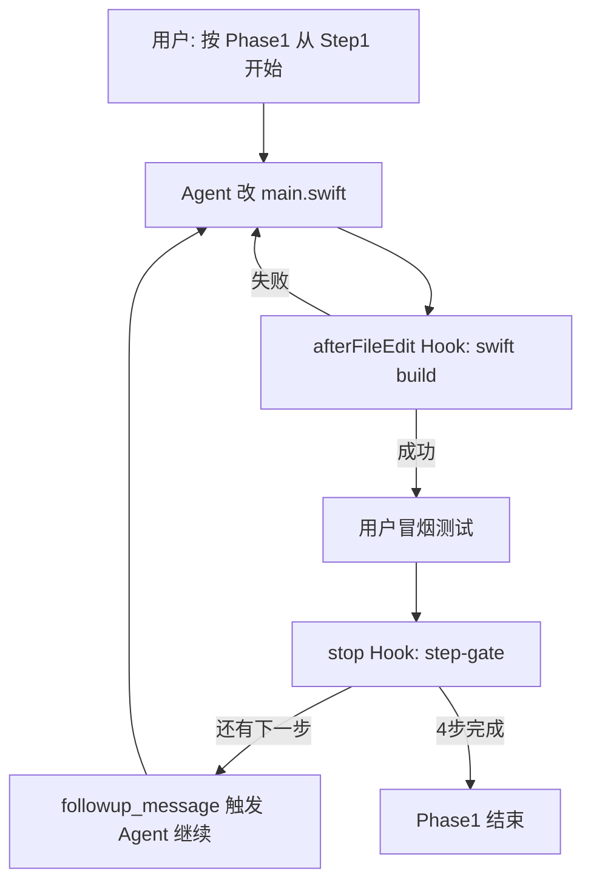

# Phase 1 修改方案与 Hook 分步执行计划

> 目标：在 `Sources/main.swift` 上完成四项快速收益优化——消除属性重复读取、路径监听、Task 取消、Formatter 预计算。

---

## 目标与范围

| 编号 | 改动项 | 预期收益 |
|------|--------|----------|
| P1-1 | 消除属性重复读取 | 目录加载 I/O 减半，大目录明显加速 |
| P1-2 | 路径变化自动加载 | 修复侧边栏/导航不刷新 bug |
| P1-3 | Task 取消与加载竞态修复 | 快速切换目录不再出现旧结果覆盖 |
| P1-4 | Formatter 预计算 | 滚动列表 CPU 下降，帧率更稳 |

**涉及文件：** 仅 `Sources/main.swift`（本阶段不拆文件）

**不在本阶段：** 渐进式加载、目录缓存、FSEvents、NSTableView 虚拟化

---

## P1-1：消除属性重复读取

### 问题

`enumerator(includingPropertiesForKeys:)` 已预取属性，循环内再次 `resourceValues(forKeys:)` 造成重复 I/O。

### 改法

将单层目录枚举从 `enumerator` 改为 `contentsOfDirectory(at:includingPropertiesForKeys:options:)`：

```swift
// 改前：enumerator + 循环内 resourceValues
// 改后：
let urls = try FileManager.default.contentsOfDirectory(
    at: url,
    includingPropertiesForKeys: [
        .isDirectoryKey,
        .contentModificationDateKey,
        .fileSizeKey,
        .isHiddenKey
    ],
    options: shouldShowHiddenFiles
        ? [.skipsPackageDescendants]
        : [.skipsHiddenFiles, .skipsPackageDescendants]
)
```

循环内**只调用一次** `fileURL.resourceValues(forKeys:)`（命中预取缓存，无额外磁盘访问）。

### 注意点

- `contentsOfDirectory` 语义就是「当前目录一层」，与 `.skipsSubdirectoryDescendants` 一致，更合适
- 保留 `do/catch`，目录无权限或不存在时清空列表并结束 loading
- `.skipsPackageDescendants` 保留，避免把 `.app` 当普通文件夹展开

### 验收

- 打开含 1000+ 文件的目录，加载时间应短于改前（可用 Instruments Time Profiler 对比 `getattrlist` 调用次数）
- 隐藏文件开关行为与改前一致

---

## P1-2：路径变化自动加载

### 问题

侧边栏、`navigateUp`、`openItem` 只改 `path`，没有统一触发 `loadItems()`；目前只有 `onAppear` 会加载。

### 改法

在 `ContentView` 的 `NavigationSplitView` 链路上增加：

```swift
.onChange(of: path) { _, _ in
    loadItems()
}
```

并**去掉**以下位置的冗余 `loadItems()` 调用（避免双重加载）：

| 位置 | 处理 |
|------|------|
| `navigateUp()` | 只改 `path`，删除 `loadItems()` |
| `openItem()` 进入目录分支 | 只改 `path`，删除 `loadItems()` |
| `SidebarView` 按钮 | 保持只改 `path`（无需改 Sidebar） |
| `createNewFolder()` 成功后 | **保留** `loadItems()`（path 未变，onChange 不触发） |
| 隐藏文件 toggle | **保留** `loadItems()`（showHiddenFiles 变化，非 path） |
| 刷新按钮 / Path 回车 | **保留** `loadItems()` |

### 补充：排序不应重新读盘

`sortOrder` 变化时，在内存中重排即可：

```swift
.onChange(of: sortOrder) { _, newOrder in
    items.sort(by: newOrder.comparator)
}
```

### 验收

- 点侧边栏 Home/Desktop/Documents → 列表立即更新
- 双击进入子目录、点向上箭头 → 列表更新
- 切换排序 → 列表重排，无 loading 闪烁
- 新建文件夹 → 列表刷新

---

## P1-3：Task 取消与加载竞态修复

### 问题

1. `guard !isLoading else { return }` 会在加载中**丢弃**新的加载请求
2. 无 Task 取消，快速切换目录时旧 Task 可能后完成，覆盖新目录结果

### 改法

**状态新增：**

```swift
@State private var loadGeneration: UInt = 0
```

**`loadItems()` 重构逻辑：**

```
1. loadGeneration += 1，记录 currentGeneration
2. isLoading = true
3. selection.removeAll()
4. 在 Task 内：
   a. 后台枚举 + 构建 [FileItem]（含预格式化字符串，见 P1-4）
   b. 每批或枚举结束后检查 Task.isCancelled
   c. await MainActor.run 前再次检查 currentGeneration == loadGeneration
   d. 匹配才更新 items 并 isLoading = false；不匹配则静默丢弃
```

**同时移除** `guard !isLoading else { return }`，改为每次调用都递增 generation 并启动新 Task（旧 Task 通过 generation 校验自然失效）。

可选增强：在 `Task` 内使用 `try Task.checkCancellation()`，在 `for` 循环中周期性检查。

### 验收

- 快速连续点击侧边栏多个位置 → 最终列表与最后选中的目录一致
- 加载中切换目录 → 不出现「闪一下旧目录」
- 加载中刷新按钮仍可用

---

## P1-4：Formatter 预计算

### 问题

`FileItem.sizeString` / `modificationDateString` 是计算属性，Table 滚动时反复创建 `ByteCountFormatter` / `DateFormatter`。

### 改法

**1. 新增静态 formatter（线程安全用法）：**

```swift
enum FileItemFormatters {
    private static let sizeFormatter: ByteCountFormatter = {
        let f = ByteCountFormatter()
        f.allowedUnits = [.useAll]
        f.countStyle = .file
        return f
    }()

    private static let dateFormatter: DateFormatter = {
        let f = DateFormatter()
        f.dateStyle = .medium
        f.timeStyle = .short
        return f
    }()

    static func formatSize(_ bytes: Int64) -> String {
        sizeFormatter.string(fromByteCount: bytes)
    }

    static func formatDate(_ date: Date) -> String {
        dateFormatter.string(from: date)
    }
}
```

**2. `FileItem` 改为存储预格式化字符串：**

```swift
struct FileItem: Identifiable, Hashable {
    // 保留原始字段供排序用
    let modificationDate: Date
    let size: Int64
    // 新增预计算展示字段
    let sizeDisplay: String
    let dateDisplay: String
}
```

**3. 在 `loadItems` 构建 `FileItem` 时一次性赋值。**

**4. `FileListView` 中 `TableColumn` 改用 `item.sizeDisplay` / `item.dateDisplay`。**

**5. `FilePreviewView` 同样改用新字段，删除旧的计算属性。**

### 验收

- 大目录滚动流畅度提升（主观 + Instruments 中 Formatter 分配减少）
- 显示格式与改前一致

---

## 改动影响矩阵

```
ContentView
  ├── @State loadGeneration          [P1-3 新增]
  ├── .onChange(of: path)            [P1-2 新增]
  ├── .onChange(of: sortOrder)        [P1-2 新增]
  ├── loadItems()                    [P1-1/P1-3/P1-4 重构]
  ├── navigateUp()                   [P1-2 删 loadItems]
  └── openItem()                     [P1-2 删 loadItems]

FileItem                             [P1-4 重构]
FileItemFormatters                   [P1-4 新增]
FileListView                         [P1-4 改用 display 字段]
FilePreviewView                      [P1-4 改用 display 字段]
```

---

## 建议提交粒度

| Commit | 内容 |
|--------|------|
| 1 | P1-1 枚举 API 替换 |
| 2 | P1-2 路径监听 + 去重 loadItems |
| 3 | P1-3 generation 取消竞态 |
| 4 | P1-4 Formatter 预计算 |

每步可独立回滚，便于 Code Review。

---

# Cursor Hook 分步执行计划

用 Cursor **项目级 Hooks** 把 Phase 1 拆成 4 步：每步改代码 → 自动构建验证 → Agent 收到下一步指令继续。

## 目录结构（待创建）

```
.cursor/
├── hooks.json
├── hooks/
│   ├── phase1-build-verify.sh      # 每步编辑后自动构建
│   ├── phase1-step-gate.sh         # Agent 结束时推进步骤
│   └── phase1-progress.json        # 步骤进度
└── plans/
    └── phase1-execution.md         # 本方案精简版（可选）
```

## hooks.json 设计

```json
{
  "version": 1,
  "hooks": {
    "afterFileEdit": [
      {
        "command": ".cursor/hooks/phase1-build-verify.sh",
        "matcher": "main\\.swift"
      }
    ],
    "stop": [
      {
        "command": ".cursor/hooks/phase1-step-gate.sh",
        "loop_limit": 4
      }
    ]
  }
}
```

| Hook | 触发时机 | 作用 |
|------|----------|------|
| `afterFileEdit` | 编辑 `main.swift` 后 | 跑 `swift build -c release`，失败则注入错误上下文 |
| `stop` | Agent 一轮结束 | 读进度文件，返回 `followup_message` 推进下一步 |

## 进度文件格式

`.cursor/hooks/phase1-progress.json`：

```json
{
  "phase": "phase1",
  "current_step": 0,
  "steps": [
    { "id": "P1-1", "title": "消除属性重复读取", "status": "pending" },
    { "id": "P1-2", "title": "路径变化自动加载", "status": "pending" },
    { "id": "P1-3", "title": "Task 取消与竞态修复", "status": "pending" },
    { "id": "P1-4", "title": "Formatter 预计算", "status": "pending" }
  ]
}
```

---

## 四步执行清单

### Step 0：初始化（人工一次）

1. 创建上述 hook 文件与 `phase1-progress.json`（`current_step: 0`）
2. `chmod +x .cursor/hooks/*.sh`
3. 对 Agent 说：**「按 Phase 1 计划从 Step 1 开始执行」**

---

### Step 1 — P1-1：消除属性重复读取

**Agent 任务：**

- 将 `enumerator` 替换为 `contentsOfDirectory(at:includingPropertiesForKeys:options:)`
- 循环内只读一次 `resourceValues`
- 补充目录不存在/无权限的错误处理

**Hook 验证（`phase1-build-verify.sh`）：**

```bash
cd /Volumes/SSD4T/pro/macquickfinder && swift build -c release 2>&1
# 退出码非 0 → 返回 additional_context 给 Agent 修复
```

**人工冒烟：**

- `./build_and_run.sh`
- 打开 `~/Downloads`，确认列表正常

**完成后：** `phase1-step-gate.sh` 将 P1-1 标为 `done`，`current_step` → 1

---

### Step 2 — P1-2：路径变化自动加载

**Agent 任务：**

- 添加 `.onChange(of: path)` 触发 `loadItems()`
- 添加 `.onChange(of: sortOrder)` 内存排序
- 从 `navigateUp` / `openItem` 移除冗余 `loadItems()`

**Hook 验证：** 构建通过

**人工冒烟：**

- 点侧边栏各入口 → 列表变化
- 切换排序 → 无 loading，顺序变化
- 双击进目录 → 正常

**完成后：** `current_step` → 2

---

### Step 3 — P1-3：Task 取消与竞态修复

**Agent 任务：**

- 新增 `loadGeneration`
- 重构 `loadItems()`：移除 `guard !isLoading`，用 generation 校验结果
- 循环内加 `Task.isCancelled` / `checkCancellation()` 检查

**Hook 验证：** 构建通过

**人工冒烟：**

- 快速连点侧边栏 5 个不同目录 → 最终显示最后一个
- 加载中立刻切换目录 → 无旧数据残留

**完成后：** `current_step` → 3

---

### Step 4 — P1-4：Formatter 预计算

**Agent 任务：**

- 新增 `FileItemFormatters`
- `FileItem` 增加 `sizeDisplay` / `dateDisplay`
- 更新 `FileListView`、`FilePreviewView`
- 删除旧计算属性

**Hook 验证：** 构建通过

**人工冒烟：**

- 打开大目录（1000+ 文件）滚动列表
- 预览面板日期/大小显示正确

**完成后：** 全部标 `done`，hook 不再发 followup

---

## phase1-step-gate.sh 核心逻辑

```bash
#!/bin/bash
PROGRESS=".cursor/hooks/phase1-progress.json"
STEP=$(jq -r '.current_step' "$PROGRESS")

case $STEP in
  0) MSG="执行 Phase1 Step1 (P1-1): 将 enumerator 改为 contentsOfDirectory，消除重复 resourceValues 读取。只改 Sources/main.swift，完成后构建验证。" ;;
  1) MSG="执行 Phase1 Step2 (P1-2): 添加 onChange(path) 和 onChange(sortOrder)，移除 navigateUp/openItem 中冗余 loadItems。" ;;
  2) MSG="执行 Phase1 Step3 (P1-3): 引入 loadGeneration，重构 loadItems 取消竞态，移除 guard !isLoading。" ;;
  3) MSG="执行 Phase1 Step4 (P1-4): 新增 FileItemFormatters，FileItem 预计算 sizeDisplay/dateDisplay。" ;;
  *) exit 0 ;;  # 全部完成，不再 followup
esac

# 更新 progress 并输出 followup_message
echo "{\"followup_message\": \"$MSG\"}"
```

---

## 执行流程图



---

## 风险与回退

| 风险 | 应对 |
|------|------|
| `onChange(path)` 与 `onAppear` 双重加载 | `onChange` 不在首次赋值时触发（SwiftUI 新 API 默认行为）；`onAppear` 保留首次加载 |
| `contentsOfDirectory` 抛错 | catch 后 `items = []`，`isLoading = false` |
| Hook 环境无 `swift` | `phase1-build-verify.sh` 开头 `command -v swift` 检查，失败则跳过构建只提示 |
| generation 与 sortOrder 冲突 | sortOrder 变化只排序，不递增 generation |

---

## 后续阶段预览

Phase 1 完成后，可继续推进：

- **Phase 2：** 渐进式列表更新、目录 LRU 缓存、FSEvents 自动刷新
- **Phase 3：** 拆分 `FileService` 层、NSTableView 虚拟化、图标缓存、Spotlight 全局搜索
