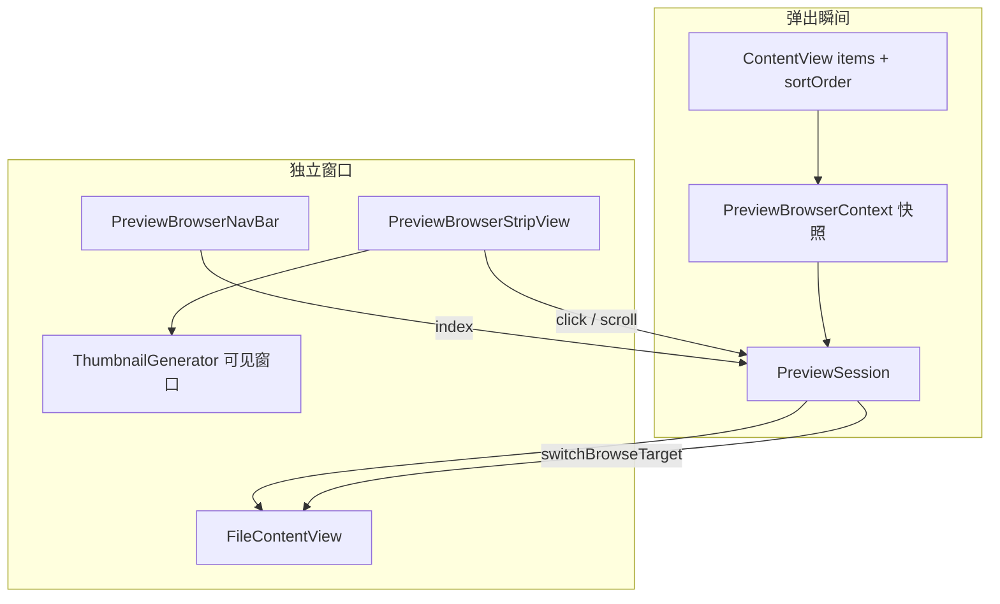

# 独立窗口浏览条（Preview Browser Strip）— 交互与架构设计

> 目标：在**已弹出的独立预览窗口**底部增加目录内多文件浏览能力；用户可在同一窗口内按当前目录排序顺序切换预览，无需回到主窗口文件列表。  
> 前置依赖：[preview-detached-window-design.md](./preview-detached-window-design.md)（`PreviewSession` / `DetachedPreviewWindowView` 已落地）。  
> 关联文档：[thumbnail-view-design.md](./thumbnail-view-design.md)（缩略图生成与缓存策略复用）。

---

## 一、现状与问题

### 1.1 当前实现

| 组件 | 位置 | 职责 |
|------|------|------|
| `DetachedPreviewWindowView` | `Preview/` | 独立窗口：顶栏 + `FileContentView(session:)` |
| `PreviewSession` | `Preview/` | 单文件预览会话（工具栏状态 + 加载结果） |
| `PreviewDetachCoordinator` | `Preview/` | 弹出 / 收回 / placement |
| `ThumbnailGenerator` | `FileList/Thumbnail/` | QL 缩略图 + LRU 内存/磁盘缓存 |
| `FileListSortEngine` | `FileList/` | 与主窗口一致的排序 |
| `ContentView` | `AppModule.swift` | 持有当前目录 `items`、`sortOrder`、`selection` |

**独立窗口当前流程**：

```
detach(session)
  → DetachedPreviewWindowView(sessionID)
  → PreviewSession 绑定单一 FileItem
  → FileContentView.beginLoadTask()
  → 用户只能预览该文件；切换需回主窗口改选中项
```

### 1.2 核心问题

| 问题 | 说明 |
|------|------|
| 单文件会话 | `PreviewSession.file` 在 detach 时固定，无法在独立窗口内浏览兄弟文件 |
| 看图 / 审 PDF 工作流断裂 | 用户弹出大图后，仍需回主列表用方向键或点击切换 |
| 无目录上下文 | detach 未携带「当前目录有序文件列表」快照 |
| 潜在性能陷阱 | 若 naive 实现「为目录内每个文件生成缩略图」，大目录会拖垮 QL 与缓存 |

### 1.3 设计原则

1. **复用 Session，切换目标文件**：同一 `PreviewSession` 内更换 `browseTarget`，调用 `beginLoadTask()`；不新建 Session、不 Clone。
2. **目录快照，非实时镜像**：detach 时捕获有序文件 ID 列表 + 排序键；主窗口后续改排序不强制同步（可提示）。
3. **缩略图按需、可见窗口加载**：禁止全目录 QL；复用 `ThumbnailGenerator` + `ThumbnailCache`。
4. **默认跳过不可预览项**：条带仅含可 inline 预览的文件（非文件夹）；切换时跳过失败类型。
5. **渐进交付**：MVP 先方向键 + 文本导航；V1 再 Cover Flow 胶片条 + 动画。

---

## 二、交互设计（推荐方案）

### 2.1 核心隐喻

**「独立预览窗口 = 单目录内的迷你浏览器」**：底部条带是缩略图版「胶片条」，当前文件居中高亮，两侧渐隐缩小；主内容区仍是完整预览 + 顶栏工具。

对标：Photos 胶片条、Finder Quick Look 左右键、Lightroom 底部 strip。

### 2.2 窗口布局

```
┌────────────────────────────────────────────────────────────────────┐
│ [←返回]  photo_042.jpg   [缩放][旋转]…          [收回] [×]          │  ← 现有顶栏
├────────────────────────────────────────────────────────────────────┤
│                                                                    │
│                     当前文件预览内容（大）                           │
│                                                                    │
├────────────────────────────────────────────────────────────────────┤
│  ○   ○   ◉   ○   ○   ○   ○    ← Preview Browser Strip（V1）       │
│       0.55 scale          1.0 scale                                │
│       opacity 0.45        opacity 1.0                              │
├────────────────────────────────────────────────────────────────────┤
│  [◀]  photo_042.jpg · 42/128  [▶]  [展开胶片条 ⌄]                  │  ← MVP 导航条（始终可见）
└────────────────────────────────────────────────────────────────────┘
```

| 区域 | MVP（P5） | V1（P6） |
|------|-----------|----------|
| 导航条 | 文件名 + 序号 + ◀▶ 按钮 | 保留；可折叠 |
| 胶片条 | 默认隐藏；可展开 | 默认展开；虚拟化横向滚动 |
| 顶栏 | 不变 | 标题随当前文件更新 |

### 2.3 胶片条视觉规范（V1）

| 属性 | 当前项（居中） | 相邻项 | 远端项 |
|------|----------------|--------|--------|
| 缩放 scale | `1.0` | `0.72` | `0.55` |
| 不透明度 | `1.0` | `0.65` | `0.40` |
| 单元尺寸 | 72pt（逻辑） | 同基线，由 scale 呈现 | 同左 |
| 间距 | 8pt | — | — |
| 选中指示 | 可选 2pt accent 边框 | — | — |
| 标签 | 无（或 hover 显示文件名 tooltip） | — | — |

**过渡动画**（V1）：

- 条带滚动居中：`easeInOut(duration: 0.22)`
- scale / opacity：`spring(response: 0.28, dampingFraction: 0.82)`
- 内容区切换：crossfade `0.15s` + 现有 `ProgressView`（不掩盖 I/O 延迟）

### 2.4 过滤与排序

**条带条目来源**（detach 时计算一次）：

```swift
orderedBrowseItems = directoryItems
    .filter { !$0.isDirectory && !$0.isParentDirectoryEntry }
    .filter { PreviewBrowserEligibility.canPreviewInDetachedWindow($0) }
    .sorted(by: sortSnapshot)  // FileListSortEngine 等价
currentIndex = orderedBrowseItems.firstIndex(where: { $0.id == session.file.id })
```

| 规则 | 说明 |
|------|------|
| 排序 | 与 detach 瞬间主窗口 `sortOrder` / `FileListPreferences.sort` 一致 |
| 排除文件夹 | 文件夹无独立窗口完整预览，不进入条带 |
| 排除 `..` | 与列表一致 |
| 隐藏文件 | 与 detach 时 `showHiddenFiles` 快照一致 |
| **同类型过滤（P7 可选）** | 设置项「条带仅显示同扩展名」；默认关闭 |

**弹出时目录仅 1 个可预览文件**：隐藏条带与导航条，行为与现有一致。

### 2.5 切换行为

#### 场景 A：点击条带某项

1. 更新 `browser.currentIndex`
2. `session.switchBrowseTarget(to: item)` → `resetControls()` + `beginLoadTask()`
3. 条带滚动使该项居中，播放 scale/opacity 动画
4. 顶栏标题更新为 `item.name`

#### 场景 B：键盘 ← / →

| 键 | 行为 |
|----|------|
| `←` | 上一可预览项；已在首项则无操作 |
| `→` | 下一可预览项 |
| `⌘←` / `⌘→` | 同左（可选，与系统 HIG 对齐） |

- 焦点在预览窗口内时生效（`.focusable()` + `onKeyPress` 或 `NSEvent` local monitor）
- 快速连按：**120ms debounce** 合并加载（见 §八）

#### 场景 C：展开 / 收起胶片条

- 默认（MVP）：条带收起，仅导航条
- 点击「展开胶片条」→ 显示 V1 strip；再次点击或 `Esc` 收起
- 收起状态持久化：`@AppStorage("previewBrowser.stripExpanded")`（可选 P7）

#### 场景 D：与主窗口选中项关系

| 模式 | 行为 |
|------|------|
| **默认：独立浏览** | 条带切换 **不** 改主窗口 `selection` |
| 可选（P7）：「同步选中到文件列表」 | 切换时 `NotificationCenter` / callback 更新主窗口选中 |

首版 **不同步**，降低耦合。

#### 场景 E：文件被外部删除 / 改名

- 切换加载失败 → 现有 `loadPhase.failed` UI
- 条带项保留至窗口关闭；可选「从条带移除已失效项」（P7）

#### 场景 F：目录在 detach 后变化

- 主窗口 `loadItems()` 刷新列表 **不** 自动更新条带快照
- 顶栏可选 badge「目录已变更」+ 按钮「刷新条带」（P7）；首版不刷新

### 2.6 快捷键汇总

| 入口 | 快捷键 | 行为 |
|------|--------|------|
| 上一文件 | `←` | 条带 index - 1 |
| 下一文件 | `→` | 条带 index + 1 |
| 展开/收起胶片条 | `⌘B` | toggle strip（V1） |
| 收回侧栏 / 关闭 | 已有 | 不变 |

### 2.7 非目标（首版不做）

- 跨目录浏览（条带不能切到子文件夹内文件）
- 条带内文件夹缩略图 + 进入文件夹
- 多选批量预览
- Contact Sheet 全页网格（列为 P8 创意项）
- 与主窗口排序实时双向同步
- 网络目录特殊 UX（沿用现有网络卷策略，不额外优化）

---

## 三、架构设计

### 3.1 模块划分

```
Sources/Explorer/Preview/Browser/
├── PreviewBrowserContext.swift       // 目录快照 + currentIndex
├── PreviewBrowserEligibility.swift // 可进入条带的文件判定
├── PreviewBrowserController.swift  // 切换、debounce、prefetch 调度
├── PreviewBrowserNavBar.swift      // MVP：◀ 文件名 · n/N ▶
├── PreviewBrowserStripView.swift   // V1：Cover Flow 条带（SwiftUI 或 NSViewRepresentable）
├── PreviewBrowserStripCell.swift   // 单格：缩略图 + scale/opacity
└── PreviewBrowserStripMetrics.swift // 尺寸、动画常量
```

集成点：

| 集成点 | 改动 |
|--------|------|
| `PreviewDetachCoordinator.detach` | 构建 `PreviewBrowserContext` 附加到 session |
| `PreviewSession` | `browseContext`、`browseTarget`、`switchBrowseTarget(to:)` |
| `DetachedPreviewWindowView` | 底部嵌入 NavBar + 可选 Strip |
| `ContentView` / detach 调用链 | 传入 `items`、`sortOrder`、`showHiddenFiles` 快照 |
| `ThumbnailGenerator` | 条带 cellSize 使用 **72pt bucket**（与列表 128pt 区分） |

### 3.2 核心类型

#### PreviewBrowserContext

```swift
@MainActor
final class PreviewBrowserContext: ObservableObject {
    let directoryPath: String
    let sortSnapshot: FileListSortPreferences  // 或 SortOrder 快照
    let showHiddenFiles: Bool
    @Published private(set) var orderedItems: [FileItem]
    @Published var currentIndex: Int

    var currentItem: FileItem { orderedItems[currentIndex] }
    var count: Int { orderedItems.count }
    var canBrowse: Bool { orderedItems.count > 1 }

    func item(at offset: Int) -> FileItem?
    func select(index: Int)
    func selectPrevious() -> Bool
    func selectNext() -> Bool
}
```

#### PreviewSession 扩展

```swift
extension PreviewSession {
    var browseContext: PreviewBrowserContext?
    var browseTarget: FileItem { browseContext?.currentItem ?? previewContentItem ?? file }

    func attachBrowserContext(_ context: PreviewBrowserContext)
    func switchBrowseTarget(to item: FileItem) {
        cancelLoad()
        resetControls()
        // 更新 context.currentIndex
        beginLoadTask(customPreviewRevision: ...)
    }
}
```

`FileContentView` 加载目标改为 `session.browseTarget`（或 `previewContentItem` 在 browse 模式下由 context 驱动）。

#### PreviewBrowserController

```swift
@MainActor
final class PreviewBrowserController: ObservableObject {
    @Published var isStripExpanded: Bool
    private var pendingSwitchTask: Task<Void, Never>?
    private let debounceMs: UInt64 = 120

    func requestSwitch(to index: Int, session: PreviewSession)
    func handleKeyNavigation(direction: PreviewBrowserDirection, session: PreviewSession)
}
```

#### Detach 时构建快照

```swift
// PreviewDetachCoordinator 或 factory
static func makeBrowserContext(
    currentFile: FileItem,
    directoryItems: [FileItem],
    sortOrder: SortOrder,
    showHiddenFiles: Bool
) -> PreviewBrowserContext?
```

### 3.3 数据流



### 3.4 胶片条实现选型

| 方案 | 优点 | 缺点 | 结论 |
|------|------|------|------|
| **SwiftUI `ScrollView` + `LazyHStack` + `ScrollViewReader`** | 与现有 Detached 窗口一致、动画好写 | 超大列表需 careful id | **V1 首选** |
| `NSCollectionView` 横向 | 与 `FileListThumbnailController` 一致、成熟虚拟化 | 桥接 + 动画略繁 | 条带 >500 项时备选 |
| 静态 HStack 全量 | 实现快 | 大目录不可用 | **禁止** |

**缩略图加载**：

```swift
// 仅对 index in (current ± prefetchRadius) 请求
thumbnailGenerator.loadThumbnail(
    for: row,
    cellSize: PreviewBrowserStripMetrics.thumbnailSize, // 72
    screenScale: scale,
    completion: { ... }
)
```

复用 `ThumbnailCache`；key 的 `sizeBucket` 与主网格不同，避免互相驱逐。

### 3.5 与 Detach 参数扩展

`PreviewWindowValue` 首版不变（仍 `sessionID`）。上下文存在 `PreviewSession` / Store 内 session 上。

detach 调用处（`FilePreviewSessionHost`）需能访问：

- `items`（当前目录完整列表）或 `directoryItems` 过滤后列表
- `sortOrder`
- `showHiddenFiles`

通过 `FilePreviewView` 向 `FilePreviewSessionHost` 传入，或在 detach 时从 `ContentView` 经 `PreviewDetachCommands` 提供 factory closure。

---

## 四、与现有组件的映射

| 现有 | 扩展后 |
|------|--------|
| `PreviewSession.file` | detach 时初始文件；浏览时以 `browseTarget` 为准 |
| `FileContentView` `.task(id:)` | task id 含 `browseTarget.id` |
| `ThumbnailGenerator` | 条带 72pt；可见±3 预取 |
| `FileListSortEngine` | detach 快照排序一次 |
| `DetachedPreviewWindowView` | + NavBar + Strip |
| `PreviewDetachCoordinator.detach` | 附加 `PreviewBrowserContext` |

---

## 五、分期实施

| 阶段 | 主题 | 交付 |
|------|------|------|
| **P5** | MVP 导航 | 方向键 + ◀▶ + `n/N`；无缩略图条 |
| **P6** | 胶片条 V1 | 虚拟化 strip + 动画 + 点击切换 |
| **P7** | 增强 | 同类型过滤、debounce 预取、展开持久化、同步选中（可选） |
| **P8** | 创意（可选） | Contact Sheet、hover 展开条带 |

详细 Issue 见 [preview-browser-strip-plan.md](./preview-browser-strip-plan.md)（PD-15 起）。

---

## 六、边界与错误处理

| 情况 | 处理 |
|------|------|
| 目录仅 1 个可预览文件 | 不显示 NavBar/Strip |
| 当前文件不在过滤后列表 | detach 时不应发生；assert + fallback 仅显示当前文件 |
| 切换时 loading | 显示 ProgressView；取消前一 task |
| 快速 ← → | debounce 120ms；仅最后一次触发 load |
| 条带缩略图失败 | 显示 `instantPlaceholder` 系统图标 |
| 图片编辑未保存时切换 | 与侧栏换文件一致：不拦截（P7 可加确认） |
| `folderInlineChild` 弹出 | 条带基于**目录列表**；当前项为 inline child；首版支持 |

---

## 七、测试要点

| 类型 | 用例 |
|------|------|
| 单元 | `PreviewBrowserContext` 上一项/下一项边界 |
| 单元 | `PreviewBrowserEligibility` 过滤文件夹、不可预览扩展 |
| 单元 | 排序快照与 `FileListSortEngine` 结果一致 |
| UI 手动 | 50 张图片目录：← → 流畅；Activity Monitor 无内存尖峰 |
| UI 手动 | 500+ 文件：条带滚动仅加载可见缩略图 |
| UI 手动 | PDF 条内切换：页码 reset、工具栏正确 |
| 性能 | 打开 strip 不对全目录发起 QL（日志计数） |
| 回归 | detach / dock / 关闭主窗口行为不变 |

---

## 八、性能红线（强制）

与 [thumbnail-view-design.md](./thumbnail-view-design.md) §性能 及 [preview-detached-window-design.md](./preview-detached-window-design.md) §八 一致：

| 规则 | 说明 |
|------|------|
| **禁止全目录 QL** | 条带缩略图仅 `visibleIndices ± 3` |
| **虚拟化** | LazyHStack 或 NSCollectionView；不得 `ForEach(allItems)` 无 lazy |
| **切换 debounce** | 键盘连按 ≥100ms 合并为一次 `beginLoadTask` |
| **单 Session** | 切换文件不新建 `PreviewSession` |
| **视频不预取** | 相邻项 prefetch 仅 metadata + 缩略图；不预创建 `AVPlayer` |
| **缓存复用** | 必须走 `ThumbnailGenerator`；禁止条带内独立 QL 通道 |
| **条带高度固定** | 建议 88–96pt（含 padding）；不随窗口拉高 |

### 规模预估

| 目录规模 | 条带 QL | 切换预览 |
|----------|---------|----------|
| &lt; 50 | 低；多数 cache hit | 与侧栏换文件相当 |
| 50–500 | 中；滚动增量加载 | debounce 后可接受 |
| 500+ | 依赖虚拟化；否则禁止 ship | 建议默认收起 strip |

---

## 九、后续扩展

| 方向 | 说明 |
|------|------|
| Contact Sheet 模式 | 窗口内切换「条带 / 网格」双模态 |
| 时间线条带 | 排序为日期时，条带显示时间刻度 |
| 插件化 | `PreviewBrowserEligibility` 可注入插件「可浏览」判定 |
| 主窗口联动 | 可选同步 selection、scrollIntoView |
| 缩略图 hover 预览 | hover 条带项 0.5s 显示大图 tooltip（慎用 QL） |

---

## 十、决策记录

| 决策 | 选择 | 理由 |
|------|------|------|
| 交付顺序 | MVP 导航 → V1 胶片条 | 低风险验证浏览模型；缩略图后加 |
| 目录列表 | detach 快照 | 避免与主窗口实时同步复杂度 |
| 主窗口 selection | 默认不同步 | 独立窗口自洽浏览 |
| 条带条目 | 排除文件夹 | 与 detached 预览能力一致 |
| 缩略图尺寸 | 72pt bucket | 与 128pt 网格 cache 分离 |
| 动画 | scale + opacity + scroll | Cover Flow 认知；GPU 便宜 |
| 同类型过滤 | P7 可选 | 摄影场景增强，非 MVP 阻塞 |
| 实现栈 | SwiftUI LazyHStack 首版 | 与 Detached 窗口一致 |
