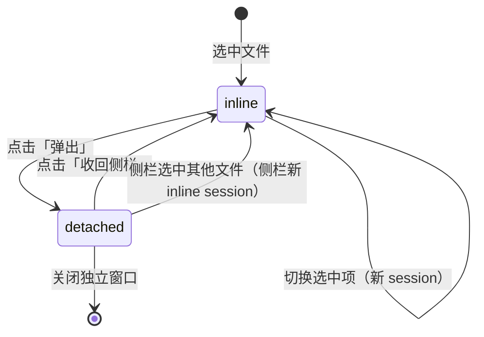
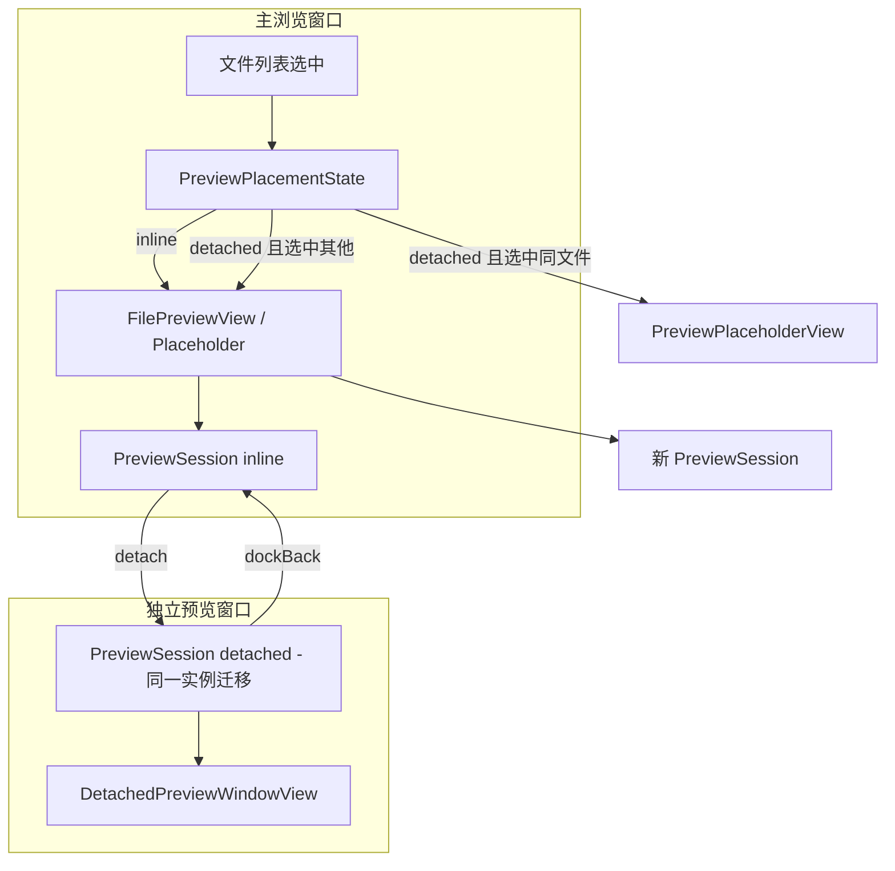

# 预览独立窗口 — 交互与架构设计

> 目标：在右侧预览面板标题栏增加「弹出独立窗口」能力；点击后将**当前预览会话**迁移到新窗口，独立窗口顶部保留与侧栏预览相同的工具栏功能；**不重复加载**文件内容。  
> 关联评估：性能分析见 §八；与 [viewer-plugin-architecture.md](./viewer-plugin-architecture.md) 的 `PreviewSession` 概念可逐步对齐，首版不阻塞插件化。

---

## 一、现状与问题

### 1.1 当前实现

| 组件 | 位置 | 职责 |
|------|------|------|
| `FilePreviewView` | `AppModule.swift` | 预览外壳：折叠、标题、工具栏、内容区 |
| `FileContentView` | `AppModule.swift` | 按类型异步加载并渲染（图片/PDF/文本/媒体等） |
| `previewToolbarItems(for:)` | `FilePreviewView` 内 | 按文件类型生成标题栏按钮（约 30+ `@State` 驱动） |
| `RightPanelStackView` | `RightPanel/` | 预览 + Snippets 纵向堆叠 |
| `WindowGroup(folder)` | `ExplorerApp` | 已有「按路径打开新浏览窗口」先例 |

**选择 → 预览流程**：

```
文件列表选中
  → FilePreviewView（selection.first）
  → FileContentView.task(id: item.id)
  → loadContent() 后台读取 + 主线程渲染
  → 标题栏按钮绑定 FilePreviewView @State
```

### 1.2 核心问题

| 问题 | 说明 |
|------|------|
| 状态与 UI 强耦合 | 工具栏状态、加载结果、渲染 View 分散在 `FilePreviewView` / `FileContentView`，无法整体迁移 |
| 右栏空间受限 | 用户希望大图/PDF/代码预览占满屏幕，但不想关闭侧栏 Snippets |
| 朴素「复制预览」有性能风险 | 新窗口再实例化一遍会导致图片/PDF/视频双倍内存与 I/O |

### 1.3 设计原则

1. **迁移（Detach），不复制（Clone）**：弹出 = 把当前 `PreviewSession` 搬到新窗口。
2. **单份内容、单份播放器**：同一时刻只有一个 View 树持有 `NSImage` / `PDFDocument` / `AVPlayer`。
3. **侧栏预览不阻塞**：弹出后主窗口侧栏可继续预览其他选中项（独立会话）。
4. **工具栏行为一致**：侧栏与独立窗口共用同一套 `previewToolbarItems` 渲染逻辑。
5. **与现有性能红线一致**：`.task(id:)` 可取消、切换释放大对象、主线程不做同步 I/O。

---

## 二、交互设计（推荐方案）

### 2.1 核心隐喻

**「弹出预览」= 把当前预览卡片从右栏撕下来，贴到一个新窗口；不是复印一份。**

用户心智模型对标：VS Code 编辑器「Move into New Window」、Finder Quick Look 独立窗口（但保留完整工具栏）。

### 2.2 标题栏按钮布局

**侧栏预览标题栏**（在关闭 `×` 左侧新增）：

```
┌────────────────────────────────────────────────────────────────────┐
│ [∨折叠] [←返回]  文件名.pdf   [缩放][旋转]…[溢出▾]   [⧉弹出] [×关闭] │
└────────────────────────────────────────────────────────────────────┘
                                              ↑ 新增      ↑ 原有
```

| 控件 | SF Symbol | 说明 |
|------|-----------|------|
| 弹出独立窗口 | `macwindow.badge.plus` | 将当前预览会话迁移到新窗口 |
| 关闭预览 | `xmark` | 与现有一致，关闭侧栏预览区（不关闭已弹出的独立窗口） |

**独立窗口顶部工具栏**（与侧栏结构对齐，宿主控件略有差异）：

```
┌────────────────────────────────────────────────────────────────────┐
│  文件名.pdf          [缩放][旋转]…[溢出▾]        [⬇收回] [×关闭窗口] │
└────────────────────────────────────────────────────────────────────┘
```

| 控件 | SF Symbol | 说明 |
|------|-----------|------|
| 收回侧栏 | `sidebar.right` 或 `arrow.down.right.and.arrow.up.left` | 会话迁回主窗口侧栏，关闭独立窗口 |
| 关闭窗口 | `xmark` | 销毁会话，释放已加载内容 |

**折叠按钮**：独立窗口不需要（窗口可自由缩放）；侧栏保留。

**文件夹内联子项预览**（`folderInlineChild`）：弹出时连同子项上下文一并迁移；独立窗口标题栏保留「返回文件夹」按钮（若处于内联子项状态）。

### 2.3 状态机：预览安置（Preview Placement）

每个**主浏览窗口**（`ContentView` 实例）维护一个 `PreviewPlacement`：

```swift
enum PreviewPlacement: Equatable {
    /// 默认：预览在侧栏 inline 渲染
    case inline

    /// 某文件已弹出到独立窗口；侧栏对该文件不再 inline 渲染
    case detached(sessionID: PreviewSessionID, fileID: FileItem.ID)
}
```



### 2.4 关键交互场景

#### 场景 A：弹出当前文件

1. 用户在侧栏预览 `report.pdf`（已翻到第 5 页、缩放 120%）。
2. 点击「弹出独立窗口」。
3. **即时**：独立窗口出现，仍显示第 5 页、120% 缩放；**无 loading 闪烁**。
4. 侧栏预览区：若当前选中仍是 `report.pdf` → 显示**轻量占位条**（见 §2.5）；若用户已选中其他文件 → 侧栏正常预览新文件。

#### 场景 B：弹出后继续浏览

1. `report.pdf` 在独立窗口中。
2. 用户在主列表选中 `photo.png`。
3. 侧栏立即开始预览 `photo.png`（新的 inline session）。
4. 独立窗口保持 `report.pdf` 不变（pinned session）。

> 这是推荐方案的核心价值：弹出是为了「占大屏看 A，同时用侧栏看 B」。

#### 场景 C：收回侧栏

1. 独立窗口显示 `report.pdf`（第 5 页）。
2. 用户点击「收回侧栏」。
3. 若主窗口当前选中 **仍是** `report.pdf`：session 迁回侧栏，独立窗口关闭，页码/缩放保留。
4. 若主窗口当前选中 **已是其他文件**：
   - 弹出确认：「收回将替换侧栏当前预览（photo.png）。是否继续？」
   - 确认后：侧栏切换为 `report.pdf` 的 session（可选：同时更新列表选中项）。

#### 场景 D：关闭独立窗口

1. 用户点击独立窗口「关闭窗口」或系统红绿灯关闭。
2. 销毁 detached session，释放 PDF/图片/播放器。
3. 若侧栏占位条正在显示该文件 → 占位条消失；若当前选中仍是该文件 → 侧栏重新 inline 加载（**唯一允许的重新加载路径**）。

#### 场景 E：关闭侧栏预览（×）

1. 行为与现有一致：`layout.showPreview = false`，右栏预览区隐藏。
2. **不影响**已弹出的独立窗口（独立窗口生命周期独立）。
3. 再次打开侧栏预览 → 对当前选中项新建 inline session。

#### 场景 F：主窗口关闭

1. 该窗口关联的所有 detached preview 窗口**一并关闭**（session 销毁）。
2. 实现：`PreviewDetachCoordinator` 按 `hostWindowID` 弱引用跟踪。

#### 场景 G：无选中 / 文件夹预览

| 上下文 | 弹出按钮 | 说明 |
|--------|----------|------|
| 未选中文件 | 隐藏或 disabled | 无内容可弹出 |
| 选中文件夹（`FolderPreviewView`） | **Phase 2** | 需自带导航上下文，首版 disabled + tooltip「文件夹预览暂不支持弹出」 |
| 文件夹内联子项 | Phase 1 支持 | 弹出时 `folderInlineChild` 写入 session |

### 2.5 侧栏占位条（Detached Placeholder）

当「当前选中文件 == 已弹出的文件」且该文件不在侧栏 inline 渲染时，显示占位条而非空白：

```
┌──────────────────────────────────────────────────────────────┐
│  📄 report.pdf 已在独立窗口中预览    [聚焦窗口] [收回侧栏]      │
└──────────────────────────────────────────────────────────────┘
```

- 高度：`PanelTopBarMetrics.totalHeight`（与折叠态标题栏一致），不占用内容区。
- 「聚焦窗口」：`NSWindow.makeKeyAndOrderFront`。
- 不触发 `loadContent()`，零 I/O。

### 2.6 独立窗口外观

| 属性 | 值 |
|------|-----|
| 窗口样式 | `.titleBar` + `.unifiedCompact`（与主窗口一致） |
| 标题 | 文件名（`PreviewFileRef.displayName`） |
| 最小尺寸 | 320 × 240 |
| 默认尺寸 | 上次关闭时 frame（按 session 文件类型分 key 持久化，可选 Phase 2） |
| 是否显示路径栏 / 侧栏 | 否，纯预览 + 工具栏 |

### 2.7 快捷键与菜单

| 入口 | 快捷键 | 行为 |
|------|--------|------|
| 菜单「预览 → 在独立窗口中打开」 | `⌘⌥P` | 弹出当前侧栏预览（与标题栏按钮等价） |
| 菜单「预览 → 收回侧栏」 | — | 仅 detached 状态 enabled |
| 菜单「窗口 → 显示/关闭预览」 | 已有 | 不受影响 |

### 2.8 非目标（首版不做）

- 同一文件同时 inline + detached 双开（性能与心智负担）
- 多个 detached 窗口（Phase 2 可选）
- 文件夹预览弹出（Phase 2）
- detached 窗口跨主窗口拖拽合并（Phase 3+）
- 预览窗口 Tab 多文件（未来）

---

## 三、架构设计

### 3.1 模块划分

```
Sources/Explorer/Preview/
├── PreviewSession.swift              // 会话：文件 + 工具栏状态 + 加载结果
├── PreviewSessionStore.swift         // 全局/按窗口 session 注册表
├── PreviewDetachCoordinator.swift    // 弹出/收回/窗口生命周期
├── PreviewWindowValue.swift          // WindowGroup 传参
├── PreviewPlacementState.swift       // 每主窗口 placement 状态
├── PreviewPanelChrome.swift          // 共用标题栏（侧栏 / 独立窗口两种 chrome 模式）
├── PreviewPlaceholderView.swift      // 侧栏 detached 占位条
├── DetachedPreviewWindowView.swift   // 独立窗口根 View
└── PreviewToolbarSupport.swift       // 从 FilePreviewView 抽出的 toolbar 构建（Phase 1 可先内联迁移）
```

与现有代码集成：

| 集成点 | 改动 |
|--------|------|
| `ExplorerApp.body` | 新增 `WindowGroup(id: "preview", for: PreviewWindowValue.self)` |
| `FilePreviewView` | 改为绑定 `PreviewSession`；根据 `PreviewPlacement` 决定 inline / placeholder |
| `FileContentView` | 加载结果写入 `PreviewSession`；或作为 session 子 View 保留 `@State` 但通过 session 桥接 |
| `RightPanelStackView` | 传入 `PreviewDetachCoordinator` / placement |
| `ExplorerWindowLayoutState` | **不**持久化 detached 状态（窗口关闭即丢失） |

### 3.2 核心类型

#### PreviewSessionID

```swift
struct PreviewSessionID: Hashable, Codable, Sendable {
    let rawValue: UUID
}
```

#### PreviewSession（@MainActor ObservableObject）

```swift
@MainActor
final class PreviewSession: ObservableObject, Identifiable {
    let id: PreviewSessionID
    let hostWindowID: UUID          // 所属主浏览窗口
    let file: FileItem
    var folderInlineChild: FileItem?

    // --- 工具栏 / 视图状态（从 FilePreviewView 迁出）---
    @Published var imageZoomScale: CGFloat = 1.0
    @Published var pdfCurrentPage: Int = 0
    @Published var markdownMode: MarkdownDisplayMode = .preview
    // ... 其余 @State 同构迁移

    // --- 加载结果（从 FileContentView 迁出）---
    @Published var loadPhase: PreviewLoadPhase = .idle
    @Published var image: NSImage?
    @Published var pdfDocument: PDFDocument?
    @Published var mediaPlayer: AVPlayer?
    @Published var textContent: String = ""
    // ...

    private var loadTask: Task<Void, Never>?

    func loadIfNeeded() { /* .task 等价逻辑 */ }
    func cancelLoad() { loadTask?.cancel() }

    /// 供 toolbar 闭包使用
    func resetControls() { /* resetPreviewControls 等价 */ }
}

enum PreviewLoadPhase: Equatable {
    case idle, loading, loaded, failed(String)
}
```

#### PreviewWindowValue（WindowGroup 参数）

```swift
struct PreviewWindowValue: Hashable, Codable {
    let sessionID: PreviewSessionID
}
```

#### PreviewDetachCoordinator

```swift
@MainActor
final class PreviewDetachCoordinator: ObservableObject {
    @Published private(set) var placement: PreviewPlacement = .inline

    func detach(session: PreviewSession, openWindow: OpenWindowAction)
    func dockBack(sessionID: PreviewSessionID)
    func onDetachedWindowWillClose(sessionID: PreviewSessionID)
    func onHostWindowWillClose(hostWindowID: UUID)
}
```

### 3.3 数据流



**迁移关键**：detach 时不是新建 session，而是：

1. `PreviewSessionStore` 标记 session `location = .detached(windowID)`
2. SwiftUI 侧栏 View 树移除 `FileContentView`（session 的 content host 置 nil）
3. `openWindow(id: "preview", value: PreviewWindowValue(sessionID:))`
4. 独立窗口 `DetachedPreviewWindowView` 挂载同一 `PreviewSession` 的 content host

这样 `NSImage` / `PDFDocument` / `AVPlayer` 实例**随 session 移动**，不重新 `loadContent()`。

### 3.4 工具栏复用

抽取 `PreviewPanelChrome`：

```swift
enum PreviewChromeMode {
    case sidebar   // 折叠、弹出、关闭预览
    case detached  // 收回、关闭窗口
}

struct PreviewPanelChrome: View {
    let mode: PreviewChromeMode
    @ObservedObject var session: PreviewSession
    let toolbarItems: [PreviewToolbarOverflowModel]
    var onCollapse: (() -> Void)?
    var onDetach: (() -> Void)?
    var onDockBack: (() -> Void)?
    var onClose: () -> Void
}
```

`previewToolbarItems(for:)` 改为 `PreviewToolbarBuilder.makeItems(session: PreviewSession, file: FileItem)`，闭包读写 session 上的 `@Published` 属性。

### 3.5 WindowGroup 注册

```swift
// ExplorerApp.swift
WindowGroup(id: ExplorerWindowScene.preview, for: PreviewWindowValue.self) { $value in
    if let value {
        DetachedPreviewWindowView(sessionID: value.sessionID)
    } else {
        EmptyView()
    }
}
.windowStyle(.titleBar)
.windowToolbarStyle(.unifiedCompact(showsTitle: true))
.defaultSize(width: 640, height: 480)
```

---

## 四、与现有组件的映射

| 现有 | 迁移后 |
|------|--------|
| `FilePreviewView` 30+ `@State` | `PreviewSession` `@Published` |
| `FileContentView` `@State` image/pdf/... | `PreviewSession` 加载结果 |
| `FilePreviewView.body` 标题栏 HStack | `PreviewPanelChrome` |
| `resetPreviewControls()` | `PreviewSession.resetControls()` |
| `loadContent()` in FileContentView | `PreviewSession.loadIfNeeded()` |
| `FolderPreviewView` inline | Phase 1 不弹出；Phase 2 扩展 session |

---

## 五、分期实施

| 阶段 | 主题 | 交付 |
|------|------|------|
| **P1** | Session 抽取 + 侧栏行为不变 | 重构，无用户可见功能 |
| **P2** | 弹出 / 收回 / 占位条 | MVP 可交付 |
| **P3** | 菜单快捷键 + 边界场景 | 主窗口关闭、确认对话框 |
| **P4** | 文件夹预览弹出 + 多窗口 | 可选增强 |

详细 Issue 拆分见 [preview-detached-window-phase1-plan.md](./preview-detached-window-phase1-plan.md)。

---

## 六、边界与错误处理

| 情况 | 处理 |
|------|------|
| 弹出时会话仍在 loading | 允许弹出，独立窗口显示 ProgressView（同一 task） |
| 弹出时图片有未保存编辑 | 独立窗口保留编辑状态；保存/关闭行为不变 |
| 文件在外部被删除 | 现有 error 路径；独立窗口显示加载失败 |
| 快速连续点击弹出 | debounce / 已 detached 则聚焦已有窗口 |
| 同一主窗口重复弹出同一文件 | 聚焦已有 detached 窗口，不新建 |
| Session store 内存泄漏 | 窗口关闭 + 主窗口关闭时从 store 移除；弱引用 host window |

---

## 七、测试要点

| 类型 | 用例 |
|------|------|
| 单元 | `PreviewPlacementState` 状态转换 |
| 单元 | detach 后 store 中 session location 正确 |
| UI 手动 | 弹出 PDF 后页码保留 |
| UI 手动 | 弹出后选其他文件，侧栏新预览正常 |
| UI 手动 | 收回侧栏后缩放/旋转保留 |
| UI 手动 | 关闭主窗口 → detached 窗口一并关闭 |
| 性能 | 弹出瞬间无 `loadContent` 二次调用（Instruments / log 断言） |

---

## 八、性能红线（强制）

与 [preview-toolbar-rollout.md](./preview-toolbar-rollout.md) §4 一致，并补充：

| 规则 | 说明 |
|------|------|
| 禁止 Clone 路径 | 代码审查禁止 detached 窗口走完整 `loadContent()` 除非 §2.4 场景 D |
| 单 AVPlayer | session 迁移时 player 不 rebuild |
| 占位条零 I/O | `PreviewPlaceholderView` 不得触发加载 |
| 主窗口关闭清理 | 所有 detached session 必须在 `willClose` 释放大对象 |

**预期开销**：弹出按钮 + 窗口 chrome ≈ 可忽略；迁移模式额外内存 ≈ 0（相对当前预览）。

---

## 九、后续与插件架构对齐

[viewer-plugin-architecture.md](./viewer-plugin-architecture.md) 规划了 `PreviewHostView` + `PreviewToolbarItem` PreferenceKey。本方案抽取的 `PreviewSession` 可演进为：

```
PreviewSession
  ├── file: PreviewFileRef
  ├── toolbarItems: [PreviewToolbarItem]  // 插件上报
  └── contentHandle: PreviewContentHandle // 插件或内置 provider
```

首版仍用现有 `previewToolbarItems(for:)` 逻辑，仅搬迁到 session 驱动，降低 P1 风险。

---

## 十、决策记录

| 决策 | 选择 | 理由 |
|------|------|------|
| 弹出语义 | 迁移 session | 避免双倍内存/I/O |
| 弹出后侧栏 | 可选预览其他文件 | 符合文件管理器工作流 |
| 同文件双开 | 不支持 | 性能与复杂度 |
| 文件夹弹出 | Phase 2 | 导航回调耦合高 |
| detached 持久化 | 不持久化 | 简化；重启后无残留窗口 |
| 窗口 frame 持久化 | Phase 2 可选 | 首版 defaultSize 即可 |
