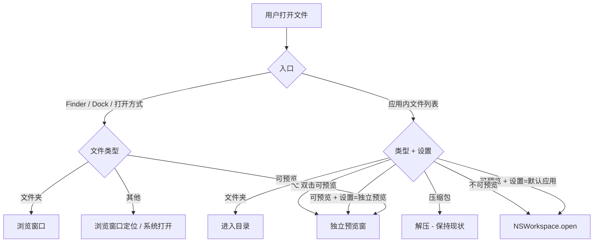
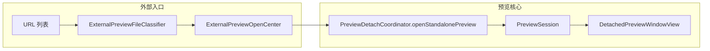

# 可预览文件独立窗口打开 — 交互与架构设计

> 目标：将当前**仅图片**支持的「外部双击 → 独立预览窗」能力，扩展到所有应用内可预览的文件类型（PDF、文本/代码、音视频、Office、压缩包、自定义规则等），并补齐应用内双击、右键菜单与设置项。  
> 前置依赖：[preview-detached-window-design.md](./preview-detached-window-design.md)、[preview-browser-strip-design.md](./preview-browser-strip-design.md)（独立窗口、胶片条、工具栏已落地）。  
> 开发计划见 [preview-standalone-open-plan.md](./preview-standalone-open-plan.md)。

---

## 一、现状与问题

### 1.1 当前实现

| 入口 | 图片 | 其他可预览类型 | 文件夹 | 不可预览文件 |
|------|------|----------------|--------|--------------|
| **Finder / 外部双击**（本应用为打开程序） | 独立预览窗 | 打开主窗口并定位到父目录 | 打开浏览窗口 | 打开主窗口并定位 |
| **应用内双击** | 系统默认应用 | 系统默认应用 | 进入目录 | 系统默认应用 |
| **侧栏预览 → 弹出** | 独立预览窗 | 独立预览窗 | Phase 2（文件夹） | — |

**相关代码**：

| 组件 | 位置 | 职责 |
|------|------|------|
| `ExternalImagePreviewOpenCenter` | `ExternalImagePreviewOpenCenter.swift` | 外部入口：仅图片 → 独立预览窗 |
| `ExternalImageFileClassifier` | `ImageFileDimensionsReader.swift` | 图片扩展名判定 |
| `PreviewDetachCoordinator.openStandaloneImagePreview` | `PreviewDetachCoordinator.swift` | 创建无宿主主窗口的 standalone session |
| `PreviewCapability.canLoadPreview` | `PreviewCapability.swift` | 侧栏/独立窗可加载预览的统一门槛 |
| `PreviewBrowserEligibility` | `PreviewBrowserEligibility.swift` | 胶片条候选过滤（与 canLoadPreview 对齐） |
| `FileOperations.open` | `ContentView.openItem` | 应用内双击 → `NSWorkspace.shared.open` |
| `DefaultImageViewerManager` | `DefaultImageViewerManager.swift` | 注册为系统默认图片查看器 |

**外部打开流程（现状）**：

```
application(open:)
  → ExternalImagePreviewOpenCenter.tryOpen  // 仅图片
  → ExternalFolderOpenCenter.requestOpen    // 其余：主浏览窗口 + 选中
```

### 1.2 核心问题

| 问题 | 说明 |
|------|------|
| 能力割裂 | 侧栏已支持多类型预览 + 弹出，但外部双击与应用内双击未复用 |
| 图片特例化 | `ExternalImagePreviewOpenCenter` / `openStandaloneImagePreview` 命名与逻辑绑定图片 |
| 用户心智不一致 | Finder 双击图片是「看图」，双击 PDF 却是「开文件管理器」 |
| 缺少快捷路径 | 应用内想独立预览必须先侧栏选中再点「弹出」 |

### 1.3 设计原则

1. **单一能力门槛**：以 `PreviewCapability.canLoadPreview(for:)` 判定可否独立预览（含自定义规则）。
2. **复用 Detached 栈**：standalone 入口与侧栏弹出共用 `PreviewSession` + `DetachedPreviewWindowView`，不重复加载管线。
3. **外部入口零主窗口**：可预览文件从 Finder 打开时 `shouldSuppressExplorerWindows`，不闪浏览窗口。
4. **应用内保守默认**：双击默认仍「用默认应用打开」；⌥ 双击与设置提供独立预览快捷路径。
5. **类型差异化仅影响初始态**：窗口默认尺寸、工具栏初始值按类型区分；UI 壳与胶片条复用。

---

## 二、适用范围

### 2.1 可独立预览（`canLoadPreview == true`）

| 分组 | 扩展名示例 | 加载路径（`PreviewLoadRoute`） |
|------|-----------|-------------------------------|
| 图片 | jpg, png, heic, webp, gif, tiff, bmp | `builtInImage` |
| 设计/矢量（QL） | psd, svg, ai, eps, dxf | `builtInQuickLookImage` |
| PDF | pdf | `builtInPDF` |
| 文本/代码 | txt, md, swift, json, html, yaml… | `builtInText` |
| 音视频 | mp4, mov, mp3, wav | `builtInMedia` |
| Office | doc, docx, xls, xlsx, ppt, pptx | docx/doc/xlsx/xls/csv/`builtInOffice` |
| 压缩包 | zip, tar, gz, tgz… | `archive` |
| 自定义规则 | 用户配置扩展名 | `customOverride` / `customSupplement` |

### 2.2 不适用独立预览

| 类型 | 行为 |
|------|------|
| 文件夹 | 打开浏览窗口（保持 `ExternalFolderOpenCenter`） |
| `.app` 包 | `NSWorkspace.shared.open` 启动应用 |
| 不可预览文件 | 应用内/外部均走系统默认应用或浏览窗口定位 |
| 父目录项 `..` | 导航上一级 |

### 2.3 压缩包（特殊策略）

| 场景 | 行为 |
|------|------|
| 外部双击（本应用为打开程序） | **预览压缩包内容**（与侧栏一致），不自动解压 |
| 应用内双击 | **保持解压**（`ArchiveOperations.extract`，现有行为） |
| 右键菜单 | 同时提供「预览压缩包」与「解压到…」 |

可选设置项「压缩包双击：预览 / 解压」留待 P4 评估（默认不改应用内行为）。

---

## 三、交互设计

### 3.1 双入口分流



### 3.2 外部入口（Finder 双击、打开方式、拖到 Dock）

**推荐行为**（当本应用被设为该类型的默认打开程序时）：

- **可预览文件** → 仅开独立预览窗，抑制主浏览窗口（`shouldSuppressExplorerWindows = true`）。
- **文件夹** → 浏览窗口（不变）。
- **其他** → 浏览窗口定位到该文件（不变）。

**多文件**：

- 若 URL 列表中含多个可预览文件：**单窗 + 胶片条**，以第一个可预览项为当前文件；不每张各开一窗。
- 若混合「可预览 + 文件夹」：文件夹走浏览窗口；可预览走独立预览窗（并行，不互相阻塞）。
- 若混合「可预览 + 不可预览」：仅处理可预览子集；若无则可预览项则 fallback 到 `ExternalFolderOpenCenter`。

**与图片现有行为差异**：

- 图片多选目前会 `forEach` 开多个窗口；P1 起统一为**单窗 + 胶片条**（图片亦受益）。若需保留图片多窗，可在 P4 用设置开关。

### 3.3 应用内双击

| 设置项 | 选项 | 推荐默认 |
|--------|------|----------|
| 可预览文件双击 | ① 独立预览窗 ② 用默认应用打开 ③ 侧栏预览（不弹窗） | **② 用默认应用打开** |
| ⌥ 双击可预览文件 | 始终独立预览窗 | 开启（不可关闭） |

**修饰键**：

- **⌥ + 双击**：绕过主选项，直接 `openStandalonePreview`。
- **Enter / Return**：与双击主选项一致。
- **⌘↩**（P2）：固定为独立预览窗打开（列表有选中项时）。

**Tooltip**（文件列表行）：

- 可预览：`单击预览 · 双击打开 · ⌥双击独立预览`
- 不可预览：保持现有文案

### 3.4 右键菜单

在「打开」与「打开方式」之间（仅 `canLoadPreview` 时显示）：

```
在独立预览窗口中打开    ⌘⌥P
```

- 无侧栏预览时：直接 standalone（等同外部入口）。
- 侧栏已有 inline 预览同文件时：与标题栏「弹出」等价（`detach`）。
- 快捷键与现有 `ExplorerKeyboardShortcuts.detachPreview` 复用。

### 3.5 各类型独立窗初始态

共用 `DetachedPreviewWindowView`；通过 `PreviewWindowValue` / session 初始配置区分：

| 类型 | 默认窗口尺寸 | 首次工具栏 / 视图状态 | `fitImageToScreen` |
|------|-------------|----------------------|-------------------|
| 图片 | 按像素适应屏幕 | `adaptImageToWindowOnResize = true`，zoom 1.0 | `true` |
| PDF | 800 × 1000 | 适配宽度 | `false` |
| 文本/代码 | 720 × 900 | 自动换行开；行号跟设置 | `false` |
| 音视频 | 960 × 540（16:9） | 不自动播放 | `false` |
| Office / QL | 800 × 600 | — | `false` |
| 压缩包 | 640 × 480 | 目录树展开 | `false` |

窗口 frame 持久化（按类型分 key）为 P4 可选项。

### 3.6 Standalone 与侧栏 Detach 差异

| 属性 | 外部 / ⌥ 双击 Standalone | 侧栏弹出 Detach |
|------|-------------------------|-----------------|
| `allowsDockBack` | `false` | `true` |
| `hostWindowID` | 新生成 UUID（无宿主） | 主浏览窗口 ID |
| 主窗口关闭联动 | 不依赖主窗口 | `onHostWindowWillClose` 清理 |
| 胶片条 | 默认展开 | 默认展开（现有） |
| placement 占位条 | 无（无主窗口侧栏） | 有 |

应用内设置选「独立预览窗」且主窗口已打开时：`allowsDockBack = true`，便于收回侧栏。

### 3.7 设置 → 预览（新分区）

```
┌─ 双击与外部打开 ─────────────────────────────┐
│ 应用内双击可预览文件：  [用默认应用打开 ▾]      │
│                                              │
│ 注册为以下类型的默认打开程序：                 │
│   [✓] 图片（已有）                            │
│   [ ] PDF                                    │
│   [ ] 文本与代码                              │
│   [ ] 音视频                                  │
│   [ ] Office 文档                             │
│                                              │
│ 外部打开可预览文件时：  [仅独立预览窗 ▾]        │
│   （备选：打开浏览窗口并选中该文件）            │
└──────────────────────────────────────────────┘
```

「注册为默认打开程序」沿用 `DefaultImageViewerManager` 模式：按 UTType 分组调用 Launch Services，**分组可勾选**，避免一次抢占所有类型。

---

## 四、架构设计

### 4.1 模块变更概览

```
Sources/Explorer/
├── ExternalPreviewOpenCenter.swift          // 由 ExternalImagePreviewOpenCenter 泛化/替换
├── ExternalPreviewFileClassifier.swift      // 由 ExternalImageFileClassifier 扩展
├── DefaultPreviewHandlerManager.swift       // P3：PDF/文本/媒体/Office 分组注册
├── DefaultPreviewHandlerSettingsModel.swift // P3
├── Preview/
│   ├── PreviewDetachCoordinator.swift       // openStandaloneImagePreview → openStandalonePreview
│   ├── PreviewWindowValue.swift             // 增加 initialWindowSize / contentKind 等
│   └── PreviewStandaloneOpenPreferences.swift // 窗口初始态按类型
├── Preferences/AppPreferences.swift           // 新设置键
├── CustomPreviewSettings.swift                // 新设置 UI 分区
├── ContentView.swift                          // openItem 分流
├── FileListRowContextMenuBuilder.swift        // 右键菜单项
└── ExplorerBrowserWindowSuppressor.swift      // 重命名引用（行为不变）
```

### 4.2 外部入口路由

```swift
// ExplorerAppDelegate — 伪代码
func application(_ application: NSApplication, open urls: [URL]) {
    if ExternalPreviewOpenCenter.shared.tryOpen(urls: urls) { return }
    ExternalFolderOpenCenter.shared.requestOpen(urls: urls)
}
```

`ExternalPreviewOpenCenter.tryOpen`：

1. 过滤文件夹 URL → 交给 folder 路径（或并行处理）。
2. `ExternalPreviewFileClassifier.previewableURLs(from:)` → `PreviewCapability.canLoadPreview`。
3. 若设置「外部打开 = 浏览窗口定位」且非默认 handler → 返回 `false`（P3）。
4. `shouldSuppressExplorerWindows = true`；激活 app。
5. 取第一个可预览 URL 创建 session；其余兄弟文件写入 `PreviewBrowserContext`。
6. `openWindow(id: preview, value: PreviewWindowValue(...))`。

### 4.3 核心 API 演进

```swift
// PreviewDetachCoordinator
@discardableResult
func openStandalonePreview(
    file: FileItem,
    directoryPath: String,
    directoryItems: [FileItem],
    sortSnapshot: FileListSortState? = nil,
    options: PreviewStandaloneOpenOptions = .default
) -> PreviewSessionID

struct PreviewStandaloneOpenOptions {
    var allowsDockBack: Bool
    var fitImageToScreen: Bool
    var initialWindowSize: CGSize?
    // 按 PreviewLoadRoute 应用工具栏初始态
}
```

`openStandaloneImagePreview` 保留为便捷包装或内联调用 `openStandalonePreview` + 图片 options。

### 4.4 数据流



### 4.5 Info.plist 扩展（P3）

在 `CFBundleDocumentTypes` 中按分组增加 Viewer 声明（`LSHandlerRank: Alternate`）：

- `com.adobe.pdf`
- `public.plain-text`、`public.source-code`、常见代码 UTType
- `public.movie`、`public.audio`
- Office 相关 UTType

与 `DefaultPreviewHandlerManager` 勾选状态联动注册，不勾选则不修改 Launch Services。

---

## 五、边界与错误处理

| 情况 | 处理 |
|------|------|
| 文件被占用 / 无读权限 | 独立窗显示加载失败；工具栏或菜单提供「用默认应用打开」 |
| 超大文本 | 沿用截断策略；标题栏提示 |
| 独立窗已打开同文件 | 聚焦已有窗口（`PreviewSessionStore` 查重） |
| 快速连续外部打开 | debounce；同路径聚焦 |
| 废纸篓内文件 | 允许预览；删除类操作受现有 Trash 逻辑约束 |
| Bridge 未就绪 | `pendingPreviewWindows` 队列（沿用现有） |
| 自定义规则刚添加 | 下次打开生效；无需重启 |

---

## 六、非目标（首版不做）

- 不可预览文件的自研渲染
- 同一文件 inline + detached 双开
- 独立预览窗跨 Mac 空间拖拽合并
- 压缩包应用内双击改为默认预览（除非 P4 设置项落地）
- 图片多选仍各开一窗（P1 统一单窗；P4 可选恢复）

---

## 七、测试要点

| 类型 | 用例 |
|------|------|
| 单元 | `ExternalPreviewFileClassifier`：各扩展名 / 自定义规则 / 目录排除 |
| 单元 | `PreviewStandaloneOpenPreferences`：各 `PreviewLoadRoute` 初始 options |
| 单元 | 多 URL 解析：仅取首个可预览 + context 含兄弟项 |
| 集成 | 外部打开 PDF/txt/mp4 → 无浏览窗口闪现 |
| 集成 | ⌥ 双击 → 独立窗；普通双击 → 系统应用 |
| 手动 | 胶片条在 standalone 窗切换 PDF/图片/文本 |
| 手动 | 右键「独立预览窗打开」与 ⌘⌥P 一致 |
| 手动 | 设置切换「双击行为」后 Enter 同步 |

---

## 八、分期摘要

| 阶段 | 主题 | 见计划文档 |
|------|------|-----------|
| **P1** | 外部入口泛化 + standalone API | PSO-01 ~ PSO-06 |
| **P2** | 应用内 ⌥ 双击、右键、⌘↩ | PSO-07 ~ PSO-10 |
| **P3** | 设置项 + 分组默认打开程序 | PSO-11 ~ PSO-15 |
| **P4** | 窗口 frame 持久化、压缩包设置、多图策略 | PSO-16 ~ PSO-18 |

详见 [preview-standalone-open-plan.md](./preview-standalone-open-plan.md)。

---

## 九、决策记录

| 决策 | 选择 | 理由 |
|------|------|------|
| 能力门槛 | `PreviewCapability.canLoadPreview` | 与侧栏/胶片条/加载管线一致 |
| 外部可预览文件 | 独立预览窗 | 与图片对齐，零主窗口干扰 |
| 应用内双击默认 | 系统默认应用 | 不破坏 Finder 式习惯 |
| ⌥ 双击 | 固定独立预览窗 | 低成本高效捷径 |
| 外部多文件 | 单窗 + 胶片条 | 避免窗口泛滥 |
| 压缩包应用内双击 | 保持解压 | 现有用户预期 |
| 压缩包外部打开 | 预览内容 | 与「查看器」角色一致 |
| 默认 handler 注册 | 分组可勾选 | 避免过度抢占系统关联 |
