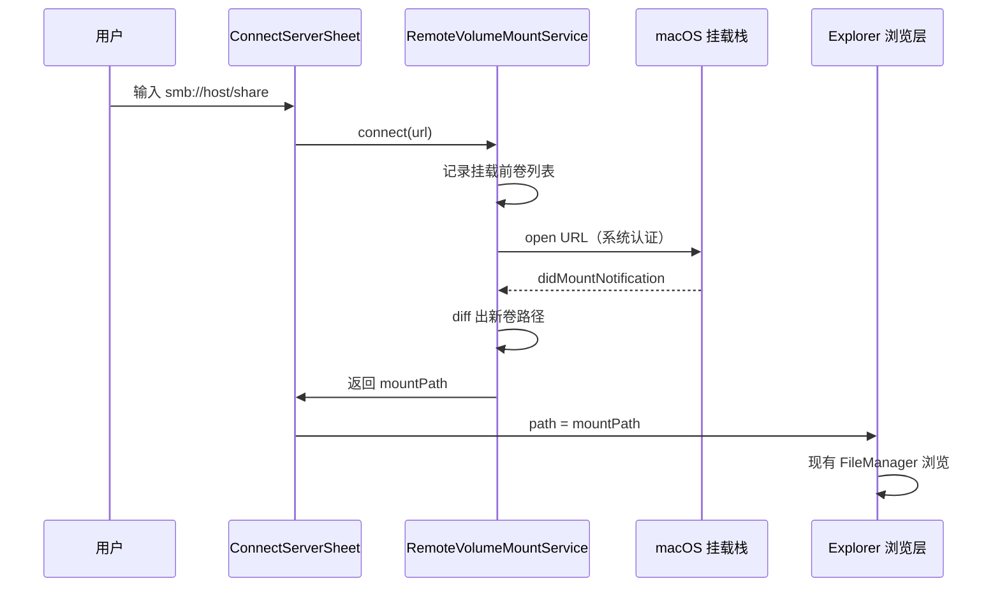

# 远程服务器连接 — 设计方案（v1 精简版）

> 目标：在应用内提供类似 Finder「连接服务器」（⌘K）的能力；挂载后与本地目录共用现有浏览链路；挂载状态与 Finder 互通（在系统支持的协议范围内）。  
> 基于 2026-06 代码库现状，**主推系统挂载 + 路径浏览**；SFTP 需单独分阶段处理。  
> **v1 精简原则**：复用 `DirectorySizeVolumeFilter` 作为网络卷策略入口；不新建 `NetworkVolumePolicy`；Finder 最近列表延后 v1.1；预览/缩略图预取 guard 纳入 v1 必做。  
> 关联评估：性能、体积、代码量见 §八、§九、§十。

---

## 一、现状与切入点

### 1.1 已有基础

| 能力 | 现状 | 文件 |
|------|------|------|
| 目录浏览 | 全路径 `FileManager.contentsOfDirectory` | `DirectoryListingLoader.swift`、`ContentView.swift` |
| 侧边栏 Devices | `mountedVolumeURLs` + mount/unmount 通知 | `SidebarView.swift`（`SidebarVolumeLoader`） |
| 网络卷性能保护 | 非本地卷跳过目录大小自动计算 | `DirectorySizeVolumeFilter` |
| 子项计数 | 已复用同一 filter，网络卷不调度 | `DirectoryItemCountService` |
| FSEvents | 网络卷**不启用**监听（与 filter 共用判断） | `DirectoryFSEventsMonitor.swift` |
| 弹出设备 | `diskutil eject`，但网络卷 `canEject` 被 `isLocal` 挡住 | `SidebarVolume`（`SidebarView.swift`） |
| 预览 | 通过 `file://` 路径读盘，挂载后无需新协议层 | `PreviewSession+LoadingPipeline.swift` |

### 1.2 核心结论

**不需要重写文件列表**。远程卷挂载到 `/Volumes/xxx`（或系统分配的 mount point）后，现有 `path → FileItem → FileListView` 链路可直接复用。

需要新增的是：

1. **连接入口**（菜单 / 快捷键 / 对话框）
2. **系统挂载封装**（触发 macOS 认证与挂载）
3. **挂载结果导航**（挂载成功后跳转到卷根目录）
4. **网络卷 UX 策略**（loading、断线、禁用重操作）
5. **应用内最近服务器列表**（Finder 最近列表延后 v1.1）
6. **网络卷预取克制**（预览/缩略图 guard，见 §六）
7. **协议扩展策略**（FTP 纳入 v1，待 Phase 0 验证；SFTP 分阶段，见 §九）

---

## 二、架构设计

### 2.1 总体流程



### 2.2 模块划分（建议新文件）

```
Sources/Explorer/RemoteServer/
├── RemoteServerURL.swift           // URL 解析、规范化、协议校验 + RemoteMountError
├── RemoteVolumeMountService.swift  // 系统挂载、超时、卷 diff（含挂载中状态）
├── RemoteServerBookmark.swift      // 最近服务器条目模型（Phase 2）
├── RecentServersStore.swift        // 应用内最近列表（Phase 2）
├── ConnectServerSheet.swift        // SwiftUI 连接对话框（Phase 3）

// v1.1 可选
└── FinderRecentServersReader.swift // 只读 Finder plist / bookmark

// v2+ 可选（仅 SFTP 内置客户端路线时需要）
└── SFTP/ …                         // 见 §九.3
```

**网络卷策略**：不新建 `NetworkVolumePolicy.swift`；在 `DirectorySizeVolumeFilter` 增加 `isNetworkVolume(path:)`，供目录元数据、FSEvents、预览/缩略图预取共用。

与现有代码的集成点：

| 集成点 | 改动 |
|--------|------|
| `ExplorerApp.commands`（`AppModule.swift`） | 新增「连接服务器…」菜单 + ⌘K |
| `ContentView` | Sheet 展示、挂载成功后更新 `@State path`；`didUnmount` 路径回退 |
| 多窗口 | 菜单/⌘K 通过 key window 回调更新**当前窗口** `ContentView.path`（参考 `ActiveWindowLayoutCenter`） |
| `SidebarView` / `SidebarRailView` | Devices 区网络卷图标、eject 修复 |
| `SidebarVolumeLoader` | 增加 `isNetworkVolume` |
| `DirectorySizeVolumeFilter` | 增加 `isNetworkVolume(path:)` |
| `DirectoryFSEventsMonitor` | **保持现状**：网络卷不启 FSEvents（性能更优） |
| `PreviewBrowserContentPrefetcher` / 缩略图预取 | 网络卷跳过预取（v1 必做） |

### 2.3 挂载 API 选型

**v1 推荐：`NSWorkspace.shared.open(url)`（等价于 `/usr/bin/open <url>`）**

理由：

- 与 Finder 共用系统挂载栈与 Keychain 凭据
- 无需自管 SMB/FTP 密码
- 实现成本最低
- **应用体积零增长**

备选（v1 不采用）：

- 直接 `mount_smbfs` / `mount_ftp`：可控性高，但凭据/选项与 Finder 不完全一致
- 自研 SMB/FTP 客户端：体积与维护成本高，且破坏 Finder 互通
- SFTP 内置客户端：见 §九

### 2.4 挂载点识别策略

`open` 不直接返回 mount path，需 diff：

```swift
struct RemoteVolumeMountService {
    func connect(to serverURL: URL) async throws -> URL {
        let before = Set(SidebarVolumeLoader.load().map(\.path))
        try await openSystemMount(serverURL)
        let mountPath = try await waitForNewVolume(
            excluding: before,
            timeout: 30
        )
        return URL(fileURLWithPath: mountPath, isDirectory: true)
    }
}
```

`waitForNewVolume` 实现：

1. 监听 `NSWorkspace.didMountNotification`（主线程 Combine）
2. 超时轮询 `mountedVolumeURLs`（500ms 间隔）
3. 若多个新卷同时出现：优先匹配 share 名 / host 名；无法判断时弹选择 sheet（v1 可简化为取第一个并 toast 提示）

失败场景：

- 用户取消认证 → 抛 `MountError.cancelled`
- 超时 → `MountError.timeout`
- 已挂载同 URL → 直接返回已有卷路径（先查 mount point 是否已有可达 share）

---

## 三、与 Finder 互通

### 3.1 按协议的互通能力

| 协议 | 系统挂载 | Finder ⌘K 互通 | 凭据共享 | v1 纳入 |
|------|----------|------------------|----------|---------|
| SMB | ✅ | ✅ | ✅ Keychain | ✅ |
| NFS | ✅ | ✅ | 视配置 | ✅ |
| WebDAV | ✅ | ✅ | ✅ | ✅ |
| AFP | ✅（已弃用） | ⚠️ | ✅ | 兼容解析，UI 不推荐 |
| **FTP** | ✅ | ✅ | ✅ 系统对话框 | ✅ |
| **SFTP** | ❌ 无原生 | ❌ | — | v2 分阶段 |

> Apple 官方文档：[Servers and shared computers you can connect to on Mac](https://support.apple.com/guide/mac-help/servers-shared-computers-connect-mac-mchlp3015/mac) 列出的原生协议包含 **FTP**，**不包含 SFTP**。Finder「连接服务器」无法直接填写 `sftp://`。

### 3.2 v1 互通范围（SMB / NFS / WebDAV / FTP）

| 能力 | v1 | 说明 |
|------|----|------|
| 挂载状态 | ✅ | 系统级，Finder 连上后本 app Devices 可见 |
| 凭据 | ✅ | Keychain 由系统管理 |
| 浏览路径 | ✅ | 同一 mount point |
| 断开挂载 | ✅ | `diskutil eject` / unmount |
| 读取 Finder 最近 URL | ⏸ v1.1 | `FinderRecentServersReader`；v1 仅用 `RecentServersStore` |
| 写入 Finder 收藏 | ❌ v2 | plist 非公开 API，键名随版本变化 |

### 3.3 Finder 数据源（v1.1 候选，本机 macOS 26 已确认键名存在）

| Key | 用途 |
|-----|------|
| `FXConnectToLastURL` | 对话框默认填充上次 URL |
| `FXRecentFolders` | `[{ name, file-bookmark }]`，bookmark 可 resolve 为 URL |
| `ShowMountedServersOnDesktop` | 只读参考，v1 不依赖 |

**v1 降级策略**：仅使用应用内 `RecentServersStore`；Sheet 默认地址为空或上次应用内连接记录。

### 3.4 Finder 数据源实现草案（v1.1）

```swift
enum FinderRecentServersReader {
    static func loadRecentServerURLs(limit: Int = 10) -> [RemoteServerBookmark] {
        // 1. 读 ~/Library/Preferences/com.apple.finder.plist
        // 2. 解析 FXRecentFolders 的 file-bookmark
        // 3. URL(resolvingBookmarkData:options:.withoutUI)
        // 4. 过滤 scheme ∈ { smb, afp, nfs, http, https, ftp }
        // 5. 去重、按 Finder 顺序
    }

    static func lastConnectURL() -> String? {
        // FXConnectToLastURL
    }
}
```

### 3.5 应用内最近列表

```swift
struct RemoteServerBookmark: Codable, Identifiable, Equatable {
    let id: String           // normalized URL string
    let displayName: String  // host 或 share 名
    let urlString: String    // smb://user@host/share
    let lastConnectedAt: Date
}
```

持久化：`UserDefaults` key `remoteServer.recentBookmarks`，最多 20 条，连接成功后 upsert。

---

## 四、URL 规范

### 4.1 支持协议

#### v1 — 系统挂载（与 Finder 互通）

| 协议 | 示例 | 备注 |
|------|------|------|
| SMB | `smb://host/share`、`smb://user@host/share` | 主推 |
| NFS | `nfs://host/export` | 企业 / NAS 常见 |
| WebDAV | `https://host/dav` | 依赖服务器配置 |
| FTP | `ftp://host/path`、`ftp://user@host:21/path` | 明文传输，UI 需安全提示 |
| AFP | `afp://host/share` | 仅兼容解析，UI 不主动推荐 |

#### v2 — SFTP（见 §九，不纳入 v1）

| 协议 | 示例 | 备注 |
|------|------|------|
| SFTP | `sftp://user@host:22/path` | 无 Finder 原生挂载；需 sshfs 或内置客户端 |

### 4.2 规范化规则

```swift
enum RemoteServerURL {
    static func normalize(_ input: String) -> URL? {
        // 1. trim
        // 2. 无 scheme 时默认补 smb://
        // 3. 拒绝 file://、javascript: 等
        // 4. host 不能为空
        // 5. ftp:// 保留 port（默认 21）；sftp:// 在 v2 启用
    }
}
```

### 4.3 地址栏联动（v1 可选，建议 v1.1）

路径栏输入 `smb://...` / `ftp://...` 回车时：

- 若未挂载 → 走 `RemoteVolumeMountService.connect`
- 若已挂载 → 直接导航（通过 bookmark / 卷名匹配）

---

## 五、UI 设计

### 5.1 入口

| 入口 | 行为 |
|------|------|
| 菜单「前往 → 连接服务器…」 | 打开 Sheet |
| ⌘K | 同 Finder 习惯 |
| Devices 区底部「连接服务器…」 | 侧边栏快捷入口（可选） |

### 5.2 ConnectServerSheet 布局

```
┌─────────────────────────────────────┐
│  连接服务器                          │
├─────────────────────────────────────┤
│  服务器地址                          │
│  [ smb://________________________ ] │
│                                     │
│  支持：SMB · NFS · WebDAV · FTP      │
│  （FTP 为明文传输，请注意安全）        │
│                                     │
│  最近连接                            │
│  ○ smb://nas.local/media            │
│  ○ ftp://ftp.example.com/pub        │
│                                     │
│         [取消]  [连接]               │
└─────────────────────────────────────┘
```

状态：

- 连接中：按钮 disabled + ProgressView +「正在连接…」
- 成功：关闭 Sheet，`path = mountPath`
- 失败：内联错误 + 保留输入

### 5.3 Devices 区增强

```swift
struct SidebarVolume {
    // 现有字段...
    let isNetworkVolume: Bool  // volumeIsLocal == false

    var icon: String {
        if isNetworkVolume { return "externaldrive.badge.wifi" }
        return isExternal ? "externaldrive" : "internaldrive"
    }
}
```

**修复 eject**：

```swift
// 现在：canEject: isEjectable && isExternal && isLocal  ❌
// 改为：
canEject: isEjectable && isExternal
```

Rail 模式（`SidebarRailView`）v1 同步补上 eject 按钮或长按菜单「断开连接」。

---

## 六、网络卷浏览策略

策略入口为 **`DirectorySizeVolumeFilter`**（`isNetworkVolume` / `shouldAutoCalculate`），不另建 `NetworkVolumePolicy`：

| 行为 | 本地卷 | 网络卷（含 FTP 挂载） |
|------|--------|----------------------|
| 列目录 | ✅ | ✅（可能慢） |
| 目录大小自动计算 | ✅ | ❌ 已有 |
| 子项计数 | ✅ | ❌ 已有 |
| FSEvents 刷新 | ✅ | ❌ **不启用**（`DirectoryFSEventsMonitor` 入口即 return） |
| 预览加载 | ✅ | ✅（`file://` 读盘） |
| 预览/胶片条内容预取 | ✅ | ❌ **v1 必做 guard** |
| 缩略图预取 | ✅ | ❌ **v1 必做 guard** |
| 树展开 | ✅ | ✅ 懒加载 |
| Snippets 执行 | ✅ | ✅（路径即真实路径） |

### 6.1 断线处理

监听 `NSWorkspace.didUnmountNotification`（在 **`ContentView`** 或共享 coordinator，不仅 `SidebarView.refreshDevices`）：

```swift
if currentPath.hasPrefix(unmountedVolumePath) {
    // 1. toast: 「已断开与服务器的连接」
    // 2. 回退到 ~/ 或上一级可访问路径
}
```

### 6.2 列表 loading UX（可选，v1.1）

网络卷下列目录时：

- 保留现有 `isLoading` 占位
- （可选）首次进入网络卷根目录时，loading 超时提示改为「网络较慢，仍在加载…」（>3s）

---

## 七、错误模型

```swift
enum RemoteMountError: LocalizedError {
    case invalidURL
    case cancelled          // 用户取消认证
    case timeout
    case alreadyMounted(URL)
    case mountFailed(String)
    case ambiguousNewVolumes([URL])
    case unsupportedProtocol(String)  // 如 v1 输入 sftp://
}
```

用户可见文案（简体中文）：

- 无效地址 →「无法识别服务器地址，请使用 smb://、ftp://、nfs:// 或 https:// 格式」
- v1 输入 sftp:// →「SFTP 将在后续版本支持；当前请使用 SMB，或通过 sshfs 挂载后再浏览」
- 取消 → 静默关闭，不 toast
- 超时 →「连接超时，请检查网络或服务器是否可用」
- FTP 安全提示 →「FTP 传输未加密，敏感数据请改用 SMB 或 SFTP（v2）」

---

## 八、性能与体积评估（总览）

| 路线 | 应用 CPU/内存 | 浏览体验 | 二进制体积 | Finder 互通 |
|------|---------------|----------|------------|-------------|
| SMB/NFS/WebDAV 系统挂载 | 极低 | 受网络延迟影响 | **≈ 0** | ✅ |
| **FTP 系统挂载** | 极低 | 与 SMB 同级 | **≈ 0** | ✅ |
| SFTP via sshfs（外部依赖） | 低 | 中等（FUSE 层） | **≈ 0** | ⚠️ 挂载后部分互通 |
| SFTP 内置客户端 | 中 | 明显慢于本地 | **+1～3 MB** | ❌ |

**结论**：

- **FTP**：与 SMB 相同架构，**性能和体积影响可忽略**，纳入 v1。
- **SFTP**：无法走系统挂载；若内置客户端则**体积、代码量、运行时开销均显著上升**，且**无法与 Finder 互通**。建议 v2 分阶段（§九）。

---

## 九、SFTP / FTP 扩展专项评估

### 9.1 FTP — 纳入 v1

#### 实现方式

与 SMB 完全相同：`NSWorkspace.shared.open(URL(string: "ftp://host/path")!)`，由 macOS 内核 / 系统 FTP 栈挂载，mount point 出现在 `/Volumes/` 或桌面。

#### 性能影响

| 维度 | 影响 | 说明 |
|------|------|------|
| 应用 CPU/内存 | **无显著增加** | 仍走 `FileManager`，无新协议栈 |
| 列目录延迟 | **与 SMB 网络卷同级** | 取决于 RTT 与服务器；已有 `NetworkVolumePolicy` 可覆盖 |
| 缩略图 | **可能较慢** | 远程读取文件头；与 SMB 相同策略 |
| FSEvents | **可用但不稳定** | 与 SMB 网络卷一致 |
| 上传/下载 | 系统实现 | 部分 FTP 服务器/配置下 Finder 侧能力有限；大文件仍受网络带宽限制 |

#### 体积影响

| 项目 | 增量 |
|------|------|
| 二进制 | **≈ 0**（仅多几个 scheme 字符串与校验分支） |
| 依赖 | **无** |
| 代码 | **+30～50 行**（`RemoteServerURL` 允许 `ftp` scheme + UI 安全提示） |

#### Finder 互通

- ✅ Finder 先连 `ftp://`，本 app Devices 可见
- ✅ 本 app 连接后 Finder 可看到同一挂载
- ⚠️ Apple 文档指出部分 FTP 场景为只读或能力受限，需在 UI 注明

#### 安全说明（必须在 UI 展示）

- FTP **明文传输**账号与数据
- 推荐使用 **SMB** 或后续 **SFTP（v2）**
- **FTPS**（`ftps://`）是否被系统 `open` 支持需在 Phase 0 spike 验证；不支持则 v1 仅 `ftp://`

---

### 9.2 SFTP — 不纳入 v1，v2 分阶段

#### 为何不能与 SMB/FTP 同列

macOS **没有** SFTP 的原生「连接服务器 → 挂载为卷」API。`sftp://` 无法通过 `NSWorkspace.open` 得到与 Finder 互通的 mount point。

因此 SFTP 只有两条路：

| 路线 | 描述 | Finder 互通 | 体积 | 代码量 |
|------|------|-------------|------|--------|
| **A. sshfs + macFUSE** | 检测用户是否安装 `sshfs`，执行 `sshfs user@host:/path /Volumes/xxx` | ⚠️ 挂载后 Finder 可浏览 FUSE 卷 | **≈ 0** | **~300 行** |
| **B. 内置 SFTP 客户端** | libssh2 / Swift SSH 库，自建虚拟目录层 | ❌ | **+1～3 MB** | **~2500～4000 行** |

#### 路线 A：sshfs（推荐作为 SFTP v2 首选）

**性能**：

- FUSE 用户态文件系统，每次 `readdir`/`read` 经 sshfs 转发，通常 **比内核 SMB 慢 10%～40%**（视目录大小与 latency）
- 无 FSEvents 或支持有限（取决于 macFUSE 版本）
- 缩略图、目录大小、递归计数：**必须沿用 NetworkVolumePolicy 禁用策略**

**体积**：

- 应用 **不捆绑** macFUSE / sshfs；运行时检测 `which sshfs`
- 未安装时 Sheet 内提示「安装 macFUSE 与 sshfs 后可挂载 SFTP，或使用 SMB」

**与 Finder 互通**：

- sshfs 挂载成功后，Finder 与 app **共享同一 mount point**（与 SMB 类似）
- 连接动作由 app 或用户终端触发，**不等同于 Finder ⌘K 收藏互通**

#### 路线 B：内置 SFTP 客户端（仅当必须「零依赖连接 SFTP」时）

**性能（显著高于系统挂载方案）**：

| 操作 | 额外开销 |
|------|----------|
| 列目录 | 每次 `contentsOfDirectory` → SFTP `READDIR` RPC，**无法复用现有 FileManager 单一路径** |
| 读文件 / 缩略图 | 需下载远端字节；Quick Look 需临时文件或流式适配 |
| 写 / 删 / 重命名 | 需实现 SFTP 写路径；拖拽、Snippets 等要接新层 |
| 目录监听 | **无 FSEvents** → 定时轮询或手动刷新，CPU 与网络开销随目录数上升 |
| 并发 | 需连接池；否则多窗口/树展开会阻塞 |

**体积**：

| 组件 | 典型增量 |
|------|----------|
| libssh2 + 静态链接 | **~0.8～1.5 MB** |
| OpenSSL / 加密依赖 | **~0.5～2 MB**（视链接方式） |
| Swift 封装与虚拟 FS 层 | 编译后 **~200～500 KB** |
| **合计** | **约 +1.5～3 MB**（相对当前零依赖 app 可见增长） |

**代码量**：

- 连接管理、认证（密码 / 密钥）、目录缓存、文件读写、错误重试、UI：**约 2500～4000 行**
- 若要 Snippets / 拖拽 / 预览与本地一致：**还需抽象 `FileSystemAccessing` 协议**，改动面扩散到 `AppModule`、FileList、Trash 等

**结论**：内置 SFTP **不符合**「低体积、低性能开销、Finder 互通」目标，**不应与 FTP 一并塞进 v1**。

#### SFTP 推荐路线图

| 阶段 | 内容 |
|------|------|
| **v1** | 输入 `sftp://` 时友好报错 + 文档说明；若检测到 `/Volumes/...` 下已有 sshfs 挂载，**正常浏览**（零额外代码） |
| **v2a** | `RemoteVolumeMountService` 扩展：检测 sshfs，一键 `sshfs` 挂载 + diff mount point |
| **v2b**（可选） | 内置 SFTP 客户端 + 虚拟 FS（仅当用户强需求且不接受 Homebrew 依赖） |

---

## 十、v1 范围与非目标

### 10.1 v1 必做

- [ ] 连接服务器 Sheet（地址输入 + 连接按钮）
- [ ] 系统挂载 + 挂载点识别 + 自动导航（更新 key window 的 `ContentView.path`）
- [ ] 支持协议：**SMB、NFS、WebDAV、FTP**（`RemoteServerURL`；FTP 待 Phase 0 实机验证）
- [ ] FTP 明文安全提示
- [ ] ⌘K + 菜单入口
- [ ] 应用内最近服务器列表（`RecentServersStore`）
- [ ] Devices 网络卷图标 + eject 修复
- [ ] 断线回退导航（`ContentView`）
- [ ] 输入 `sftp://` 的 v1 降级提示
- [ ] **网络卷预览/缩略图预取 guard**（`DirectorySizeVolumeFilter`）
- [ ] 基础单元测试（URL 规范化、mount diff 逻辑）

### 10.2 v1 不做

- SFTP 连接（仅提示 + 兼容已有 sshfs 挂载路径浏览）
- **Finder 最近 URL 只读**（延后 v1.1）
- 写入 Finder 收藏列表
- 自研 SMB / FTP / SFTP 协议栈
- 挂载高级选项（端口、只读、FTPS 等，待 spike 后决定）
- 侧边栏独立「网络」分组
- 后台自动重连
- 路径栏 `smb://` / `ftp://` 智能识别（延后 v1.1）

### 10.3 v1.1 候选

- `FinderRecentServersReader`（`FXConnectToLastURL` + bookmark）
- 路径栏 URL 识别与连接
- 网络卷慢 loading 文案

### 10.4 v2 候选

- SFTP via sshfs 一键挂载（§9.2 路线 A）
- FTPS 支持验证与纳入
- 侧边栏「网络」分组 + 应用内收藏
- 内置 SFTP 客户端（§9.2 路线 B，独立评估通过后）

---

## 十一、测试计划

| 场景 | 预期 |
|------|------|
| Finder 先连接 SMB | Devices 出现，本 app 可浏览 |
| Finder 先连接 FTP | 同上 |
| 本 app 连接 FTP | Finder 可见同一卷（能力以系统为准） |
| 本 app 连接 SMB | Finder 侧栏/桌面可见同一卷 |
| 本 app eject | Finder 中卷消失 |
| Finder 断开 | 本 app 当前路径自动回退 |
| 错误密码 | 系统弹窗，app 不 crash |
| 慢网列目录 | loading 正常，不触发目录大小/计数 |
| 重复连接同一 URL | 导航到已有 mount point |
| 输入 sftp:// | v1 显示「后续支持」；若 sshfs 已挂载该路径，可直接浏览 |
| FTP 大目录 | 列表可接受延迟，无 UI 卡死 |

---

## 十二、v1 任务清单

按推荐实施顺序排列。

### Phase 0 — 调研 Spike（0.5 天）

| ID | 任务 | 产出 | 状态 |
|----|------|------|------|
| T0-1 | 在 macOS 13+ 验证 Finder plist 键名与 bookmark 结构 | 确认 `FXRecentFolders` 可延后 v1.1 | ✅ macOS 26：`com.apple.finder.plist` 存在 |
| T0-2 | 验证 `NSWorkspace.open` 对 smb://、**ftp://** 的挂载 diff 策略 | 记录超时、ambiguous 案例 | ⏳ 需实机 NAS/FTP 联调 |
| T0-3 | 验证 **ftps://** 是否可被系统 open | 结论写入本文档 | ⏳ 待测；暂不入 v1 |
| T0-4 | 验证 **sshfs 已挂载**路径是否被 `SidebarVolumeLoader` 展示 | 确认 v1 零改动可浏览 | ✅ 逻辑上 `/Volumes/*` 外置卷均可见 |
| T0-5 | 确认 `DirectoryItemCountService` 在网络卷上确实不调度 | 无需改 | ✅ `shouldSchedulePath` 复用 `DirectorySizeVolumeFilter` |

### Phase 1 — 基础模块（1 天）

| ID | 任务 | 文件 | 估行 |
|----|------|------|------|
| T1-1 | `RemoteServerURL`：normalize、scheme 校验（**含 ftp**）、默认 smb:// | `RemoteServerURL.swift` | ~100 |
| T1-2 | `RemoteMountError` + 本地化（含 unsupportedProtocol / sftp 提示） | `RemoteServerURL.swift` + `L10n` | ~50 |
| T1-3 | `RemoteVolumeMountService`：before/after diff + notification 等待 | `RemoteVolumeMountService.swift` | ~180 |
| T1-4 | 单元测试：URL normalize、diff 逻辑 | `Tests/ExplorerTests/RemoteServer*.swift` | ~140 |

**验收**：mock 卷列表 diff 正确；`ftp://`、`smb://` 均可 normalize。

### Phase 2 — 最近服务器（0.5 天）

| ID | 任务 | 文件 | 估行 |
|----|------|------|------|
| T2-1 | `RemoteServerBookmark` 模型 | `RemoteServerBookmark.swift` | ~30 |
| T2-2 | `RecentServersStore`：UserDefaults CRUD，上限 20 | `RecentServersStore.swift` | ~80 |
| ~~T2-3~~ | ~~`FinderRecentServersReader`~~ | — | **延后 v1.1** |
| T2-3 | Sheet 最近列表数据源 | `ConnectServerSheet.swift` | ~40 |

### Phase 3 — UI 与入口（1 天）

| ID | 任务 | 文件 | 估行 |
|----|------|------|------|
| T3-1 | `ConnectServerSheet` + **FTP 安全提示** + sftp 降级文案 | `ConnectServerSheet.swift` | ~220 |
| T3-2 | 菜单「连接服务器…」+ ⌘K | `AppModule.swift`, `ExplorerKeyboardShortcuts.swift` | ~40 |
| T3-3 | `ContentView` sheet + 连接成功 `path = mountPath` + key window 回调 | `ContentView.swift` | ~50 |
| T3-4 | （可选）Devices 底部「连接服务器…」 | `SidebarView.swift` | ~25 |

### Phase 4 — 侧边栏与断线（0.5 天）

| ID | 任务 | 文件 | 估行 |
|----|------|------|------|
| T4-1 | `SidebarVolume.isNetworkVolume` + icon | `SidebarView.swift` | ~20 |
| T4-2 | 修复 `canEject` | `SidebarView.swift` | ~5 |
| T4-3 | `SidebarRailView` eject / 断开菜单 | `SidebarView.swift` | ~40 |
| T4-4 | `didUnmount` 路径回退 | `ContentView.swift` | ~60 |

### Phase 5 — 网络卷策略收口（0.5 天）

| ID | 任务 | 文件 | 估行 |
|----|------|------|------|
| T5-1 | `DirectorySizeVolumeFilter.isNetworkVolume` | `DirectorySizeVolumeFilter.swift` | ~10 |
| T5-2 | 预览内容预取 guard | `PreviewBrowserContentPrefetcher.swift` | ~15 |
| T5-3 | 胶片条缩略图预取 guard | `PreviewBrowserStripThumbnailLoader.swift` | ~15 |
| ~~T5-4~~ | ~~慢 loading 文案~~ | — | **可选 v1.1** |

### Phase 6 — 联调（0.5 天）

| ID | 任务 | 产出 |
|----|------|------|
| T6-1 | 执行 §十一 测试矩阵（含 FTP，若 Phase 0 通过） | 测试记录 |
| T6-2 | README 一句：远程连接依赖系统挂载，FTP 明文，SFTP v2 | 用户说明 |

### 工作量汇总

| Phase | 估时 |
|-------|------|
| Phase 0 | 0.5 天 |
| Phase 1～5 | **约 3～3.5 天** |
| Phase 6 | 0.5 天 |
| **合计** | **约 3.5～4 天** |

新增代码约 **700～900 行**（含测试；较初版精简约 250 行）。

### 建议 PR 切分

1. **PR-1**：`RemoteServerURL` + `RemoteVolumeMountService` + 测试（含 ftp scheme）← **当前**
2. **PR-2**：`ConnectServerSheet` + `RecentServersStore` + ⌘K + 挂载导航
3. **PR-3**：Devices 增强 + 断线回退 + 网络卷预取 guard
4. **PR-4**（v1.1）：`FinderRecentServersReader` + 路径栏 URL

---

## 十三、修订记录

| 日期 | 说明 |
|------|------|
| 2026-06-19 | 初版：系统挂载方案 + v1 任务清单 |
| 2026-06-19 | 增补 FTP（v1）、SFTP（v2）性能/体积评估与分阶段路线 |
| 2026-06-26 | **精简版**：更正 FSEvents/文件引用；合并 NetworkVolumePolicy；Finder 最近延后 v1.1；预取 guard 升为 v1 必做；开始 Phase 1 实现 |
