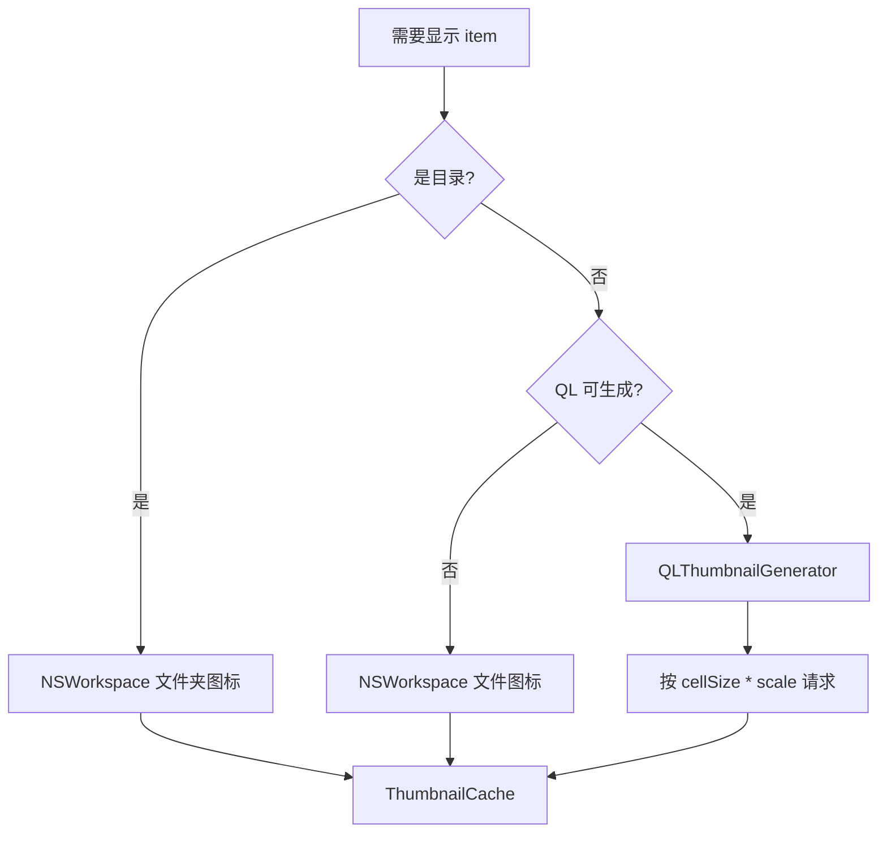

# 文件列表缩略图视图 — 设计方案

> 目标：在顶部工具栏增加「列表 / 缩略图」视图切换；缩略图模式下以紧凑正方形网格展示文件，可预览类型显示真实缩略图，其余显示系统图标；支持排序、缩放、悬停信息，并与现有列表交互能力尽量对齐。  
> 本文档基于当前代码结构（`FileListView` + `FileListTableHost` + `FileListSortEngine`）编写，可直接拆分为开发 Plan。

---

## 一、背景与目标

### 1.1 现状

| 区域 | 现状 |
|------|------|
| 文件列表 | 单一 **详情列表视图**（`NSTableView` 宿主 `FileListTableHost`），4 列：Name / Type / Size / Date Modified |
| 工具栏 | 左侧面板、新建文件夹、显示隐藏文件、**排序菜单**、浏览设置、搜索框 |
| 排序 | `FileListPreferences.sort` + `FileListSortEngine` 持久化；工具栏 `SortOrder` 与表头排序已桥接 |
| 预览 | 右侧 `FilePreviewView`；单文件 Quick Look / 图片 / PDF 等；**列表区尚无缩略图** |
| 图标 | `NSWorkspace.shared.icon(forFile:)`（`FileListTableController` 行渲染） |

### 1.2 目标（来自需求）

1. 工具栏增加 **两个视图图标**：当前详情列表 + 缩略图视图（互斥切换）。
2. 缩略图模式：文件列表面板变为 **网格排列**；可预览文件（如图片）显示缩略图，不可预览仍显示图标。
3. **排序能力保留**（与列表模式共用同一排序状态）。
4. 缩略图模式下支持 **⌘ + 滚轮** 缩放格子大小；工具栏提供 **滑动条** 调节大小。
5. 布局 **尽量紧凑**：正方形格子、固定间距；文件名在底部单行省略号 + 半透明底；文件大小在右上角半透明底。
6. **Mouse over** 显示更完整的文件信息。

### 1.3 非目标（首版）

- 封面流（Cover Flow）或 macOS Finder 全套视图（分栏、画廊等）
- 缩略图模式下的 **树形展开**（与 Finder 图标视图一致，首版扁平列表）
- 按类型 / 日期 **分组标题**（可作为 Phase 2）
- 用户自定义缩略图裁剪方式（居中 / 填充）— 首版统一 `aspectFill` 裁切
- iCloud 占位符缩略图的专门 UI（首版与普通「无缩略图」一致，显示图标）

---

## 二、体验设计

### 2.1 工具栏布局

在现有 `primaryAction` 区域，**排序菜单左侧**插入视图切换控件；缩略图模式激活时，在其右侧显示缩放滑动条。

```
┌─────────────────────────────────────────────────────────────────────────┐
│ [侧栏] [新建] [隐藏]  │列表│缩略图│  [排序▼]  [━━●━━ 128px]  [设置] [搜索] │
└─────────────────────────────────────────────────────────────────────────┘
         ↑ 新增 Segmented          ↑ 仅缩略图模式显示
```

**推荐控件**：`Picker` + `.segmented` 或两个 `ToolbarItem` 组成的分段按钮（与系统 HIG 一致）。

| 模式 | SF Symbol | Help |
|------|-----------|------|
| 列表 | `list.bullet` 或 `tablecells` | 列表视图 |
| 缩略图 | `square.grid.2x2` | 缩略图视图 |

**快捷键（建议）**：

| 操作 | 快捷键 |
|------|--------|
| 切换到列表 | `Cmd+1` |
| 切换到缩略图 | `Cmd+2` |
| 放大缩略图 | `Cmd++` / `Cmd+滚轮上` |
| 缩小缩略图 | `Cmd+-` / `Cmd+滚轮下` |
| 重置缩略图大小 | `Cmd+0`（可选，回到默认 128） |

### 2.2 缩略图格子视觉规范

每个格子为 **正方形**，内容区与叠加层分离：

```
┌──────────────────────┐  ← cellSize × cellSize（如 128pt）
│              [12 KB] │  ← 右上角：sizeDisplay，9–10pt 字，半透明黑底圆角 4pt
│                      │
│     [缩略图/图标]     │  ← 正方形内容区，aspectFill + 居中裁切
│                      │
│▓▓▓ 文件名很长… ▓▓▓▓▓│  ← 底部 overlay：单行 NSTruncatingTail，高 18–20pt
└──────────────────────┘
     ↑ gap 固定 4pt（cellSpacing）
```

**尺寸 token（建议默认值）**：

| Token | 值 | 说明 |
|-------|-----|------|
| `cellSpacing` | 4 pt | 格子水平/垂直间距（固定，不随缩放变化） |
| `contentInset` | 8 pt | 网格相对滚动视图边缘的内边距 |
| `labelOverlayHeight` | 20 pt | 底部文件名条高度 |
| `sizeBadgePadding` | 4×2 pt | 右上角大小标签内边距 |
| `sizeBadgeCornerRadius` | 4 pt | |
| `overlayBackground` | `NSColor.black.withAlphaComponent(0.45)` | 浅色/深色模式可微调 |
| `labelFontSize` | 11 pt | 与列表 Name 列接近 |
| `sizeBadgeFontSize` | 9 pt | 次要信息 |

**选中态**：

- 格子外描边：`accentColor` 2pt，圆角与格子一致（4pt）。
- 半透明选中底：`accentColor.opacity(0.15)` 覆盖整个格子（含 overlay 区域）。
- 与列表模式选中色保持一致，避免两套视觉语言。

**文件夹**：

- 首版仍用 **文件夹系统图标** 居中显示（不生成文件夹内容拼图，避免性能与复杂度）。
- 可选增强（Phase 2）：右下角小角标显示子项数量（需异步统计，与目录大小 overlay 策略类似）。

**「..」上级目录**：

- 首版在网格 **左上角固定一格** 显示 `arrow.up.circle` + 文案「..」；或 **不显示格子**，仅依赖工具栏返回 / `Cmd+[`（与列表一致）。  
- **推荐**：保留一格，便于鼠标用户；排序时始终 pin 在索引 0（复用 `FileListSortEngine` 对 parent 行的处理）。

### 2.3 缩放行为

| 输入 | 行为 |
|------|------|
| 工具栏 Slider | 范围 **64 – 256 pt**，步进 8 pt；拖动时实时 reflow 网格 |
| ⌘ + 滚轮 | 在文件列表区域且焦点在列表时，按滚轮方向增减 `cellSize`（步进 8） |
| ⌘ + 0 | 重置为默认 128 pt |

**持久化**：`@AppStorage("explorer.fileList.thumbnailCellSize")`，默认 `128`。

**实现注意**：

- 缩放改变的是 **格子边长**，不是缩略图 bitmap 分辨率；生成缩略图时应按 `cellSize * backingScale` 请求，避免放大模糊。
- Slider 与滚轮共用同一 `@State` / `AppStorage`，避免双源。

### 2.4 悬停信息（Tooltip / Popover）

**首版推荐 NSToolTip**（轻量、与 AppKit 网格契合）：

```
非常长的文件名.jpg
类型：JPEG 图像
大小：2.4 MB
修改：2026/6/17 14:30
路径：/Users/…/Photos/…
```

| 字段 | 来源 |
|------|------|
| 标题 | 完整 `name`（不截断） |
| 类型 | `fileType` |
| 大小 | `sizeDisplay`（目录显示 `--` 或已计算的目录大小） |
| 修改时间 | `dateDisplay` |
| 路径 | `id`（完整路径，次要色） |

**增强（Phase 2，可选）**：

- 悬停 **300ms** 后在格子旁显示 **轻量 Popover**（含 160×160 大图预览），类似 Finder 快速查看的弱化版。
- 悬停文件夹 **500ms** 触发 Spring-loading 打开（若已有全局 spring-loading 策略则复用）。

### 2.5 排序在缩略图模式下的 UX

列表模式：表头点击 + 工具栏菜单。  
缩略图模式：**无表头**，排序完全依赖工具栏 **现有排序菜单**（`SortOrder` / `FileListPreferences.sort`）。

建议在缩略图工具栏区域增加 **当前排序的简短标签**（只读，如「名称 ↑」），减少「网格看起来无序」的困惑。实现成本低，体验提升明显。

### 2.6 创意增强（可选，按优先级）

以下在核心功能稳定后可逐步加入：

| 优先级 | 创意 | 价值 |
|--------|------|------|
| P1 | **空格键快速预览**（选中或悬停项） | 与 Finder 习惯一致，右侧预览面板可联动 |
| P1 | **方向键网格导航**（↑↓←→ 按视觉位置） | 键盘用户必备；`NSCollectionView` 需自定义 key loop |
| P2 | 视频 / PDF **首帧缩略图**（QL 已覆盖则免开发） | 提升「可预览」覆盖率 |
| P2 | 图片 **渐进式加载**（低分辨率占位 → 清晰图） | 大目录滚动更顺滑 |
| P2 | 隐藏文件 **角标**（与列表一致） | 视觉一致性 |
| P3 | 按扩展名 **淡色背景**（图片略暖、视频略蓝） | 快速扫视类型，不依赖读扩展名 |
| P3 | 多选时 **浮动信息条**「已选 12 项，共 48.2 MB」 | 补全列表模式多列信息的缺失 |
| P3 | 缩略图模式 **框选**（橡皮筋） | 与列表空白区框选对齐 |

---

## 三、功能对齐矩阵

缩略图模式须与列表模式共享同一套业务回调（`FileListTableInteraction` 可重命名为 `FileListInteraction`，或缩略图宿主接收同结构体）。

| 能力 | 列表 | 缩略图首版 | 说明 |
|------|------|------------|------|
| 单选 / ⌘ 多选 / ⇧ 范围选 | ✅ | ✅ | `NSCollectionView` 原生支持 |
| 双击打开 | ✅ | ✅ | `collectionView(_:doubleClickForItemAt:)` |
| 慢速双击重命名 | ✅ | ✅ | 第二下单击已选项 → inline rename |
| 右键菜单 | ✅ | ✅ | 复用 `makeContextMenu` |
| Delete 删除 | ✅ | ✅ | 复用 `onDelete` |
| 拖放移入当前目录 | ✅ | ✅ | 外层 `onDrop` 不变 |
| 拖到其他文件夹 | ✅ | ⚠️ Phase 1.5 | 需实现 `NSCollectionView` 拖拽源 |
| 快速搜索（/） | ✅ | ✅ | 高亮文件名（见 §4.5） |
| 框选空白区 | ✅ | ✅ | 网格空白处拖选 |
| 树形展开 | ✅ | ❌ | 缩略图模式禁用 `treeExpandEnabled` |
| 列宽 / 列顺序 | ✅ | N/A | |
| 排序 | ✅ | ✅ | 共用 `FileListSortEngine` |
| 目录大小异步列 | ✅ | ⚠️ | 仅 tooltip / 角标展示，格内仍 `--` 或右上角 |
| 预览面板联动 | ✅ | ✅ | `selection` 绑定不变 |

---

## 四、技术架构

### 4.1 总体结构

```mermaid
flowchart TB
    subgraph Explorer
        CV[ContentView / AppModule]
        FLV[FileListView]
    end

    subgraph ViewMode
        VM[FileListViewMode: list | thumbnail]
    end

    subgraph ListMode
        TH[FileListTableHost]
        TC[FileListTableController]
    end

    subgraph ThumbnailMode
        TKH[FileListThumbnailHost]
        TKC[FileListThumbnailController]
        TCache[ThumbnailCache]
        TGen[ThumbnailGenerator]
    end

    subgraph Shared
        Prefs[FileListPreferencesStore]
        Sort[FileListSortEngine]
        Rows[FileListRow / makeListRows]
        Inter[FileListTableInteraction]
    end

    CV --> VM
    FLV --> VM
    VM -->|list| TH --> TC
    VM -->|thumbnail| TKH --> TKC
    TKC --> TCache --> TGen
    FLV --> Rows --> Sort
    TH --> Prefs
    TKH --> Prefs
    TC --> Inter
    TKC --> Inter
```

### 4.2 新增类型

```swift
/// 文件列表视图模式
public enum FileListViewMode: String, CaseIterable, Codable {
    case list
    case thumbnail
}

/// 缩略图网格布局参数（持久化 cellSize）
public struct FileListThumbnailPreferences: Codable, Equatable {
    public var cellSize: CGFloat  // 64...256, default 128
}

/// 扩展 FileListPreferences（或独立 AppStorage 键）
// explorer.fileList.viewMode
// explorer.fileList.thumbnailCellSize
```

**`FileListView.body` 分支**：

```swift
FileListPanelLayout {
    switch viewMode {
    case .list:
        fileTable  // 现有 FileListTableHost
    case .thumbnail:
        fileThumbnailGrid  // 新 FileListThumbnailHost
    }
}
```

### 4.3 推荐实现载体：`NSCollectionView`

| 方案 | 优点 | 缺点 |
|------|------|------|
| **NSCollectionView + Grid Layout** | 原生网格、复用选择/拖拽 API、大量 item 性能可控 | 需新建 Controller，与 Table 并列 |
| SwiftUI `LazyVGrid` | 声明式 | 大列表性能、框选、拖拽、重命名难对齐 AppKit 列表 |
| 继续用 `NSTableView` 一行多列 | 单宿主 | 列宽模拟网格别扭，难维护 |

**结论**：新建 `FileListThumbnailHost: NSViewRepresentable`，内部 `NSCollectionView` + `NSCollectionViewGridLayout`。

核心类：

| 文件 | 职责 |
|------|------|
| `FileListThumbnailHost.swift` | SwiftUI 桥接 |
| `FileListThumbnailController.swift` | 数据源、选择同步、排序行、缩放 reflow |
| `FileListThumbnailItem.swift` | `NSCollectionViewItem` 子类，绘制缩略图 + overlay |
| `ThumbnailGenerator.swift` | QL / 图标 生成策略 |
| `ThumbnailCache.swift` | 内存 LRU + 磁盘可选（Phase 2） |

### 4.4 缩略图生成策略



**QLThumbnailGenerator（推荐主路径）**：

```swift
let request = QLThumbnailGenerator.Request(
    fileAt: url,
    size: CGSize(width: pixelSize, height: pixelSize),
    scale: NSScreen.main?.backingScaleFactor ?? 2,
    representationTypes: .thumbnail
)
QLThumbnailGenerator.shared.generateRepresentations(for: request) { thumbnail, _, _ in
    // 回主线程更新 item
}
```

**可预览类型**：交给 Quick Look（图片、PDF、视频、Office、音频封面等）；与右侧 `FilePreviewView` / `QuickLookPreview` 能力对齐，**不要维护一份独立扩展名白名单**，除非 QL 失败再 fallback。

**不可预览**：`NSWorkspace.shared.icon(forFile: iconPath)`，在正方形内 **aspectFit** 缩放（图标留边距 12%），与缩略图 **aspectFill** 区分，用户一眼可辨。

**缓存键**：`path + modificationDate + size + cellSizeBucket`  
- `cellSizeBucket`：按 32pt 分桶，避免每个像素都重生成。  
- 目录内容变化时依赖现有 `onItemsChanged` / FSEvents 失效。

**并发**：专用 `OperationQueue`，`maxConcurrentOperationCount = 4`；滚动时取消不可见 item 的请求（`QLThumbnailGenerator` 支持 cancellationToken）。

### 4.5 搜索高亮

复用 `FileListTextHighlight`：缩略图底部文件名 overlay 使用 `NSAttributedString` 或 SwiftUI `Text` 高亮 `searchText` / `quickSearchText` 匹配段（与列表 Name 列一致）。

### 4.6 缩放与布局重算

`NSCollectionViewGridLayout` 属性：

```swift
layout.itemSize = NSSize(width: cellSize, height: cellSize)
layout.minimumInteritemSpacing = FileListThumbnailMetrics.cellSpacing
layout.minimumLineSpacing = FileListThumbnailMetrics.cellSpacing
layout.sectionInset = NSEdgeInsets(top: 8, left: 8, bottom: 8, right: 8)
```

`cellSize` 变化时：

1. 更新 layout.itemSize  
2. `invalidateLayout()`  
3. 使缓存中「尺寸桶」变化的可见 item 重新请求缩略图  

**滚轮监听**：在 `FileListThumbnailController` 的 `scrollView` 或 `collectionView` 上安装局部 `NSEvent.addLocalMonitorForEvents(matching: .scrollWheel)`，检测 `event.modifierFlags.contains(.command)`。

### 4.7 与排序的集成

数据流保持不变：

```
FileItem[] → makeListRows() → FileListRow[]
    → FileListSortEngine.sorted(rows, preferencesStore.sort)
    → displayRows（Table 或 Collection 共用）
```

缩略图模式 **不显示表头**，不在网格内提供列点击排序；切换回列表时表头指示与 `preferencesStore.sort` 一致。

工具栏 `SortOrder` 变更 → 更新 `preferencesStore.sort` → 两端视图一起刷新（已有 `onChange` 桥接可扩展）。

### 4.8 树形展开

缩略图模式下强制 `treeEnabled == false`：

```swift
private var treeEnabled: Bool {
    viewMode == .list && treeExpandEnabled && searchText.isEmpty
}
```

UI 上可在设置中灰显「树形展开」或自动忽略。避免在网格里表达 depth 缩进。

### 4.9 Explorer 层改动点

| 位置 | 改动 |
|------|------|
| `AppModule` 工具栏 | 视图 Segmented + 条件 Slider |
| `FileListView` | `viewMode` 分支渲染 |
| `AppSettings` / `FileListStorageKeys` | 新持久化键 |
| `FileListPanelLayout` | 无需改（仍铺满） |
| 菜单 `CommandGroup` | 可选：查看 → 列表/缩略图 |

---

## 五、关键交互细节

### 5.1 选择与打开

- **单击**：选中（⌘ 切换，⇧ 范围）；与 Table 相同同步 `selection: Set<String>`。  
- **双击**：`onOpenRow` → `openItem`（目录进入，文件用默认应用打开）。  
- **空白单击**：清空选择（`onBlankSingleClick`）。  
- **空白双击**：`onBlankDoubleClick`（新建文件夹等，沿用设置）。

### 5.2 重命名

在 `FileListThumbnailItem` 内嵌与 `FileListInlineRenameField` 同类的文本域；触发逻辑复用 Table 的「第二下单击已选项」或 F2（若已有）。

重命名时：

- 隐藏底部文件名 overlay，显示输入框（仍贴底半透明条）。  
- `onRenameEditingChanged` 通知 Explorer 禁用全局快捷键。

### 5.3 拖拽

**Phase 1**：仅保留目录级 `onDrop`（拖入当前文件夹）。  
**Phase 1.5**：实现 `NSCollectionView` drag source + 行内 drop 到文件夹格子（高亮目标格）。

### 5.4 键盘

| 键 | 行为 |
|----|------|
| ↑↓←→ | 网格方向移动选择（需计算 layout 位置） |
| Space | 切换 Quick Look / 右侧预览（P1 增强） |
| / | 快速搜索（已有） |
| Delete | 删除（已有） |
| Enter | 打开选中项 |
| F2 | 重命名（若列表已支持） |

### 5.5 无障碍

- `NSAccessibilityThumbnail` 或 `accessibilityLabel` = 完整文件名 + 大小 + 修改日期。  
- 选中朗读者额外报「已选中」。

---

## 六、性能与内存

| 场景 | 策略 |
|------|------|
| 5000+ 文件目录 | 仅可见 cell 请求缩略图；滚动快速时延迟 50ms 合并请求 |
| 4K 图片 | QL 按显示尺寸生成，不解码全图 |
| 内存 | `ThumbnailCache` LRU 上限 **150 MB** 或 **500 张**（可配置） |
| 主线程 | 生成在后台，仅 `imageView.image =` 在主线程 |
| 模式切换 | 列表 ↔ 缩略图 **保留 selection**，不重新 `loadItems` |

---

## 七、持久化

| 键 | 类型 | 默认 | 说明 |
|----|------|------|------|
| `explorer.fileList.viewMode` | String | `list` | `FileListViewMode` rawValue |
| `explorer.fileList.thumbnailCellSize` | Double | `128` | 格子边长 pt |

**不**按目录记忆 viewMode（与 Finder 不同），首版全局一种视图；若用户有需求再扩展 `viewModeByPath`。

---

## 八、分阶段实施计划

### Phase 1 — 最小可用（MVP）

1. `FileListViewMode` + 工具栏 Segmented 切换  
2. `FileListThumbnailHost` + 网格 + 系统图标（暂不全量 QL）  
3. 底部文件名 + 右上角大小 overlay  
4. 选择、双击打开、右键菜单、Delete  
5. 共用排序；禁用树形展开  
6. Slider + ⌘滚轮缩放 + 持久化 cellSize  

**验收**：图片目录能以缩略图浏览；排序/缩放/选择/打开正常。

### Phase 2 — 缩略图质量

1. `ThumbnailGenerator` + `QLThumbnailGenerator`  
2. `ThumbnailCache` + 滚动取消  
3. 搜索高亮  
4. Tooltip 完整信息  
5. 选中态视觉打磨  

**验收**：常见图片/视频/PDF 显示真实缩略图；快速滚动不明显卡顿。

### Phase 3 — 交互对齐

1. 网格键盘导航  
2. 框选  
3. 拖出/拖入文件夹格子  
4. Inline 重命名  
5. 空格预览 / 多选信息条（可选）  

**验收**：与列表模式交互差距可接受，用户可无障碍切换两种视图。

### Phase 4 — 打磨（可选）

1. 文件夹子项数量角标  
2. 磁盘缩略图缓存  
3. 按类型底色  
4. Spring-loading  

---

## 九、文件与模块清单（建议）

```
Sources/FileList/
  FileListViewMode.swift
  FileListThumbnailMetrics.swift
  Thumbnail/
    FileListThumbnailHost.swift
    FileListThumbnailController.swift
    FileListThumbnailController+Interaction.swift
    FileListThumbnailItem.swift
    FileListThumbnailCellView.swift      // 绘制 overlay
    ThumbnailGenerator.swift
    ThumbnailCache.swift

Sources/Explorer/
  AppModule.swift                        // 工具栏
  FileListView（内嵌于 AppModule）        // 分支 + viewMode 状态
```

单元测试（可选）：

- `FileListSortEngine` 在缩略图数据源上与列表一致  
- `ThumbnailCache` 键失效逻辑  
- `cellSize` 钳制 64–256  

---

## 十、风险与对策

| 风险 | 对策 |
|------|------|
| 两套宿主（Table + Collection）行为漂移 | 共用 `FileListRow`、`FileListSortEngine`、`FileListTableInteraction` |
| QL 生成慢 | 先显示图标，缩略图就绪后 crossfade 0.15s |
| 深色模式下 overlay 可读性 | 黑底白字 / 浅色模式白底黑字，用 `NSAppearance` 适配 |
| 重命名与 overlay 布局冲突 | 重命名期间隐藏静态 label，仅显示 field |
| AppModule 过大 | 缩略图工具栏抽 `FileListToolbarItems` ViewModifier |

---

## 十一、与 Finder 的差异（刻意选择）

| 项目 | Finder | MeoFind 本方案 |
|------|--------|----------------|
| 图标视图标签位置 | 下方外部 | **内部底部 overlay**（更紧凑） |
| 大小显示 | 信息栏 / 显示选项 | **格内右上角** |
| 树形 | 无 | 列表有，缩略图无 |
| 缩放 | 底部滑块 / 双指 | 工具栏滑块 + ⌘滚轮 |

---

## 十二、总结

本方案在 **不改动现有列表架构** 的前提下，并列增加 `NSCollectionView` 缩略图宿主，共用排序与交互回调；缩略图生成以 **Quick Look** 为主、系统图标为辅；视觉上采用 **正方形紧密网格 + 底部文件名 + 右上角大小** 的 overlay 方案，并预留空格预览、键盘导航、拖拽等增强路径。

建议从 **Phase 1 MVP** 开工：先打通视图切换与网格框架，再接入 QL 缩略图与交互对齐，最后做性能与细节打磨。
