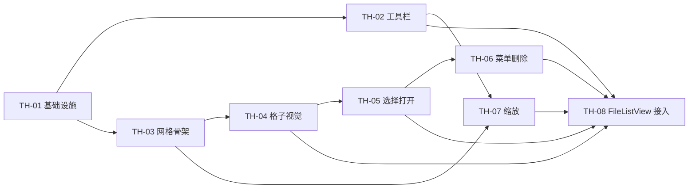

# 缩略图视图 Phase 1 — 开发计划（MVP）

> 依据：[thumbnail-view-design.md](./thumbnail-view-design.md) 第八章 Phase 1  
> 目标：工具栏可切换列表/缩略图；缩略图网格展示系统图标 + overlay；选择、打开、排序、缩放可用。

---

## 总览

| Phase | 主题 | Issue 数 | 预估 |
|-------|------|----------|------|
| **1 MVP** | 视图切换 + 网格框架 + 基础交互 | 8 | 3–5 天 |
| 2 | QL 缩略图 + 缓存 + Tooltip | 6 | 3–4 天 |
| 3 | 键盘导航 + 框选 + 拖拽 + 重命名 | 5 | 4–5 天 |
| 4 | 打磨（角标、磁盘缓存等） | 4 | 按需 |

本文档 **仅展开 Phase 1**，每项对应一个可独立 PR / Issue。

---

## Phase 1 Issue 列表

### TH-01：视图模式基础设施

**类型**：feat  
**依赖**：无  
**文件**：

- `Sources/FileList/FileListViewMode.swift`（新建）
- `Sources/FileList/FileListThumbnailMetrics.swift`（新建）
- `Sources/FileList/FileListStorageKeys.swift`（扩展）

**任务**：

- [ ] 定义 `FileListViewMode: String, CaseIterable, Codable { list, thumbnail }`
- [ ] 定义 `FileListThumbnailMetrics`：`minCellSize=64`、`maxCellSize=256`、`defaultCellSize=128`、`cellSpacing=4`、`contentInset=8`、`labelOverlayHeight=20`
- [ ] 新增持久化键：`explorer.fileList.viewMode`、`explorer.fileList.thumbnailCellSize`
- [ ] 提供 `clamp(cellSize:)` 工具方法

**验收**：

- FileList 模块可独立编译
- 默认值与设计文档 §七 一致

---

### TH-02：工具栏视图切换与缩放控件

**类型**：feat  
**依赖**：TH-01  
**文件**：

- `Sources/Explorer/AppModule.swift`（`ContentView` 工具栏）

**任务**：

- [ ] `@AppStorage` 绑定 `viewMode`、`thumbnailCellSize`
- [ ] 在排序菜单 **左侧** 插入 Segmented：`list.bullet` / `square.grid.2x2`
- [ ] `viewMode == .thumbnail` 时显示 Slider（64–256，步进 8）+ 数值标签
- [ ] Help 文案：「列表视图」「缩略图视图」
- [ ] （可选）`Cmd+1` / `Cmd+2` 菜单项

**验收**：

- 切换 Segmented 后 `AppStorage` 持久化，重启应用保持
- 缩略图模式下 Slider 拖动，`thumbnailCellSize` 实时变化
- 列表模式下 Slider 隐藏

---

### TH-03：缩略图网格宿主（NSCollectionView 骨架）

**类型**：feat  
**依赖**：TH-01  
**文件**：

- `Sources/FileList/Thumbnail/FileListThumbnailHost.swift`
- `Sources/FileList/Thumbnail/FileListThumbnailController.swift`
- `Sources/FileList/Thumbnail/FileListThumbnailCollectionView.swift`

**任务**：

- [ ] `FileListThumbnailHost: NSViewRepresentable`，接口对齐 `FileListTableHost`（rows、interaction、selection、preferencesStore、cellSize、onOpenRow）
- [ ] `NSScrollView` + `NSCollectionView` + `NSCollectionViewGridLayout`
- [ ] `update()` 内：`FileListSortEngine.sorted` → `displayRows`
- [ ] `cellSize` 变化时更新 `layout.itemSize` 并 `invalidateLayout()`
- [ ] 目录切换时滚动到顶部

**验收**：

- 空网格可渲染；传入 rows 后显示对应数量的空白格子
- 改变 `cellSize` 后列数随宽度 reflow
- 排序变更后格子顺序与列表模式一致

---

### TH-04：格子视觉（图标 + overlay）

**类型**：feat  
**依赖**：TH-03  
**文件**：

- `Sources/FileList/Thumbnail/FileListThumbnailCellView.swift`
- `Sources/FileList/Thumbnail/FileListThumbnailItem.swift`

**任务**：

- [ ] 正方形 `FileListThumbnailCellView`：主图区 + 底部文件名条 + 右上角大小角标
- [ ] 目录 / 不可预览：**NSWorkspace 图标**，`aspectFit` + 12% 内边距
- [ ] 文件名：单行 `lineBreakMode = .byTruncatingTail`，半透明底
- [ ] 大小：`sizeDisplay`，父目录与空大小不显示角标
- [ ] 父目录行：`arrow.up.circle` 图标 +「..」
- [ ] 选中态：accent 描边 + 浅色填充

**验收**：

- 视觉符合设计文档 §2.2 ASCII 示意
- 深浅色模式下 overlay 可读
- 长文件名显示省略号

---

### TH-05：选择与打开

**类型**：feat  
**依赖**：TH-03, TH-04  
**文件**：

- `FileListThumbnailController.swift`（扩展）
- `FileListThumbnailCollectionView.swift`

**任务**：

- [ ] 单击：单选；⌘ 切换；⇧ 范围选（复用 `NSCollectionView` 默认行为）
- [ ] `selection` 双向绑定，与列表模式共用 `Set<String>`
- [ ] 双击：`onOpenRow`
- [ ] Enter / Return：`onOpenRow`（无修饰键）
- [ ] 空白区单击：清空选择（`onBlankSingleClick`）
- [ ] 列表 ↔ 缩略图切换时 **保留 selection**

**验收**：

- 多选后切换视图，选中项仍高亮
- 双击目录进入、双击文件打开
- Enter 打开当前选中项

---

### TH-06：右键菜单与 Delete

**类型**：feat  
**依赖**：TH-05  
**文件**：

- `FileListThumbnailController+Interaction.swift`

**任务**：

- [ ] 格子上 `rightMouseDown`：未选中则先选中，弹出 `makeContextMenu`
- [ ] 空白区右键：`blankMenuActions` 菜单
- [ ] Delete / Forward Delete：调用 `onDelete`（快速搜索有内容时优先 backspace，与列表一致）
- [ ] ESC：关闭快速搜索
- [ ] 可见字符：触发 `onQuickSearchInput`

**验收**：

- 右键菜单与列表模式相同项可用
- Delete 删除选中文件；无选中时 Backspace 后退目录（若可）

---

### TH-07：缩放交互（Slider + ⌘滚轮）

**类型**：feat  
**依赖**：TH-02, TH-03  
**文件**：

- `FileListThumbnailController.swift`
- `FileListThumbnailHost.swift`

**任务**：

- [ ] SwiftUI Slider 已通过 `cellSize` 传入 `updateNSView`
- [ ] 列表区域内 `NSEvent` 局部监听：`⌘ + scrollWheel` 增减 cellSize（步进 8）
- [ ] 变更后写回 `@AppStorage`（通过 SwiftUI Binding 闭包 `onCellSizeChange`）
- [ ] 钳制 64–256

**验收**：

- 仅缩略图模式 + 焦点在列表时 ⌘滚轮生效
- 滚轮与 Slider 数值同步并持久化

---

### TH-08：FileListView 接入与树形禁用

**类型**：feat  
**依赖**：TH-02 ~ TH-07  
**文件**：

- `Sources/Explorer/AppModule.swift`（`FileListView`）

**任务**：

- [ ] `FileListView` 增加 `viewMode`、`thumbnailCellSize`、`onThumbnailCellSizeChange`
- [ ] `body` 内 `switch viewMode`：`fileTable` / `fileThumbnailGrid`
- [ ] 抽取 `makeTableInteraction()` 供两种视图复用
- [ ] `treeEnabled` 增加条件：`viewMode == .list`
- [ ] `makeListRows()` 两种模式共用
- [ ] 缩略图模式暂不接 `DirectorySizeTableBridge`（角标显示 `--`，Phase 2 可接）

**验收**（Phase 1 整体验收）：

- [ ] 工具栏切换后文件区在列表/网格间切换
- [ ] 图片目录以网格浏览（MVP 为图标；Phase 2 为真实缩略图）
- [ ] 排序菜单改变顺序，两种视图同步
- [ ] 缩放、选择、双击打开、Delete、右键正常
- [ ] 缩略图模式下树形展开不生效

---

## 实施顺序（推荐）

**单日建议节奏**：

| 天 | Issue |
|----|-------|
| D1 | TH-01 + TH-03 骨架 |
| D2 | TH-04 + TH-05 |
| D3 | TH-06 + TH-07 |
| D4 | TH-02 + TH-08 联调验收 |

---

## Phase 2–4 Issue 索引（待 Phase 1 完成后开工）

### Phase 2 — 缩略图质量

| ID | 标题 |
|----|------|
| TH-09 | `ThumbnailGenerator` + `QLThumbnailGenerator` |
| TH-10 | `ThumbnailCache` LRU + 滚动取消 |
| TH-11 | 搜索高亮（`FileListTextHighlight`） |
| TH-12 | NSToolTip 完整文件信息 |
| TH-13 | 选中态 / 加载 crossfade 打磨 |
| TH-14 | 目录大小 overlay 接入缩略图角标 |

### Phase 3 — 交互对齐

| ID | 标题 |
|----|------|
| TH-15 | 方向键网格导航 |
| TH-16 | 空白区橡皮筋框选 |
| TH-17 | `NSCollectionView` 拖出 / 拖入文件夹格 |
| TH-18 | Inline 重命名 |
| TH-19 | Space 快速预览（可选） |

### Phase 4 — 打磨

| ID | 标题 |
|----|------|
| TH-20 | 文件夹子项数量角标 |
| TH-21 | 磁盘缩略图缓存 |
| TH-22 | 按扩展名淡色底 |
| TH-23 | Spring-loading 进入子目录 |

---

## 测试清单（Phase 1 手动）

| # | 场景 | 预期 |
|---|------|------|
| T1 | 打开含 50+ 图片的目录，切缩略图 | 网格显示，可滚动 |
| T2 | 工具栏改排序为「大小」 | 网格顺序更新 |
| T3 | Slider 拖到最小/最大 | 列数变化，不崩溃 |
| T4 | 按住 ⌘ 滚轮 | 格子缩放 |
| T5 | 选中 3 个文件，切回列表 | 仍选中 3 项 |
| T6 | 双击文件夹 | 进入目录 |
| T7 | 右键文件 | 与列表相同菜单 |
| T8 | Delete 选中文件 | 走现有删除流程 |
| T9 | 重启应用 | 视图模式与格子大小保持 |
| T10 | 列表下展开树，切缩略图 | 仅显示当前层，无缩进子项 |

---

## 风险与缓解（Phase 1）

| 风险 | 缓解 |
|------|------|
| `AppModule` 继续膨胀 | TH-08 仅最小改动；后续可抽 `FileListToolbarItems` |
| Collection 与 Table 选择不同步 | 共用 `selection: Set<String>` + 统一 `displayRows` 排序 |
| ⌘滚轮与系统缩放冲突 | 仅在 collectionView 为第一响应者时拦截 |

---

## 完成定义（Definition of Done）

Phase 1 视为完成当：

1. TH-01 ~ TH-08 全部勾选验收项  
2. `swift build` 通过  
3. 测试清单 T1–T10 手动通过  
4. 无新增 linter 错误  
