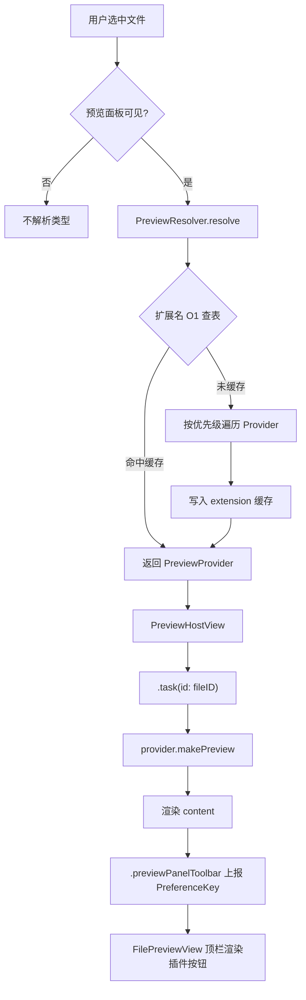
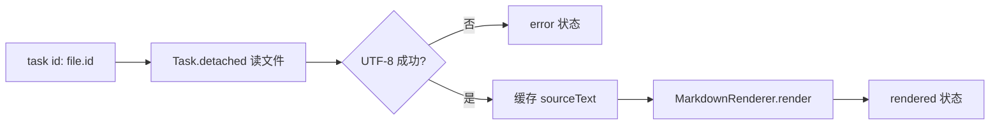

# 查看器插件架构设计

> 目标：在右侧预览面板引入**可扩展的查看器插件**机制，使不同文件类型可由插件接管预览；插件加载后可**替换**现有内置查看器（图片 / PDF / 文本）。  
> 核心约束：**未启用插件时几乎零开销**；启用后仍保持当前应用的响应速度与取消语义。

---

## 一、现状与问题

### 1.1 当前实现

预览逻辑全部集中在 `Sources/Explorer/AppModule.swift`：

| 组件 | 职责 |
|------|------|
| `FilePreviewView` | 预览面板外壳：顶栏（文件名、图片缩放、关闭）、内容区 |
| `FileContentView` | 按扩展名分支加载内容，管理 loading / error 状态 |
| `loadContent()` | 硬编码扩展名白名单 → 图片 / PDF / 文本 |
| `ImagePreviewContent` / `PDFPreview` / `TextFilePreview` | 三种内置渲染实现 |

**选择 → 预览流程**：

```
NSTableView 选择
  → ContentView @State selection
  → FilePreviewView（取 selection.first）
  → FileContentView.task(id: item.id)
  → loadContent() 按 pathExtension 分支
  → 渲染对应 View
```

### 1.2 已有可借鉴的模式

本项目在文件列表侧已采用**轻量注入**而非重量级插件框架：

- `FileListTableInteraction`：闭包注入业务回调
- `DirectorySizeColumnProvider`：带 `revision` 的增量更新令牌，避免整表刷新

查看器插件应延续这一风格：**协议 + 注册表 + 惰性加载**，避免引入 XPC、脚本引擎等重方案。

### 1.3 待解决问题

| 问题 | 说明 |
|------|------|
| 类型路由硬编码 | `loadContent()` 内 if/else 扩展名列表，无法扩展 |
| 预览与 AppModule 强耦合 | 约 400 行预览代码埋在 4300 行单体文件中 |
| 顶栏工具按钮写死 | 图片缩放按钮硬编码在 `FilePreviewView`，插件无法贡献操作 |
| 类型识别单一 | 仅 `pathExtension`，未用 `UTType` / 文件内容嗅探 |
| 内外置查看器无法切换 | 缺少优先级与覆盖规则 |

---

## 二、设计目标与非目标

### 2.1 目标

1. **可扩展**：插件声明支持的文件类型，由注册表统一路由。
2. **可替换**：插件优先级高于内置查看器时，完全接管该类型的预览与工具栏。
3. **零插件零成本**：未配置外部插件时，路由走静态内置表，性能与现在等价。
4. **快响应**：选中文件后立即显示 loading；加载可取消；大文件后台读取。
5. **可交互**：不同插件在预览顶栏展示**各自不同的按钮**，按钮可随插件内部状态动态更新（如预览/源码切换、导出进行中禁用）。
6. **与现有架构一致**：SwiftUI 外壳 + `NSViewRepresentable` 桥接；`.task(id:)` 生命周期。

### 2.2 非目标（首版不做）

- 跨进程 XPC 插件（启动慢、序列化开销大）
- 用户可安装的任意代码沙箱（安全模型需单独设计）
- 多选文件同时预览
- 插件市场 / 在线分发

---

## 三、总体架构

### 3.1 模块划分

```
Package.swift
├── PreviewKit          ← 新建 library：协议、上下文、注册表、内置 Provider
├── FileList            ← 不变
└── Explorer            ← 预览 UI 宿主，依赖 PreviewKit
```

后续外部插件可作为：

- **同仓库 Preview Plugin Target**（开发期、内置扩展）
- **Bundle 插件**（`*.mqfpreview`，放入 Application Support，按需 dlopen）

```
┌─────────────────────────────────────────────────────────────┐
│                        Explorer App                          │
│  FilePreviewView ──► PreviewHostView ──► PreviewResolver    │
└──────────────────────────────┬──────────────────────────────┘
                               │ import
┌──────────────────────────────▼──────────────────────────────┐
│                       PreviewKit                             │
│  PreviewProvider  PreviewContext  PreviewRegistry           │
│  BuiltinImageProvider / BuiltinPDFProvider / BuiltinText...  │
└──────────────────────────────┬──────────────────────────────┘
                               │ 可选加载
┌──────────────────────────────▼──────────────────────────────┐
│              External Preview Plugins (.mqfpreview)          │
│  Manifest.json + 动态库 / Swift Package 产物                  │
└─────────────────────────────────────────────────────────────┘
```

### 3.2 核心数据流



**关键性能点**：类型解析结果按扩展名缓存；未打开预览面板时不触发解析；外部插件 Bundle 在首次需要时才加载。顶栏按钮通过 SwiftUI Preference 随 View 状态自动同步，无需额外回调。

---

## 四、核心协议

### 4.1 预览上下文 `PreviewContext`

向插件传递文件信息与宿主能力，**不包含** Explorer 业务类型，避免 PreviewKit 依赖 Explorer。

```swift
public struct PreviewFileRef: Sendable, Equatable {
    public let id: String          // 文件路径，与 FileItem.id 一致
    public let url: URL
    public let name: String
    public let size: Int64
    public let contentType: UTType? // 由宿主尽力填充，可为 nil
}

public struct PreviewHostServices {
    /// 刷新当前文件预览（文件被外部修改后）
    public var reload: @Sendable () -> Void
    /// 在 Finder 中显示
    public var revealInFinder: @Sendable () -> Void
    /// 用系统默认应用打开
    public var openWithDefaultApp: @Sendable () -> Void
    /// 显示宿主原生 Toast / Alert
    public var presentError: @Sendable (String) -> Void
    /// 弹出 NSSavePanel，返回用户选择的路径（取消返回 nil）
    public var presentSavePanel: @Sendable (_ suggestedName: String, _ allowedTypes: [UTType]) async -> URL?
}
```

### 4.2 查看器提供者 `PreviewProvider`

```swift
public protocol PreviewProvider: AnyObject {
    /// 唯一标识，如 "com.macquickfinder.builtin.image"
    var id: String { get }
    
    /// 越大越优先；内置默认 0，外部插件建议 ≥ 100
    var priority: Int { get }
    
    /// 快速声明支持的扩展名（用于 O(1) 索引，无需打开文件）
    var supportedExtensions: Set<String> { get }
    
    /// 可选：UTType 匹配（插件加载时注册，运行时不反复解析）
    var supportedContentTypes: [UTType] { get }
    
    /// 是否可处理该文件（同步、轻量，禁止 IO）
    func canPreview(_ file: PreviewFileRef) -> Bool
    
    /// 构建预览内容（SwiftUI）；宿主负责 .task 调度与取消
    /// 插件在返回的 View 上使用 `.previewPanelToolbar { ... }` 声明顶栏按钮
    @MainActor
    func makePreview(
        file: PreviewFileRef,
        services: PreviewHostServices
    ) -> AnyView
}
```

**设计说明**：

- 使用 `class` + `AnyObject`，便于 Bundle 插件用 `@objc` 工厂导出（若未来需要）。
- `canPreview` 必须**无阻塞**；重逻辑放在 `makePreview` 内部的 `.task` 里。
- `makePreview` 返回的 View 自行管理 `@State` 与异步加载，与现有 `FileContentView` 模式一致。
- **顶栏按钮不在协议层静态声明**，改由预览 View 通过修饰符上报，见 4.3 节。

### 4.3 动态顶栏：按插件显示不同按钮

#### 4.3.1 需求与初版缺陷

初版在 `PreviewProvider` 上暴露 `toolbarItems()`，并在 `onAppear` 时调用一次。这有两个问题：

| 问题 | 示例 |
|------|------|
| 无法随状态更新 | Markdown 插件「预览 ↔ 源码」切换后，按钮文案/图标应变为「渲染预览」 |
| 与内容区状态割裂 | 导出 PDF 进行中应禁用按钮；按钮定义在 Provider，状态在 View 内 |

因此改为 **声明式顶栏**：插件在预览 View 的 `body` 里用修饰符上报按钮，与 SwiftUI `.toolbar` 思路一致。

#### 4.3.2 顶栏项模型 `PreviewToolbarItem`

```swift
public enum PreviewToolbarItemKind: Equatable {
    case button
    case toggle(isOn: Bool)
    case menu([PreviewToolbarMenuEntry])
}

public struct PreviewToolbarMenuEntry: Identifiable {
    public let id: String
    public let title: String
    public let systemImage: String?
    public let action: @MainActor () -> Void
}

public struct PreviewToolbarItem: Identifiable, Equatable {
    public let id: String
    public let kind: PreviewToolbarItemKind
    public let title: String           // 用于 accessibility / 纯文字按钮
    public let systemImage: String?
    public let help: String?
    public let isEnabled: Bool
    public let showsProgress: Bool     // 为 true 时宿主显示 indeterminate 进度
    public let action: (@MainActor () -> Void)?

    public static func == (lhs: Self, rhs: Self) -> Bool {
        lhs.id == rhs.id && lhs.kind == rhs.kind
            && lhs.title == rhs.title && lhs.systemImage == rhs.systemImage
            && lhs.help == rhs.help && lhs.isEnabled == rhs.isEnabled
            && lhs.showsProgress == rhs.showsProgress
        // action 不参与相等性
    }
}
```

支持的按钮形态：

| kind | 用途 | 宿主渲染 |
|------|------|----------|
| `.button` | 一次性操作（导出 PDF、复制） | `Button` + SF Symbol |
| `.toggle(isOn:)` | 模式切换（预览/源码） | 按下态高亮的 `Button` 或 `Toggle` 样式 |
| `.menu` | 多选一操作（导出 PDF / HTML） | `Menu` |

#### 4.3.3 PreferenceKey 上报机制

```swift
public struct PreviewToolbarItemsKey: PreferenceKey {
    public static var defaultValue: [PreviewToolbarItem] { [] }
    public static func reduce(value: inout [PreviewToolbarItem], nextValue: () -> [PreviewToolbarItem]) {
        value = nextValue()  // 最内层 wins，避免重复累加
    }
}

public extension View {
    /// 向预览面板顶栏贡献按钮；可多次调用，按声明顺序排列
    func previewPanelToolbar(
        @PreviewToolbarBuilder _ items: () -> [PreviewToolbarItem]
    ) -> some View {
        preference(key: PreviewToolbarItemsKey.self, value: items())
    }
}

@resultBuilder
public enum PreviewToolbarBuilder {
    public static func buildBlock(_ items: PreviewToolbarItem...) -> [PreviewToolbarItem] { items }
    public static func buildOptional(_ items: [PreviewToolbarItem]?) -> [PreviewToolbarItem] { items ?? [] }
    public static func buildEither(first: [PreviewToolbarItem]) -> [PreviewToolbarItem] { first }
    public static func buildEither(second: [PreviewToolbarItem]) -> [PreviewToolbarItem] { second }
}
```

**状态联动**：插件 View 的 `@State` 变化 → `body` 重算 → `previewPanelToolbar` 产生新 items → Preference 冒泡 → 顶栏自动刷新。无需手动回调宿主。

#### 4.3.4 顶栏职责划分

```
┌──────────────────────────────────────────────────────────────┐
│  [ 文件名 ]     Spacer     [ 插件按钮区 ]     [ 关闭 ✕ ]      │
│       ↑ 宿主固定              ↑ 插件动态           ↑ 宿主固定   │
└──────────────────────────────────────────────────────────────┘
```

| 区域 | 归属 | 说明 |
|------|------|------|
| 文件名 | 宿主 `FilePreviewView` | 所有类型统一 |
| 插件按钮区 | 当前 `PreviewProvider` 的 View 上报 | **随文件类型 / 插件变化**；切换选中文件时 `.id(file.id)` 清空 |
| 关闭 | 宿主 | 始终存在，插件不可覆盖 |

不同插件、不同文件类型顶栏按钮可以完全不同：

- 图片内置插件：`[ − ] [ + ]` 缩放
- PDF 内置插件：无按钮
- Markdown 插件：`[ 源码 ] [ 导出 PDF ]`
- 未来视频插件：`[ 播放 ] [ 静音 ]`

#### 4.3.5 宿主收集与渲染

```swift
struct PreviewHostView: View {
    let file: PreviewFileRef
    let services: PreviewHostServices
    @Binding var toolbarItems: [PreviewToolbarItem]

    var body: some View {
        Group {
            switch PreviewRegistry.shared.resolve(for: file) {
            case .provider(let provider):
                provider.makePreview(file: file, services: services)
            case .unavailable:
                Text("Preview not available for this file type")
                    .foregroundStyle(.secondary)
            }
        }
        .id(file.id)
        .onPreferenceChange(PreviewToolbarItemsKey.self) { items in
            toolbarItems = items
        }
    }
}

struct FilePreviewView: View {
    @State private var pluginToolbarItems: [PreviewToolbarItem] = []

    var body: some View {
        VStack(spacing: 0) {
            PreviewPanelTitleBar(
                fileName: selectedItem?.name,
                pluginItems: pluginToolbarItems,
                onClose: { showPreview = false }
            )
            Divider()
            if let fileRef = selectedFileRef {
                PreviewHostView(
                    file: fileRef,
                    services: hostServices,
                    toolbarItems: $pluginToolbarItems
                )
            }
        }
        .onChange(of: selectedItem?.id) { _ in
            pluginToolbarItems = []  // 切换文件时立即清空，避免旧按钮残留
        }
    }
}
```

`PreviewPanelTitleBar` 根据 `PreviewToolbarItem.kind` 渲染对应控件；`showsProgress == true` 时在按钮旁显示 `ProgressView`（scale: small）。

### 4.4 解析结果 `PreviewResolution`

```swift
public enum PreviewResolution: Equatable {
    case provider(any PreviewProvider)
    case unavailable(reason: String?)
}
```

---

## 五、注册表与路由 `PreviewRegistry`

### 5.1 静态内置表（零插件路径）

内置 Provider 在编译期注册，**不扫描磁盘、不动态加载**：

```swift
public final class PreviewRegistry {
    public static let shared = PreviewRegistry()
    
    private var providers: [any PreviewProvider] = []
    private var extensionIndex: [String: any PreviewProvider] = [:]
    private var resolveCache: [String: PreviewResolution] = [:]  // key = file.id
    
    public func register(_ provider: any PreviewProvider) { ... }
    public func resolve(for file: PreviewFileRef) -> PreviewResolution { ... }
    public func invalidateCache(forFileID id: String? = nil) { ... }
}
```

**`resolve` 算法**（按性能排序）：

1. 若 `file.id` 在 `resolveCache` 中 → 直接返回（同一文件重复选中零成本）。
2. 取 `ext = url.pathExtension.lowercased()`，查 `extensionIndex`。
3. 若索引命中且 `canPreview(file)` → 缓存并返回。
4. 否则按 `priority` 降序遍历 `providers`（通常 ≤ 10 个）→ 首个 `canPreview` 为真。
5. 无匹配 → `.unavailable`。

**无外部插件时的行为**：只有 3 个内置 Provider，步骤 2 命中率高，与当前 `if ext == "pdf"` 等价。

### 5.2 外部插件加载（惰性）

```swift
public final class PreviewPluginLoader {
    private var didScan = false
    
    /// 仅在首次打开预览面板或设置页启用插件时调用
    public func loadIfNeeded() {
        guard !didScan else { return }
        didScan = true
        let pluginURLs = pluginDirectory().contents...
        for url in pluginURLs where url.pathExtension == "mqfpreview" {
            loadBundle(at: url)  // 注册其中声明的 PreviewProvider
        }
        PreviewRegistry.shared.rebuildIndex()
    }
}
```

插件目录（建议）：

```
~/Library/Application Support/MacQuickFinder/PreviewPlugins/
└── MarkdownPreview.mqfpreview/
    ├── Manifest.json
    └── MarkdownPreview
```

**Manifest.json** 示例：

```json
{
  "id": "com.example.markdown-preview",
  "name": "Markdown 预览",
  "version": "1.0.0",
  "priority": 200,
  "extensions": ["md", "markdown"],
  "contentTypes": ["net.daringfireball.markdown"],
  "principalClass": "MarkdownPreviewProvider"
}
```

加载策略：

| 时机 | 行为 |
|------|------|
| 应用启动 | **不**加载插件 |
| 首次 `showPreview == true` | 后台队列扫描插件目录，完成后 `rebuildIndex` |
| 设置中禁用某插件 | 从 `providers` 移除并 `invalidateCache` |
| 插件崩溃 / 符号缺失 | 跳过该 Bundle，记录日志，不影响内置预览 |

### 5.3 覆盖内置查看器

规则：**同一扩展名，priority 最高者胜出**。

| Provider | priority | 扩展名 |
|----------|----------|--------|
| BuiltinImageProvider | 0 | jpg, png, … |
| BuiltinPDFProvider | 0 | pdf |
| BuiltinTextProvider | 0 | txt, swift, … |
| MarkdownPreviewPlugin | 200 | md |
| UniversalImagePlugin | 150 | jpg, png, … |

上例中 `.md` 由 Markdown 插件处理；`.jpg` 由 UniversalImagePlugin 替换内置图片查看器。

用户可在设置中为单个插件开启「仅补充 / 强制覆盖」开关，实现上即调整 `priority` 或过滤内置 Provider。

---

## 六、宿主 UI 改造

### 6.1 新组件 `PreviewHostView`

替代现有 `FileContentView` 中的类型分支，成为唯一入口。通过 `onPreferenceChange` 将插件顶栏同步到 `FilePreviewView`：

```swift
struct PreviewHostView: View {
    let file: PreviewFileRef
    let services: PreviewHostServices
    @Binding var toolbarItems: [PreviewToolbarItem]

    var body: some View {
        Group {
            switch PreviewRegistry.shared.resolve(for: file) {
            case .provider(let provider):
                provider.makePreview(file: file, services: services)
            case .unavailable:
                Text("Preview not available for this file type")
                    .foregroundStyle(.secondary)
            }
        }
        .id(file.id)
        .onPreferenceChange(PreviewToolbarItemsKey.self) { toolbarItems = $0 }
    }
}
```

### 6.2 `FilePreviewView` 调整

顶栏拆为 `PreviewPanelTitleBar`，插件按钮与关闭按钮分区渲染：

```swift
struct FilePreviewView: View {
    @Binding var showPreview: Bool
    let selection: Set<FileItem.ID>
    let items: [FileItem]
    @State private var pluginToolbarItems: [PreviewToolbarItem] = []

    var body: some View {
        VStack(spacing: 0) {
            PreviewPanelTitleBar(
                fileName: selectedItem?.name,
                pluginItems: pluginToolbarItems,
                onClose: { showPreview = false }
            )
            Divider()
            if let item = selectedItem, !item.isDirectory {
                PreviewHostView(
                    file: PreviewFileRef(item: item),
                    services: makeHostServices(for: item),
                    toolbarItems: $pluginToolbarItems
                )
            } else {
                placeholderView
            }
        }
        .onChange(of: selectedItem?.id) { _ in pluginToolbarItems = [] }
        .onAppear { PreviewPluginLoader.shared.loadIfNeeded() }
    }
}
```

### 6.3 内置 Provider 拆分

将现有实现原样迁入 PreviewKit，行为保持不变：

| Provider | 源逻辑 | 异步策略 |
|----------|--------|----------|
| `BuiltinImageProvider` | `NSImage(contentsOf:)` + `ImagePreviewContent` | 建议改为 `Task.detached` 读文件后回主线程建 `NSImage`（修复大图卡顿） |
| `BuiltinPDFProvider` | `PDFDocument` + `PDFPreview` | 同上，后台创建 `PDFDocument` |
| `BuiltinTextProvider` | `TextFilePreviewReader` + `TextFilePreview` | 已是 `Task.detached`，保持 |

内置插件的顶栏按钮在各自预览 View 内声明，例如 `BuiltinImagePreviewView`：

```swift
.previewPanelToolbar {
    PreviewToolbarItem(
        id: "zoom-in", kind: .button, title: "放大",
        systemImage: "plus.magnifyingglass", help: "放大",
        isEnabled: zoomScale < 5, showsProgress: false
    ) { zoomScale = min(zoomScale + 0.25, 5) }
    PreviewToolbarItem(
        id: "zoom-out", kind: .button, title: "缩小",
        systemImage: "minus.magnifyingglass", help: "缩小",
        isEnabled: zoomScale > 1, showsProgress: false
    ) { zoomScale = max(zoomScale - 0.25, 1) }
}
```

PDF / Text 内置插件不上报 toolbar，顶栏仅显示文件名与关闭。

---

## 七、插件侧实现指南

### 7.1 典型插件结构（同仓库 Target）

```
Sources/
├── PreviewKit/
└── MarkdownPreviewPlugin/
    ├── MarkdownPreviewProvider.swift    // PreviewProvider 实现
    ├── MarkdownPreviewView.swift        // 预览 UI + 顶栏声明
    ├── MarkdownRenderer.swift           // MD → AttributedString
    ├── MarkdownPDFExporter.swift        // 导出 PDF
    └── MarkdownPreviewPluginRegistration.swift
```

注册入口：

```swift
public enum MarkdownPreviewPluginRegistration {
    public static func register() {
        PreviewRegistry.shared.register(MarkdownPreviewProvider())
    }
}
```

Explorer 在 `PreviewPluginLoader` 中 `#if canImport(MarkdownPreviewPlugin)` 调用，或通过 Bundle Manifest 动态加载。

### 7.2 顶栏按钮声明模板

插件在预览 View 末尾链式声明，按钮随 `@State` 自动更新：

```swift
struct MarkdownPreviewView: View {
    @State private var showSource = false
    @State private var isExportingPDF = false

    var body: some View {
        content
            .previewPanelToolbar {
                PreviewToolbarItem(
                    id: "toggle-source",
                    kind: .toggle(isOn: showSource),
                    title: showSource ? "渲染预览" : "源码",
                    systemImage: showSource ? "doc.richtext" : "chevron.left.forwardslash.chevron.right",
                    help: showSource ? "切换为渲染预览" : "切换为 Markdown 源码",
                    isEnabled: !isLoading && error == nil,
                    showsProgress: false
                ) { showSource.toggle() }

                PreviewToolbarItem(
                    id: "export-pdf",
                    kind: .button,
                    title: "导出 PDF",
                    systemImage: "arrow.down.doc",
                    help: "将当前 Markdown 导出为 PDF",
                    isEnabled: !isLoading && !isExportingPDF && sourceText != nil,
                    showsProgress: isExportingPDF
                ) { Task { await exportPDF() } }
            }
    }
}
```

切换选中文件或插件时，`onChange(of: file.id)` 清空顶栏，不会残留上一文件的按钮。

---

## 八、Markdown 预览插件开发指南

以下以「预览 Markdown / 切换源码视图 / 导出 PDF」为例，说明第一个参考插件的完整开发思路。

### 8.1 功能与顶栏映射

| 功能 | 顶栏按钮 | kind | 状态联动 |
|------|----------|------|----------|
| 渲染预览 Markdown | （默认内容区） | — | `showSource == false` |
| 切换源码视图 | 「源码」/「渲染预览」 | `.toggle` | `showSource` 翻转 |
| 导出 PDF | 「导出 PDF」 | `.button` | `isExportingPDF` 时 `showsProgress` |

顶栏示意（渲染模式）：

```
README.md          [ </> 源码 ]  [ ↓ 导出 PDF ]  [ ✕ ]
```

顶栏示意（源码模式，按钮文案变化）：

```
README.md          [ 📄 渲染预览 ]  [ ↓ 导出 PDF ]  [ ✕ ]
```

### 8.2 Provider 实现

```swift
public final class MarkdownPreviewProvider: PreviewProvider {
    public let id = "com.macquickfinder.plugin.markdown"
    public let priority = 200
    public let supportedExtensions: Set<String> = ["md", "markdown"]
    public let supportedContentTypes: [UTType] = [.init("net.daringfireball.markdown")!]

    public func canPreview(_ file: PreviewFileRef) -> Bool {
        supportedExtensions.contains(file.url.pathExtension.lowercased())
    }

    @MainActor
    public func makePreview(file: PreviewFileRef, services: PreviewHostServices) -> AnyView {
        AnyView(MarkdownPreviewView(file: file, services: services))
    }
}
```

`priority = 200` 高于内置文本 Provider（0），`.md` 文件由本插件接管，不再走纯文本预览。

### 8.3 预览 View 状态机

```swift
enum MarkdownPreviewMode { case rendered, source }

struct MarkdownPreviewView: View {
    let file: PreviewFileRef
    let services: PreviewHostServices

    @State private var mode: MarkdownPreviewMode = .rendered
    @State private var sourceText: String?
    @State private var rendered: AttributedString?
    @State private var isLoading = true
    @State private var error: String?
    @State private var isExportingPDF = false

    var body: some View {
        Group {
            if isLoading {
                ProgressView("Loading preview...")
            } else if let error {
                errorView(error)
            } else if mode == .source, let sourceText {
                MarkdownSourceView(text: sourceText)   // 复用 NSTextView 或 BuiltinText 样式
            } else if let rendered {
                MarkdownRenderedView(content: rendered) // ScrollView + Text
            }
        }
        .frame(maxWidth: .infinity, maxHeight: .infinity)
        .task(id: file.id) { await loadContent() }
        .previewPanelToolbar { toolbarItems }
    }

    private var toolbarItems: [PreviewToolbarItem] { ... }  // 见 7.2
}
```

加载流程：



### 8.4 Markdown 渲染方案

首版推荐 **轻量本地方案**，避免嵌入 WebKit（启动与内存开销大）：

| 方案 | 优点 | 缺点 | 建议 |
|------|------|------|------|
| `AttributedString(markdown:)` | 系统 API，零依赖 | GFM 支持有限（表格、任务列表弱） | **Phase 1 首选** |
| swift-markdown + 自定义 Visit | GFM 较完整 | 需引入依赖、自己画 AttributedString | Phase 2 |
| WKWebView + marked.js | 渲染最接近浏览器 | 重、慢、难与顶栏状态联动 | 不推荐首版 |

```swift
enum MarkdownRenderer {
    static func render(_ source: String) throws -> AttributedString {
        var options = AttributedString.MarkdownParsingOptions()
        options.interpretedSyntax = .inlineOnlyPreservingWhitespace
        return try AttributedString(markdown: source, options: options)
    }
}
```

大文件策略：与内置文本一致，首屏最多解析前 20,000 字符，超出追加 `[Content truncated...]`。

### 8.5 源码视图

复用 PreviewKit 中已有的 `TextFilePreview`（`NSTextView` + 等宽字体），或封装 `MarkdownSourceView`：

- `isEditable = false`，`isSelectable = true`
- 与渲染模式共用同一份 `sourceText`，切换模式**不重新读盘**
- 切换仅改 `mode`，顶栏 toggle 自动更新文案

### 8.6 导出 PDF

在 `Task.detached` 中生成 PDF，主线程弹保存面板：

```swift
private func exportPDF() async {
    guard let sourceText, !isExportingPDF else { return }
    isExportingPDF = true
    defer { isExportingPDF = false }

    let defaultName = file.url.deletingPathExtension().lastPathComponent + ".pdf"
    guard let dest = await services.presentSavePanel(defaultName, [.pdf]) else { return }

    do {
        try await Task.detached(priority: .userInitiated) {
            let pdfData = try MarkdownPDFExporter.makePDF(
                from: sourceText,
                title: file.name
            )
            try pdfData.write(to: dest, options: .atomic)
        }.value
    } catch {
        services.presentError(error.localizedDescription)
    }
}
```

**PDF 生成**（macOS 原生，无第三方依赖）：

```swift
enum MarkdownPDFExporter {
    static func makePDF(from markdown: String, title: String) throws -> Data {
        let rendered = try MarkdownRenderer.render(markdown)
        let textView = NSTextView(frame: NSRect(x: 0, y: 0, width: 612, height: 792))
        textView.textStorage?.setAttributedString(NSAttributedString(rendered))
        return textView.dataWithPDF(inside: textView.bounds)
    }
}
```

复杂排版（代码块高亮、分页）可在后续迭代改用 `PDFKit` 手动排版；首版以「可打印的纯文本 PDF」为目标。

### 8.7 Package.swift 集成

```swift
.target(name: "PreviewKit", dependencies: []),
.target(
    name: "MarkdownPreviewPlugin",
    dependencies: ["PreviewKit"]
),
.executableTarget(
    name: "Explorer",
    dependencies: ["FileList", "PreviewKit", "MarkdownPreviewPlugin"]
),
```

开发期插件随主程序编译进 bundle；发布后可单独打包为 `MarkdownPreview.mqfpreview`。

### 8.8 Manifest（外部 Bundle 分发时）

```json
{
  "id": "com.macquickfinder.plugin.markdown",
  "name": "Markdown 预览",
  "version": "1.0.0",
  "priority": 200,
  "extensions": ["md", "markdown"],
  "contentTypes": ["net.daringfireball.markdown"],
  "principalClass": "MarkdownPreviewProvider",
  "toolbarCapabilities": ["toggle", "button", "menu"]
}
```

`toolbarCapabilities` 为文档性字段，宿主不强制解析；供设置页展示插件能力。

### 8.9 测试清单

| 用例 | 预期 |
|------|------|
| 选中 `.md` | 渲染预览，顶栏显示「源码」「导出 PDF」 |
| 点击「源码」 | 内容切为等宽原文，按钮变为「渲染预览」 |
| 快速切换文件 | 顶栏按钮不残留上一文件状态 |
| 导出 PDF 中 | 导出按钮禁用并显示进度 |
| 无插件 / 禁用插件 | `.md` 回退内置文本预览，顶栏无插件按钮 |
| 卸载 Markdown 插件 | `PreviewRegistry` 移除后 `rebuildIndex`，`.md` 回退文本 |

---

## 九、性能保障清单

| 场景 | 策略 | 预期开销 |
|------|------|----------|
| 未打开预览面板 | 不调用 `resolve` / 不加载插件 | **0** |
| 打开预览，无外部插件 | `extensionIndex` O(1) 命中内置 Provider | 与现网相当 |
| 切换选中文件 | `.task(id:)` 取消旧加载；`resolveCache` 避免重复匹配 | 一次哈希查找 |
| 外部插件未加载 | 首次打开预览时后台 `loadIfNeeded`，不阻塞首帧 | 首帧仍用内置表 |
| 插件 `canPreview` | 禁止同步 IO；仅看扩展名 / 已缓存 UTType | < 1µs 级 |
| 大文件读取 | `Task.detached` + 字节上限（沿用 Text 的 20k 字符策略） | 不阻塞主线程 |
| 顶栏刷新 | PreferenceKey 随 `body` 更新，不额外轮询 | 与 SwiftUI 刷新同频 |
| 索引重建 | 仅在注册/卸载插件时 | 非热路径 |

### 9.1 避免的反模式

- 在 `body` 或 `canPreview` 中读取文件头
- 每次 `resolve` 扫描插件目录
- 插件使用全局单例缓存无限增长（应随 `file.id` 失效）
- 用 `AnyView` 嵌套超过 2 层（一层在 Provider 边界可接受）

- 在 Provider 层静态定义 toolbar 且无法随 View 状态更新（应使用 `.previewPanelToolbar`）

### 9.2 类型识别增强（可选第二阶段）

在 `PreviewFileRef` 构建时由 Explorer 填充 `contentType`：

```swift
let values = try? url.resourceValues(forKeys: [.contentTypeKey])
let contentType = values?.contentType
```

仅当扩展名索引未命中或存在冲突 Provider 时，才用 `UTType` 二次匹配。不在热路径做 magic-byte 嗅探。

---

## 十、与 FileItem 的桥接

PreviewKit 不依赖 `FileItem`。Explorer 提供薄桥接：

```swift
extension PreviewFileRef {
    init(item: FileItem) {
        self.id = item.id
        self.url = item.url
        self.name = item.name
        self.size = item.size
        self.contentType = (try? item.url.resourceValues(forKeys: [.contentTypeKey]).contentType)
    }
}
```

`FilePreviewView` 继续接收 `FileItem`，在边界转换为 `PreviewFileRef`。

---

## 十一、实施路线图

### Phase 0 — 文档与接口（当前）

- [x] 架构文档
- [x] 动态顶栏 PreferenceKey 方案
- [x] Markdown 参考插件开发指南
- [ ] 评审确认 Manifest 格式与优先级规则

### Phase 1 — 协议与内置迁移（无外部插件）

1. 新建 `PreviewKit` target
2. 定义 `PreviewProvider` / `PreviewRegistry` / `PreviewFileRef`
3. 实现 `PreviewToolbarItem` + `previewPanelToolbar` + `PreviewToolbarItemsKey`
4. 实现 `PreviewPanelTitleBar`（button / toggle / menu 渲染）
5. 迁移 Image / PDF / Text 为三个 `Builtin*Provider`
6. `FilePreviewView` 改用 `PreviewHostView` + 顶栏分区
7. 从 `AppModule.swift` 删除 `loadContent` 分支
8. 图片 / PDF 加载改为 `Task.detached`

**验收**：无插件时行为与现网一致；图片缩放按钮出现在顶栏插件区。

### Phase 2 — Markdown 参考插件

1. 新建 `MarkdownPreviewPlugin` target
2. 实现渲染 / 源码切换 / 导出 PDF
3. 验证顶栏动态更新与文件切换清空
4. 单元测试：priority 覆盖 `.md` 内置文本

### Phase 3 — 外部 Bundle 插件

1. `PreviewPluginLoader` + `Manifest.json` 解析
2. 设置页：插件列表、启用/禁用、优先级
3. 将 Markdown 插件打包为 `MarkdownPreview.mqfpreview`

### Phase 4 — 增强（按需）

- `UTType` 二级匹配
- 文件变更时 `FSEvents` 触发 `services.reload()`
- 插件代码签名与公证策略
- GFM 增强渲染（swift-markdown）

---

## 十二、测试策略

| 层级 | 内容 |
|------|------|
| PreviewRegistryTests | 扩展名索引、priority 覆盖、缓存失效 |
| BuiltinProviderTests | 各类型 `canPreview`、截断文本、取消语义 |
| MarkdownPluginTests | 模式切换、PDF 导出、顶栏 toggle 文案 |
| Integration | 选中文件 → 预览显示；快速切换不串图、不串按钮 |
| 性能 | Instruments：无插件时 `resolve` 调用 < 0.1ms；主线程无同步读大文件 |

---

## 十三、安全与稳定性（外部插件）

首版外部插件面向**本机受信任路径**（Application Support），建议：

1. Bundle 需包含有效 Team ID 签名（与主应用相同或公证）
2. `dlopen` 失败则跳过，不崩溃
3. 插件 API 仅暴露 `PreviewHostServices`，不暴露任意文件系统写权限
4. 未来若开放第三方插件，再引入沙箱 `NSExtension` 方案

---

## 十四、总结

本方案通过 **PreviewKit 协议层 + 静态内置 Provider + 惰性 Bundle 加载 + 声明式顶栏**，在架构上实现可扩展预览，在性能上保证：

- **无插件 ≈ 现网**：编译期内置表 + O(1) 扩展名索引，无磁盘扫描。
- **有插件仍快**：首次打开预览才加载；priority 一次排序；结果按文件缓存。
- **顶栏按插件定制**：各插件通过 `.previewPanelToolbar` 上报不同按钮；`@State` 变化自动刷新顶栏（预览/源码切换、导出进度）；切换文件立即清空，无残留。
- **交互统一**：预览内容区由 `makePreview` 自管；宿主固定文件名与关闭按钮。

Markdown 插件作为首个参考实现，验证「渲染 + 源码切换 + 导出 PDF」三类顶栏交互，可作为后续视频、Office 等插件的模板。

这与项目已有的 `FileListTableInteraction`、`DirectorySizeColumnProvider` 注入风格一致，改动面可控，适合分阶段落地。
